# 詳細アーキテクチャ設計書
**Detailed Architecture Design for Time Series Forecasting System**

---

## 📋 ドキュメント情報

| 項目 | 内容 |
|-----|------|
| **ドキュメントタイトル** | 時系列予測システム 詳細アーキテクチャ設計書 |
| **バージョン** | v1.0.0 |
| **作成日** | 2025-11-03 |
| **最終更新日** | 2025-11-03 |
| **対象システム** | NeuralForecast Auto Runner + Time Series Forecasting System |
| **アーキテクチャスタイル** | レイヤードアーキテクチャ（9層） + Hexagonal Architecture |

---

## 目次

1. [アーキテクチャ概要](#1-アーキテクチャ概要)
2. [9層アーキテクチャ詳細](#2-9層アーキテクチャ詳細)
3. [コンポーネント図](#3-コンポーネント図)
4. [シーケンス図](#4-シーケンス図)
5. [データフロー図](#5-データフロー図)
6. [デプロイメント図](#6-デプロイメント図)
7. [設計パターン](#7-設計パターン)
8. [品質属性の実現](#8-品質属性の実現)
9. [技術スタック](#9-技術スタック)
10. [付録](#10-付録)

---

## 1. アーキテクチャ概要

### 1.1 アーキテクチャスタイル

本システムは、以下の複数のアーキテクチャスタイルを組み合わせて設計されています：

#### 1.1.1 レイヤードアーキテクチャ (Layered Architecture)

**9つの層で構成**:

```
┌─────────────────────────────────────────────────────────┐
│  Layer 9: Application Layer                              │
│  - CLI Entry Point, Web UI, Main Orchestrator          │
└─────────────────────────────────────────────────────────┘
                         ↓
┌─────────────────────────────────────────────────────────┐
│  Layer 8: Logging Layer                                  │
│  - Structured Logger, Progress Tracker, MLflow Bridge   │
└─────────────────────────────────────────────────────────┘
                         ↓
┌─────────────────────────────────────────────────────────┐
│  Layer 7: Artifact Management Layer                      │
│  - Artifact Manager, Model Saver, Prediction Saver      │
└─────────────────────────────────────────────────────────┘
                         ↓
┌─────────────────────────────────────────────────────────┐
│  Layer 6: Execution Layer                                │
│  - Executor, Serial/Parallel/Ray Executor               │
└─────────────────────────────────────────────────────────┘
                         ↓
┌─────────────────────────────────────────────────────────┐
│  Layer 5: Execution Plan Layer                           │
│  - Combination Generator, Execution Plan, Scheduler     │
└─────────────────────────────────────────────────────────┘
                         ↓
┌─────────────────────────────────────────────────────────┐
│  Layer 4: Hyperparameter Layer                           │
│  - Loss Registry, Scaler Registry, Search Algorithm     │
└─────────────────────────────────────────────────────────┘
                         ↓
┌─────────────────────────────────────────────────────────┐
│  Layer 3: Model Discovery Layer                          │
│  - Model Registry, Capability Analyzer, Backend         │
└─────────────────────────────────────────────────────────┘
                         ↓
┌─────────────────────────────────────────────────────────┐
│  Layer 2: Data Layer                                     │
│  - Data Loader, Preprocessor, Exog Encoder              │
└─────────────────────────────────────────────────────────┘
                         ↓
┌─────────────────────────────────────────────────────────┐
│  Layer 1: Configuration Layer                            │
│  - Config, Path Config, Execution Config                │
└─────────────────────────────────────────────────────────┘
                         ↓
┌─────────────────────────────────────────────────────────┐
│  Infrastructure Layer                                    │
│  - PostgreSQL, File System, MLflow, Ray, Optuna         │
└─────────────────────────────────────────────────────────┘
```

---

#### 1.1.2 Hexagonal Architecture (Ports and Adapters)

**外部システムとの統合**:

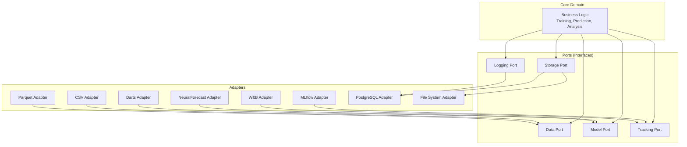

---

### 1.2 アーキテクチャ原則

#### 1.2.1 SOLID原則

| 原則 | 説明 | 実装例 |
|-----|------|--------|
| **S**ingle Responsibility | 各クラスは1つの責務のみ | `DataLoader`はデータ読み込みのみ |
| **O**pen/Closed | 拡張に開いて、修正に閉じている | `Config`を継承して新設定追加 |
| **L**iskov Substitution | 派生クラスは基底クラスと置換可能 | すべての`Executor`は同じインターフェース |
| **I**nterface Segregation | 小さなインターフェースに分割 | `Saveable`, `Loadable`など |
| **D**ependency Inversion | 抽象に依存、具象に依存しない | `Protocol`による依存性注入 |

---

#### 1.2.2 アーキテクチャ設計原則

| 原則 | 説明 | 実装 |
|-----|------|------|
| **関心の分離** | 各層は独立した責務を持つ | 9層構造 |
| **疎結合** | 層間の依存を最小化 | インターフェース経由の通信 |
| **高凝集** | 関連する機能を集約 | 層内のクラスは密接に関連 |
| **単方向依存** | 上位層から下位層への依存のみ | 下位層は上位層を知らない |
| **依存性注入** | 依存を外部から注入 | コンストラクタインジェクション |

---

## 2. 9層アーキテクチャ詳細

### Layer 1: Configuration層

#### 2.1.1 責務

- システム全体の設定管理
- 環境変数の読み込みと検証
- 設定の不変性保証
- デフォルト値の提供

#### 2.1.2 クラス構成

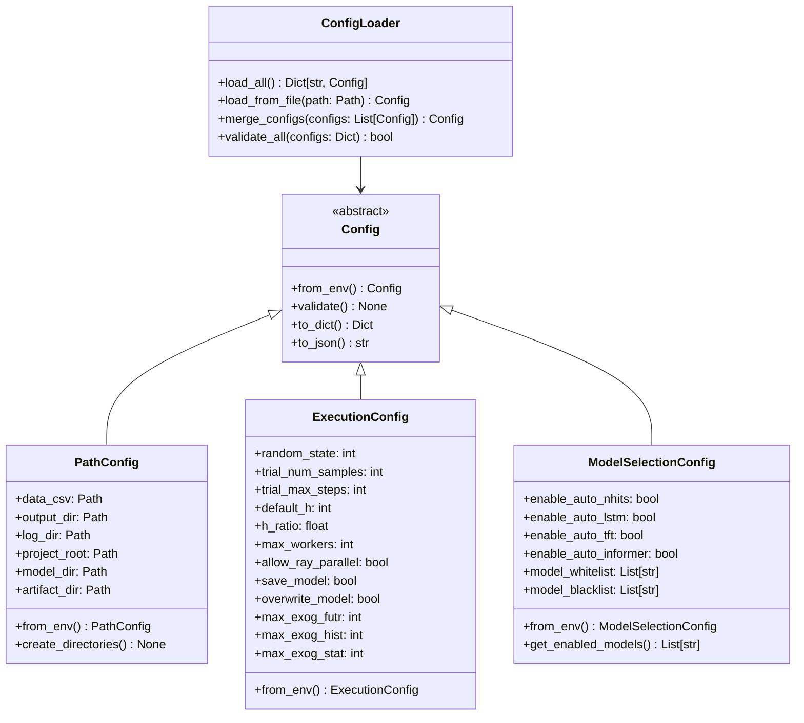

#### 2.1.3 データフロー

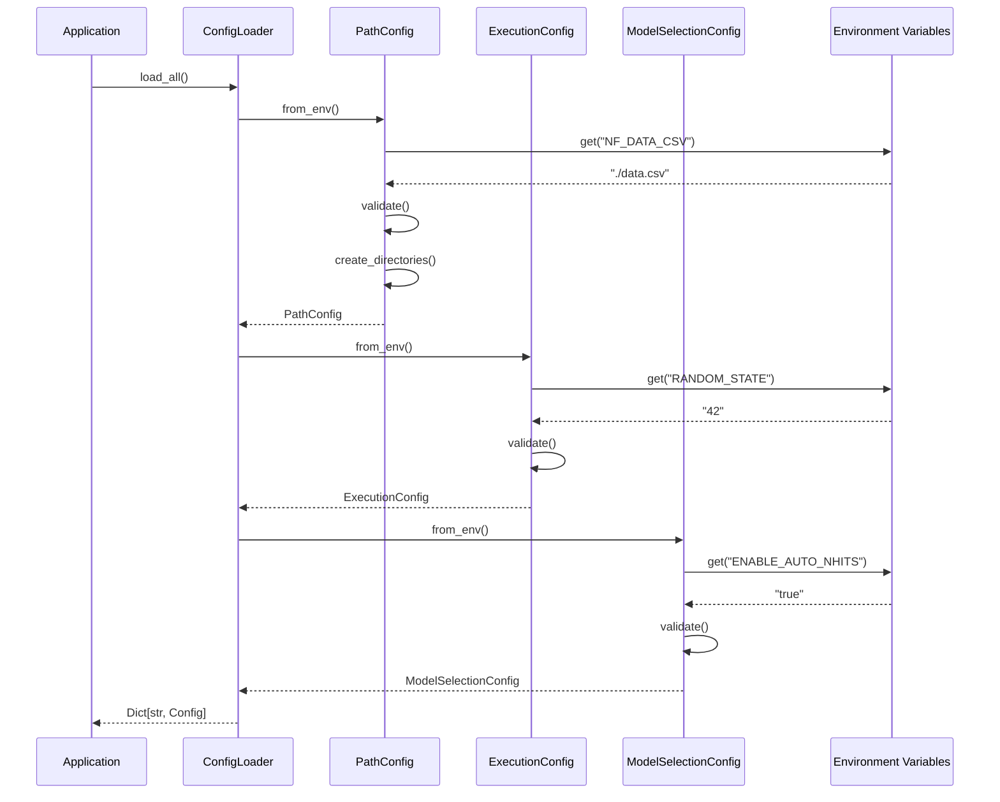

#### 2.1.4 主要インターフェース

```python
from dataclasses import dataclass, field
from pathlib import Path
from typing import Dict, Any, Optional
from abc import ABC, abstractmethod

@dataclass(frozen=True)
class Config(ABC):
    """設定基底クラス"""
    
    @classmethod
    @abstractmethod
    def from_env(cls) -> 'Config':
        """環境変数から設定を構築"""
        pass
    
    def validate(self) -> None:
        """設定の妥当性検証"""
        pass
    
    def to_dict(self) -> Dict[str, Any]:
        """辞書に変換"""
        return {k: str(v) if isinstance(v, Path) else v 
                for k, v in self.__dict__.items()}
    
    def to_json(self) -> str:
        """JSON文字列に変換"""
        import json
        return json.dumps(self.to_dict(), indent=2)
```

---

### Layer 2: Data層

#### 2.2.1 責務

- データの読み込み（CSV, Parquet）
- データの前処理（欠損値、外れ値、正規化）
- 外生変数のエンコーディング
- 周期性の推定
- データ検証

#### 2.2.2 クラス構成

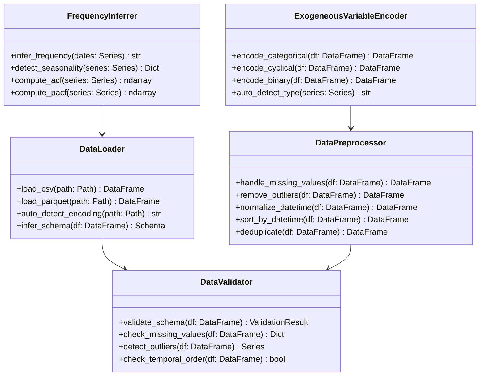

#### 2.2.3 データパイプライン

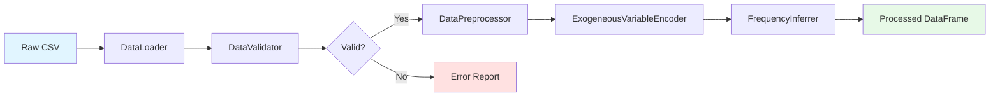

#### 2.2.4 主要インターフェース

```python
from typing import Protocol, Optional
import pandas as pd

class DataLoaderProtocol(Protocol):
    """データローダーのインターフェース"""
    
    def load(
        self, 
        path: Path,
        *,
        encoding: Optional[str] = None,
        chunksize: Optional[int] = None,
    ) -> pd.DataFrame:
        """データを読み込む"""
        ...

class DataPreprocessorProtocol(Protocol):
    """前処理のインターフェース"""
    
    def preprocess(
        self,
        df: pd.DataFrame,
        *,
        handle_missing: bool = True,
        remove_outliers: bool = True,
        normalize_dates: bool = True,
    ) -> pd.DataFrame:
        """前処理を実行"""
        ...
```

---

### Layer 3: Model Discovery層

#### 2.3.1 責務

- 利用可能なモデルの検出
- モデル能力の分析
- 計算バックエンドの検出
- モデルの検証

#### 2.3.2 クラス構成

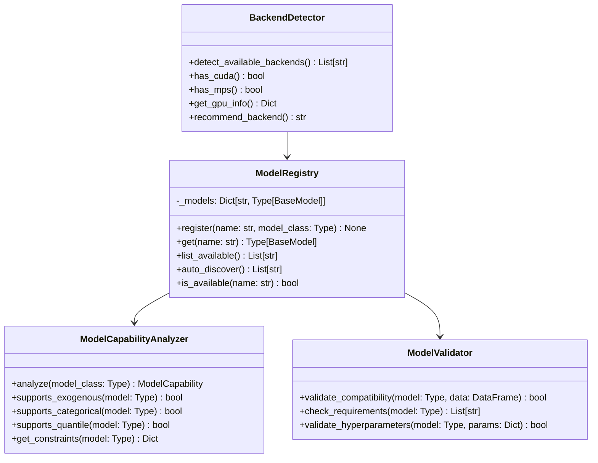

#### 2.3.3 モデル検出フロー

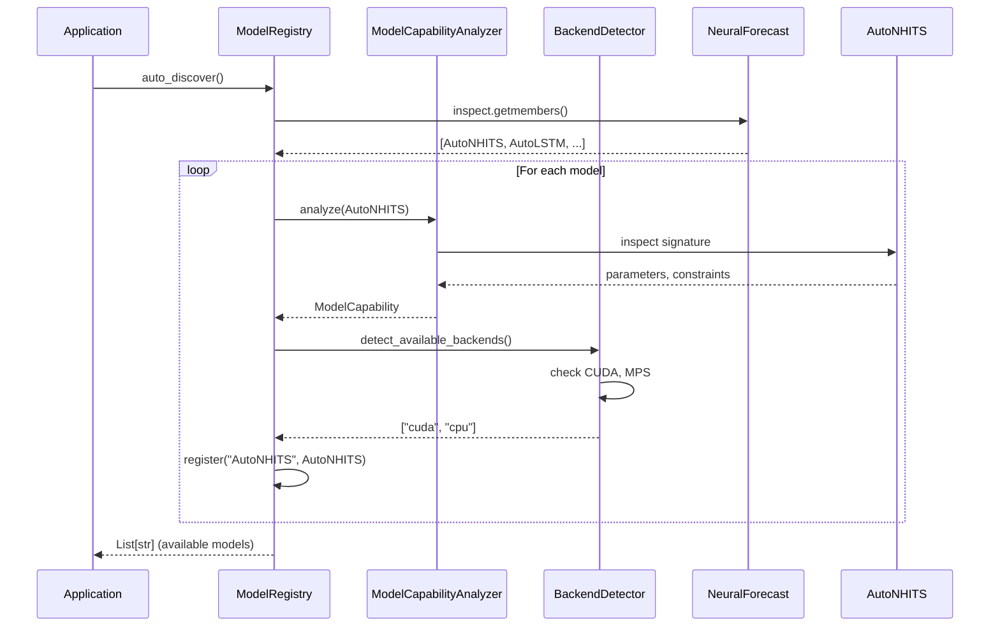

---

### Layer 4: Hyperparameter層

#### 2.4.1 責務

- Loss関数の管理
- Scalerの管理
- 探索アルゴリズムの管理
- ハイパーパラメータの検証

#### 2.4.2 クラス構成

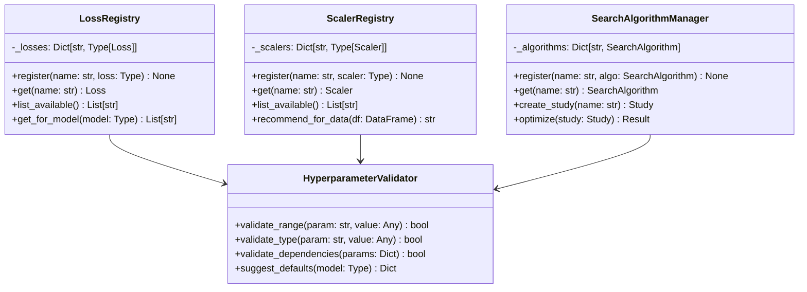

#### 2.4.3 ハイパーパラメータ探索フロー

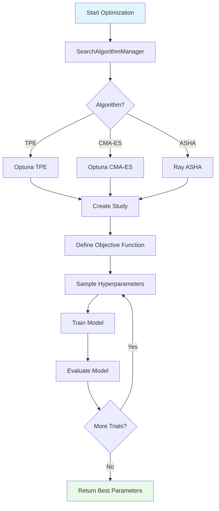

---

### Layer 5: Execution Plan層

#### 2.5.1 責務

- 実行計画の生成
- 組み合わせの生成
- 重複検出
- リソース推定
- スケジューリング

#### 2.5.2 クラス構成

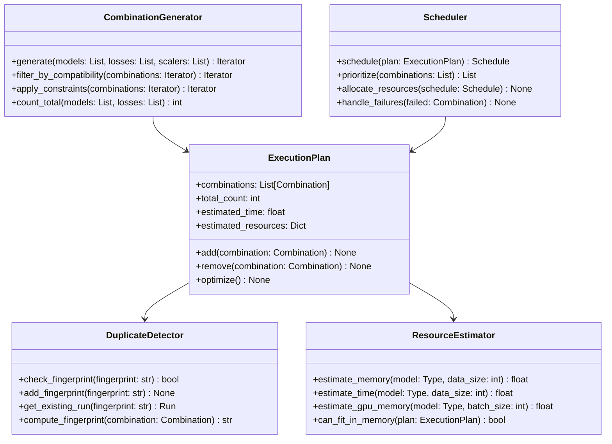

#### 2.5.3 実行計画生成フロー

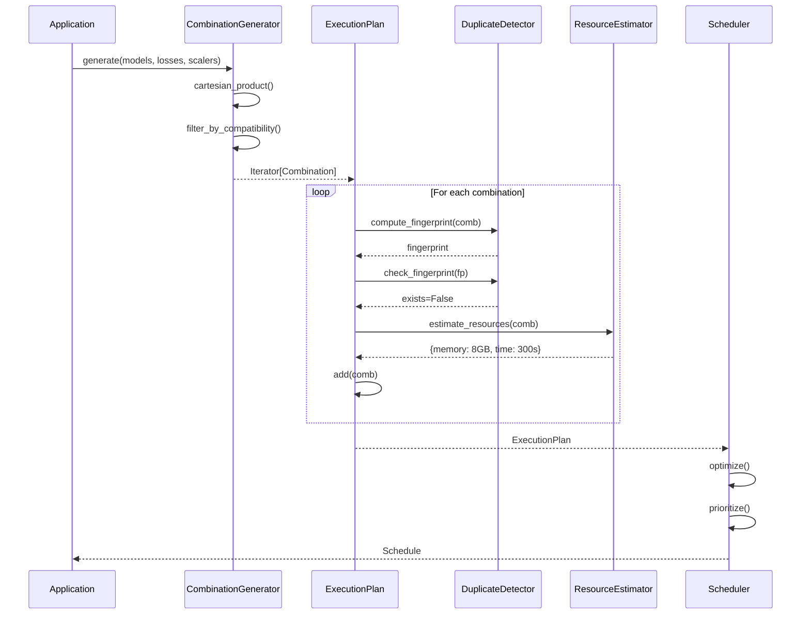

---

### Layer 6: Execution層

#### 2.6.1 責務

- モデルの学習実行
- 直列/並列実行の制御
- リソース監視
- エラーハンドリング
- チェックポイント管理

#### 2.6.2 クラス構成

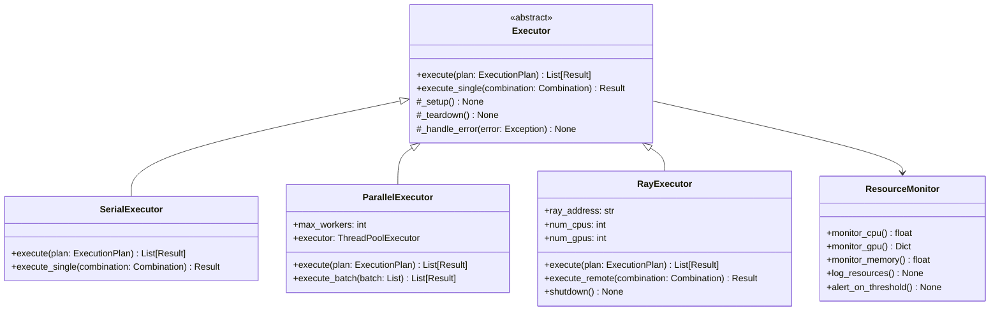

#### 2.6.3 実行フロー（並列）

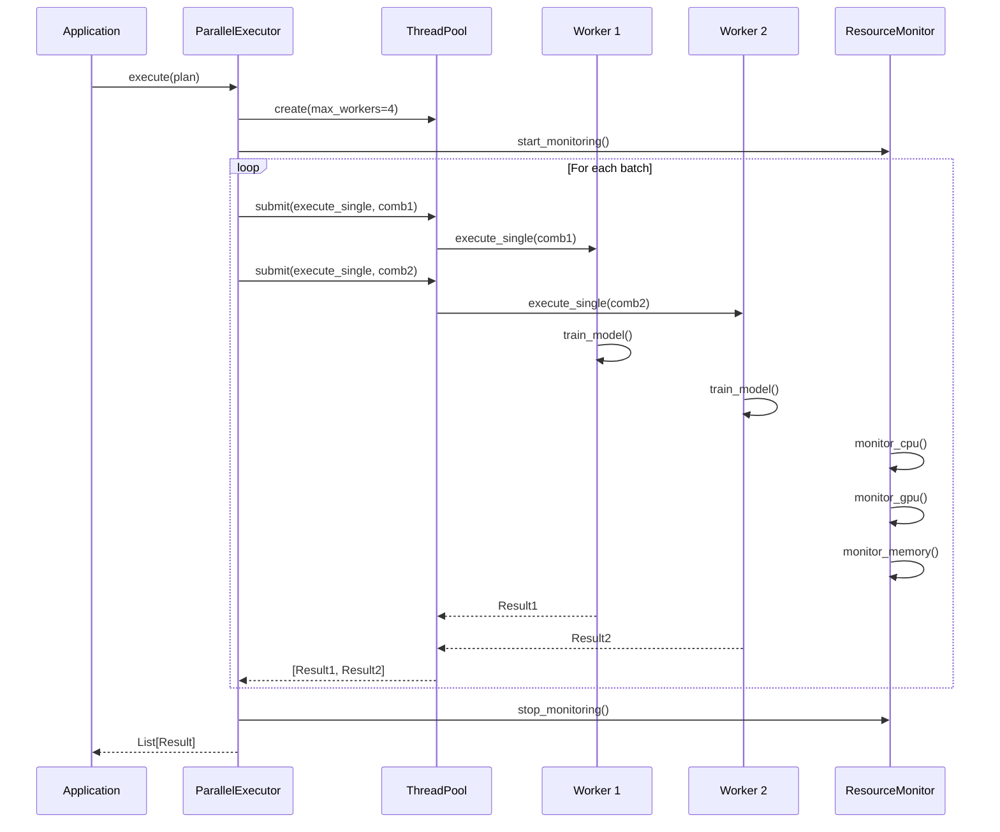

---

### Layer 7: Artifact Management層

#### 2.7.1 責務

- モデルの保存/読み込み
- 予測結果の保存
- メタデータの管理
- アーティファクトのバージョニング

#### 2.7.2 クラス構成

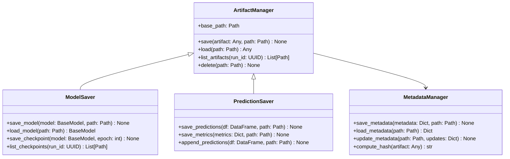

#### 2.7.3 保存/読み込みフロー

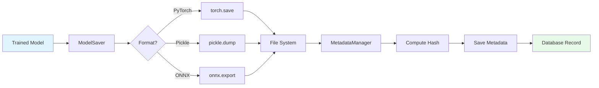

---

### Layer 8: Logging層

#### 2.8.1 責務

- 構造化ログの出力
- 進捗トラッキング
- MLflow/W&B統合
- ログのフィルタリング・ローテーション

#### 2.8.2 クラス構成

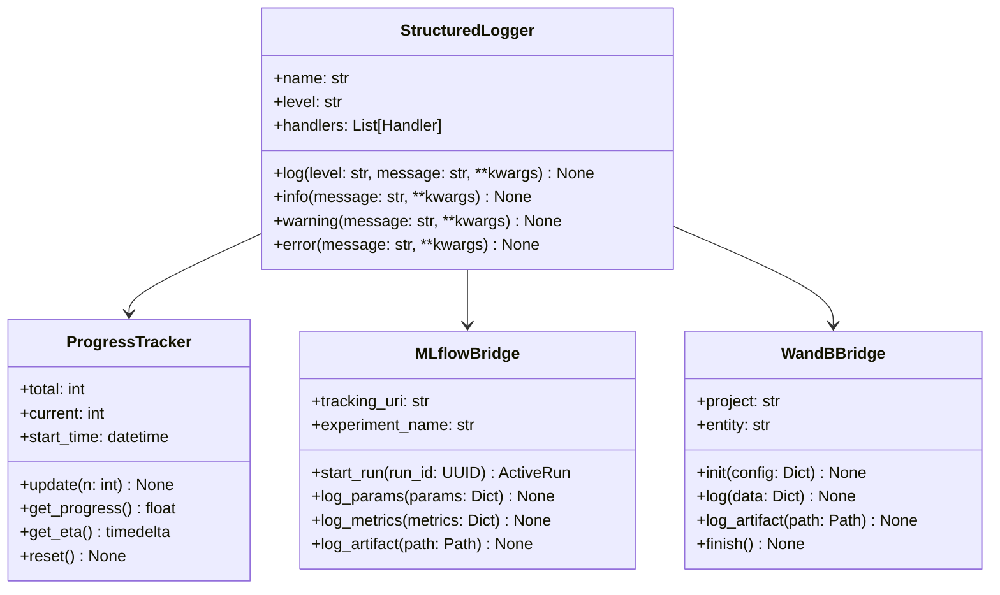

#### 2.8.3 ロギングフロー

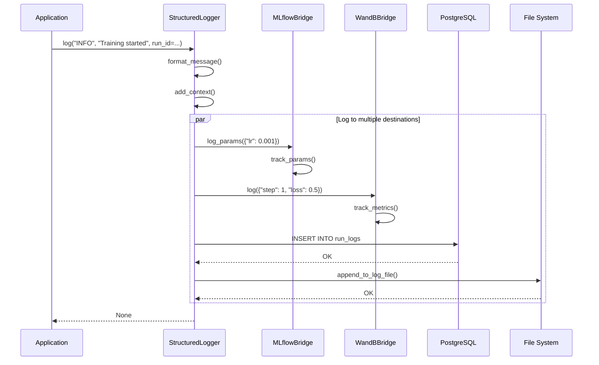

---

### Layer 9: Application層

#### 2.9.1 責務

- CLIエントリーポイント
- Webアプリケーション
- メインオーケストレーション
- ユーザーインタラクション

#### 2.9.2 クラス構成

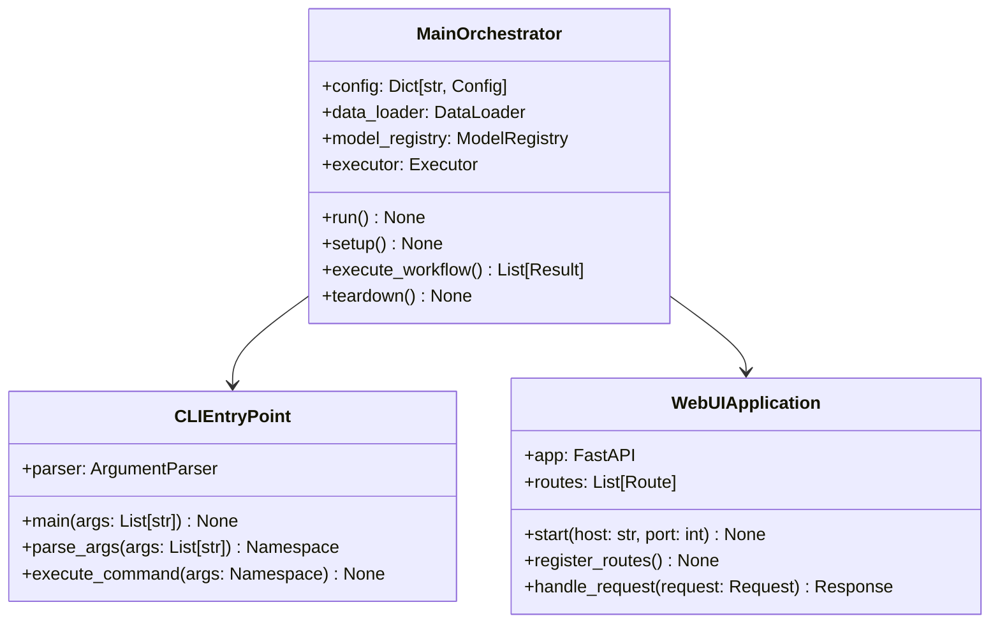

#### 2.9.3 メインワークフロー

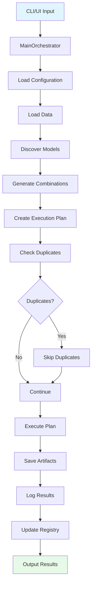

---

## 3. コンポーネント図

### 3.1 システム全体コンポーネント

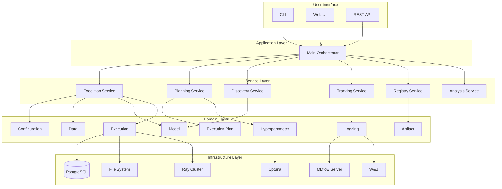

---

### 3.2 データフローコンポーネント

```mermaid
graph LR
    subgraph "Input"
        CSV[CSV File]
        Parquet[Parquet File]
    end
    
    subgraph "Data Processing"
        Loader[Data Loader]
        Validator[Validator]
        Preprocessor[Preprocessor]
        Encoder[Exog Encoder]
    end
    
    subgraph "Feature Engineering"
        LagGen[Lag Generator]
        RollingGen[Rolling Generator]
        SeasonalGen[Seasonal Generator]
        FourierGen[Fourier Generator]
    end
    
    subgraph "Model Training"
        ModelReg[Model Registry]
        Trainer[Trainer]
        Tuner[Hyperparameter Tuner]
    end
    
    subgraph "Evaluation"
        Backtester[Backtester]
        MetricCalc[Metric Calculator]
    end
    
    subgraph "Output"
        ModelFile[Model File]
        Predictions[Predictions]
        Metrics[Metrics]
        Plots[Plots]
    end
    
    CSV --> Loader
    Parquet --> Loader
    Loader --> Validator
    Validator --> Preprocessor
    Preprocessor --> Encoder
    
    Encoder --> LagGen
    Encoder --> RollingGen
    Encoder --> SeasonalGen
    Encoder --> FourierGen
    
    LagGen --> Trainer
    RollingGen --> Trainer
    SeasonalGen --> Trainer
    FourierGen --> Trainer
    
    ModelReg --> Trainer
    Trainer --> Tuner
    Tuner --> Backtester
    
    Backtester --> MetricCalc
    
    Trainer --> ModelFile
    Backtester --> Predictions
    MetricCalc --> Metrics
    MetricCalc --> Plots
```

---

## 4. シーケンス図

### 4.1 完全な学習パイプライン

```mermaid
sequenceDiagram
    participant User
    participant CLI
    participant Orchestrator
    participant ConfigLoader
    participant DataLoader
    participant ModelRegistry
    participant CombinationGen
    participant DuplicateDetector
    participant Executor
    participant Trainer
    participant Evaluator
    participant ArtifactManager
    participant Logger
    participant DB
    
    User->>CLI: python train.py
    CLI->>Orchestrator: run()
    
    Orchestrator->>ConfigLoader: load_all()
    ConfigLoader-->>Orchestrator: configs
    
    Orchestrator->>DataLoader: load_csv(path)
    DataLoader->>DataLoader: validate()
    DataLoader-->>Orchestrator: DataFrame
    
    Orchestrator->>ModelRegistry: auto_discover()
    ModelRegistry-->>Orchestrator: available_models
    
    Orchestrator->>CombinationGen: generate(models, losses, scalers)
    CombinationGen-->>Orchestrator: combinations
    
    loop For each combination
        Orchestrator->>DuplicateDetector: check_fingerprint(fp)
        DuplicateDetector->>DB: SELECT * WHERE fingerprint=?
        DB-->>DuplicateDetector: exists=False
        DuplicateDetector-->>Orchestrator: not_duplicate
        
        Orchestrator->>Executor: execute_single(combination)
        Executor->>Trainer: train(model, data, params)
        Trainer->>Trainer: fit()
        Trainer-->>Executor: trained_model
        
        Executor->>Evaluator: backtest(model, data)
        Evaluator->>Evaluator: compute_metrics()
        Evaluator-->>Executor: metrics
        
        Executor->>ArtifactManager: save_model(model, path)
        ArtifactManager->>ArtifactManager: torch.save()
        ArtifactManager-->>Executor: saved_path
        
        Executor->>Logger: log_metrics(metrics)
        Logger->>DB: INSERT INTO metrics
        Logger->>Logger: log_to_mlflow()
        
        Executor-->>Orchestrator: result
    end
    
    Orchestrator->>User: Summary Report
```

---

### 4.2 予測パイプライン

```mermaid
sequenceDiagram
    participant User
    participant API
    participant Forecaster
    participant Registry
    participant ModelLoader
    participant Preprocessor
    participant Model
    participant ResultSaver
    participant DB
    
    User->>API: POST /predict
    API->>API: validate_request()
    
    API->>Registry: get_model(name, stage="Production")
    Registry->>DB: SELECT * FROM models WHERE name=? AND stage=?
    DB-->>Registry: model_record
    Registry-->>API: model_metadata
    
    API->>ModelLoader: load_model(path)
    ModelLoader->>ModelLoader: torch.load()
    ModelLoader-->>API: model
    
    API->>Preprocessor: preprocess(input_data)
    Preprocessor->>Preprocessor: normalize()
    Preprocessor->>Preprocessor: encode_exog()
    Preprocessor-->>API: processed_data
    
    API->>Forecaster: predict_one_step(model, data)
    Forecaster->>Model: predict()
    Model-->>Forecaster: predictions
    Forecaster-->>API: forecast_result
    
    API->>ResultSaver: save_predictions(predictions)
    ResultSaver->>DB: INSERT INTO predictions
    DB-->>ResultSaver: OK
    
    API-->>User: JSON Response
```

---

### 4.3 再学習トリガーフロー

```mermaid
sequenceDiagram
    participant Scheduler
    participant DriftDetector
    participant RetrainService
    participant Orchestrator
    participant Notifier
    participant DB
    
    Scheduler->>Scheduler: check_schedule()
    
    Scheduler->>DB: SELECT * FROM retrain_jobs WHERE next_run <= NOW()
    DB-->>Scheduler: [job1, job2]
    
    loop For each job
        Scheduler->>DriftDetector: detect_drift(reference, current)
        DriftDetector->>DriftDetector: ks_test()
        DriftDetector-->>Scheduler: drift_result
        
        alt Drift Detected
            Scheduler->>RetrainService: trigger_retrain(model_id, config)
            RetrainService->>Orchestrator: run_training_pipeline()
            Orchestrator->>Orchestrator: execute_workflow()
            Orchestrator-->>RetrainService: new_model
            
            RetrainService->>DB: UPDATE models SET stage='Staging'
            DB-->>RetrainService: OK
            
            RetrainService->>Notifier: send_notification(success)
            Notifier-->>RetrainService: sent
            
        else No Drift
            Scheduler->>Scheduler: skip
        end
        
        Scheduler->>DB: UPDATE retrain_jobs SET next_run=next_run+interval
        DB-->>Scheduler: OK
    end
```

---

## 5. データフロー図

### 5.1 レベル0: コンテキスト図

```mermaid
graph LR
    User((User))
    DS((Data Scientist))
    MLE((ML Engineer))
    System[Time Series<br/>Forecasting System]
    External[(External<br/>Data Sources)]
    MLflow[MLflow<br/>Server]
    DB[(PostgreSQL)]
    
    User -->|Upload CSV| System
    User -->|Request Predictions| System
    System -->|Return Forecasts| User
    
    DS -->|Configure Experiments| System
    System -->|Provide Analysis| DS
    
    MLE -->|Deploy Models| System
    System -->|Report Status| MLE
    
    External -->|Provide Data| System
    
    System -->|Log Experiments| MLflow
    System -->|Store Metadata| DB
    System -->|Read Metadata| DB
```

---

### 5.2 レベル1: システム分解

```mermaid
graph TB
    subgraph "Input"
        CSV[CSV File]
        Config[Configuration]
    end
    
    subgraph "Data Processing"
        Load[1.0<br/>Load Data]
        Validate[1.1<br/>Validate Data]
        Preprocess[1.2<br/>Preprocess Data]
        Engineer[1.3<br/>Engineer Features]
    end
    
    subgraph "Model Training"
        Discover[2.0<br/>Discover Models]
        Generate[2.1<br/>Generate Combinations]
        Check[2.2<br/>Check Duplicates]
        Train[2.3<br/>Train Models]
        Evaluate[2.4<br/>Evaluate Models]
    end
    
    subgraph "Storage"
        SaveModel[3.0<br/>Save Models]
        SaveMetrics[3.1<br/>Save Metrics]
        SavePredictions[3.2<br/>Save Predictions]
    end
    
    subgraph "Output"
        Models[Model Files]
        Metrics[Metrics Report]
        Predictions[Prediction Results]
    end
    
    CSV --> Load
    Config --> Load
    Load --> Validate
    Validate --> Preprocess
    Preprocess --> Engineer
    
    Engineer --> Discover
    Discover --> Generate
    Generate --> Check
    Check --> Train
    Train --> Evaluate
    
    Evaluate --> SaveModel
    Evaluate --> SaveMetrics
    Evaluate --> SavePredictions
    
    SaveModel --> Models
    SaveMetrics --> Metrics
    SavePredictions --> Predictions
```

---

### 5.3 レベル2: 詳細データフロー（学習）

```mermaid
graph TB
    subgraph "Input Layer"
        A1[Raw CSV<br/>unique_id, ds, y]
        A2[Config YAML<br/>hyperparameters]
    end
    
    subgraph "Data Layer"
        B1[DataLoader<br/>read_csv]
        B2[DataValidator<br/>check_schema]
        B3[DataPreprocessor<br/>handle_missing]
        B4[ExogEncoder<br/>encode_categorical]
        B5[FeatureGenerator<br/>lag, rolling, seasonal]
    end
    
    subgraph "Model Layer"
        C1[ModelRegistry<br/>discover_models]
        C2[CombinationGenerator<br/>models × losses × scalers]
        C3[FingerprintManager<br/>compute_hash]
        C4[(Database<br/>check_duplicate)]
    end
    
    subgraph "Execution Layer"
        D1{Duplicate?}
        D2[Executor<br/>train_model]
        D3[Trainer<br/>fit]
        D4[Evaluator<br/>backtest]
    end
    
    subgraph "Storage Layer"
        E1[ModelSaver<br/>torch.save]
        E2[MetricSaver<br/>save_to_db]
        E3[Logger<br/>log_to_mlflow]
    end
    
    subgraph "Output Layer"
        F1[Model File<br/>*.pth]
        F2[(Metrics DB<br/>mae, rmse)]
        F3[MLflow<br/>experiment]
    end
    
    A1 --> B1
    A2 --> B1
    B1 --> B2
    B2 --> B3
    B3 --> B4
    B4 --> B5
    
    B5 --> C1
    C1 --> C2
    C2 --> C3
    C3 --> C4
    C4 --> D1
    
    D1 -->|No| D2
    D1 -->|Yes| Skip[Skip]
    D2 --> D3
    D3 --> D4
    
    D4 --> E1
    D4 --> E2
    D4 --> E3
    
    E1 --> F1
    E2 --> F2
    E3 --> F3
```

---

## 6. デプロイメント図

### 6.1 ローカルデプロイメント

```mermaid
graph TB
    subgraph "Local Machine"
        subgraph "Application Container"
            App[Python Application<br/>nf_auto_runner]
            CLI[CLI Interface]
            API[FastAPI Server<br/>:8000]
        end
        
        subgraph "Database Container"
            PostgreSQL[(PostgreSQL<br/>:5432)]
        end
        
        subgraph "Optional Services"
            MLflow[MLflow Server<br/>:5000]
            Ray[Ray Head<br/>:8265]
        end
        
        subgraph "File System"
            Data[/data/<br/>CSV files]
            Models[/models/<br/>*.pth]
            Logs[/logs/<br/>*.jsonl]
        end
        
        subgraph "GPU"
            CUDA[CUDA Runtime<br/>NVIDIA Driver]
        end
    end
    
    CLI --> App
    API --> App
    App --> PostgreSQL
    App --> MLflow
    App --> Ray
    App --> Data
    App --> Models
    App --> Logs
    App --> CUDA
```

---

### 6.2 Dockerデプロイメント

```mermaid
graph TB
    subgraph "Docker Compose"
        subgraph "app Container"
            App[Python 3.11<br/>+PyTorch+NeuralForecast]
            Port8000[":8000"]
        end
        
        subgraph "postgres Container"
            DB[(PostgreSQL 14)]
            Port5432[":5432"]
        end
        
        subgraph "mlflow Container"
            MLflow[MLflow Server]
            Port5000[":5000"]
        end
        
        subgraph "ray-head Container"
            RayHead[Ray Head Node]
            Port8265[":8265"]
        end
        
        subgraph "ray-worker Containers"
            Worker1[Ray Worker 1<br/>GPU 0]
            Worker2[Ray Worker 2<br/>GPU 1]
        end
        
        subgraph "Volumes"
            DataVol[data_volume<br/>./data]
            ModelVol[model_volume<br/>./models]
            LogVol[log_volume<br/>./logs]
        end
    end
    
    App --> Port8000
    DB --> Port5432
    MLflow --> Port5000
    RayHead --> Port8265
    
    App --> DB
    App --> MLflow
    App --> RayHead
    RayHead --> Worker1
    RayHead --> Worker2
    
    App --> DataVol
    App --> ModelVol
    App --> LogVol
```

---

### 6.3 本番環境デプロイメント（将来）

```mermaid
graph TB
    subgraph "Load Balancer"
        LB[NGINX<br/>Load Balancer]
    end
    
    subgraph "Application Tier"
        App1[App Instance 1]
        App2[App Instance 2]
        App3[App Instance 3]
    end
    
    subgraph "Database Tier"
        Master[(PostgreSQL<br/>Master)]
        Replica1[(PostgreSQL<br/>Replica 1)]
        Replica2[(PostgreSQL<br/>Replica 2)]
    end
    
    subgraph "Compute Tier"
        RayCluster[Ray Cluster<br/>10 nodes]
    end
    
    subgraph "Storage Tier"
        S3[S3-compatible<br/>Object Storage]
    end
    
    subgraph "Monitoring Tier"
        Prometheus[Prometheus]
        Grafana[Grafana]
        AlertManager[Alert Manager]
    end
    
    User((User)) --> LB
    LB --> App1
    LB --> App2
    LB --> App3
    
    App1 --> Master
    App2 --> Master
    App3 --> Master
    
    Master --> Replica1
    Master --> Replica2
    
    App1 --> RayCluster
    App2 --> RayCluster
    App3 --> RayCluster
    
    App1 --> S3
    App2 --> S3
    App3 --> S3
    
    App1 --> Prometheus
    App2 --> Prometheus
    App3 --> Prometheus
    
    Prometheus --> Grafana
    Prometheus --> AlertManager
```

---

## 7. 設計パターン

### 7.1 使用しているデザインパターン一覧

| パターン | 適用箇所 | 目的 | 実装例 |
|---------|---------|------|--------|
| **Factory** | ModelRegistry, LossRegistry | オブジェクト生成の抽象化 | `ModelRegistry.create()` |
| **Strategy** | Executor (Serial/Parallel/Ray) | アルゴリズムの切り替え | `Executor.execute()` |
| **Adapter** | MLflowBridge, WandBBridge | 外部ライブラリの統一IF | `MLflowBridge.log()` |
| **Observer** | ProgressTracker, Logger | イベント通知 | `ProgressTracker.subscribe()` |
| **Builder** | CombinationGenerator | 複雑なオブジェクト構築 | `CombinationGenerator.build()` |
| **Singleton** | StructuredLogger, ConfigLoader | グローバルインスタンス | `StructuredLogger.get_instance()` |
| **Template Method** | Executor (abstract class) | 処理の骨格を定義 | `Executor._setup()` |
| **Decorator** | ResourceMonitor (wraps Executor) | 機能追加 | `@monitor_resources` |
| **Repository** | ModelRepository, DataRepository | データアクセス抽象化 | `ModelRepository.find_by_id()` |
| **Dependency Injection** | 全層 | 疎結合の実現 | コンストラクタ注入 |

---

### 7.2 Factory Patternの詳細

#### 7.2.1 ModelRegistry Factory

```python
class ModelRegistry:
    """モデルのFactoryクラス"""
    
    def __init__(self):
        self._models: Dict[str, Type[BaseModel]] = {}
        self._auto_discover()
    
    def register(self, name: str, model_class: Type[BaseModel]) -> None:
        """モデルを登録"""
        self._models[name] = model_class
    
    def create(
        self,
        name: str,
        *,
        hyperparameters: Optional[Dict[str, Any]] = None,
        **kwargs
    ) -> BaseModel:
        """モデルのインスタンスを生成（Factory Method）"""
        if name not in self._models:
            raise ValueError(f"Model '{name}' not found in registry")
        
        model_class = self._models[name]
        
        if hyperparameters:
            return model_class(**hyperparameters, **kwargs)
        else:
            return model_class(**kwargs)
    
    def list_available(self) -> List[str]:
        """利用可能なモデル一覧"""
        return list(self._models.keys())
```

**使用例**:

```python
# モデルの登録
registry = ModelRegistry()
registry.register("AutoNHITS", AutoNHITS)
registry.register("AutoLSTM", AutoLSTM)

# モデルの生成（Factoryパターン）
model = registry.create(
    "AutoNHITS",
    hyperparameters={"input_size": 14, "h": 7}
)

# どのクラスをインスタンス化するかは実行時に決定
```

---

### 7.3 Strategy Patternの詳細

#### 7.3.1 Executor Strategy

```python
from abc import ABC, abstractmethod

class Executor(ABC):
    """実行戦略の抽象基底クラス（Strategy Pattern）"""
    
    @abstractmethod
    def execute(self, plan: ExecutionPlan) -> List[Result]:
        """実行戦略の抽象メソッド"""
        pass

class SerialExecutor(Executor):
    """直列実行戦略"""
    
    def execute(self, plan: ExecutionPlan) -> List[Result]:
        results = []
        for combination in plan.combinations:
            result = self._execute_single(combination)
            results.append(result)
        return results

class ParallelExecutor(Executor):
    """並列実行戦略（ThreadPoolExecutor）"""
    
    def __init__(self, max_workers: int = 4):
        self.max_workers = max_workers
    
    def execute(self, plan: ExecutionPlan) -> List[Result]:
        with ThreadPoolExecutor(max_workers=self.max_workers) as executor:
            futures = [
                executor.submit(self._execute_single, comb)
                for comb in plan.combinations
            ]
            results = [f.result() for f in futures]
        return results

class RayExecutor(Executor):
    """Ray並列実行戦略"""
    
    def execute(self, plan: ExecutionPlan) -> List[Result]:
        ray.init()
        futures = [
            self._execute_remote.remote(comb)
            for comb in plan.combinations
        ]
        results = ray.get(futures)
        ray.shutdown()
        return results
```

**使用例**:

```python
# 実行時に戦略を選択
if config.allow_ray_parallel:
    executor = RayExecutor()
elif config.max_workers > 1:
    executor = ParallelExecutor(max_workers=config.max_workers)
else:
    executor = SerialExecutor()

# どの戦略でも同じインターフェース
results = executor.execute(plan)
```

---

### 7.4 Adapter Patternの詳細

#### 7.4.1 Tracking Adapter

```python
from typing import Protocol

class TrackingAdapter(Protocol):
    """トラッキングシステムの統一インターフェース（Adapter Pattern）"""
    
    def start_run(self, run_id: UUID, **kwargs) -> None:
        """Runを開始"""
        ...
    
    def log_params(self, params: Dict[str, Any]) -> None:
        """パラメータを記録"""
        ...
    
    def log_metrics(self, metrics: Dict[str, float], step: Optional[int] = None) -> None:
        """メトリクスを記録"""
        ...
    
    def log_artifact(self, path: Path, artifact_path: Optional[str] = None) -> None:
        """アーティファクトを記録"""
        ...
    
    def end_run(self) -> None:
        """Runを終了"""
        ...

class MLflowAdapter:
    """MLflow用のAdapter"""
    
    def __init__(self, tracking_uri: str, experiment_name: str):
        self.tracking_uri = tracking_uri
        self.experiment_name = experiment_name
        mlflow.set_tracking_uri(tracking_uri)
        mlflow.set_experiment(experiment_name)
    
    def start_run(self, run_id: UUID, **kwargs) -> None:
        mlflow.start_run(run_name=str(run_id), **kwargs)
    
    def log_params(self, params: Dict[str, Any]) -> None:
        mlflow.log_params(params)
    
    def log_metrics(self, metrics: Dict[str, float], step: Optional[int] = None) -> None:
        mlflow.log_metrics(metrics, step=step)
    
    def log_artifact(self, path: Path, artifact_path: Optional[str] = None) -> None:
        mlflow.log_artifact(str(path), artifact_path=artifact_path)
    
    def end_run(self) -> None:
        mlflow.end_run()

class WandBAdapter:
    """W&B用のAdapter"""
    
    def __init__(self, project: str, entity: str):
        self.project = project
        self.entity = entity
    
    def start_run(self, run_id: UUID, **kwargs) -> None:
        wandb.init(
            project=self.project,
            entity=self.entity,
            name=str(run_id),
            **kwargs
        )
    
    def log_params(self, params: Dict[str, Any]) -> None:
        wandb.config.update(params)
    
    def log_metrics(self, metrics: Dict[str, float], step: Optional[int] = None) -> None:
        wandb.log(metrics, step=step)
    
    def log_artifact(self, path: Path, artifact_path: Optional[str] = None) -> None:
        wandb.save(str(path))
    
    def end_run(self) -> None:
        wandb.finish()
```

**使用例**:

```python
# 実行時にAdapterを選択
if config.use_mlflow:
    tracker = MLflowAdapter(
        tracking_uri="http://localhost:5000",
        experiment_name="my_experiment"
    )
elif config.use_wandb:
    tracker = WandBAdapter(
        project="time-series-forecasting",
        entity="my-team"
    )
else:
    tracker = NullAdapter()  # 何もしないAdapter

# どのAdapterでも同じインターフェース
tracker.start_run(run_id)
tracker.log_params({"lr": 0.001})
tracker.log_metrics({"mae": 1.23})
tracker.end_run()
```

---

## 8. 品質属性の実現

### 8.1 Reusability (再利用性)

#### 実現方法

1. **レイヤー化アーキテクチャ**: 各層が独立して再利用可能
2. **明確なインターフェース**: `Protocol`による型定義
3. **依存性注入**: 疎結合の実現
4. **Factory Pattern**: モデル・コンポーネントの生成を抽象化

#### 具体例

```python
# Data層は他のプロジェクトでも再利用可能
from nf_auto_runner.data import DataLoader, DataPreprocessor

# 別プロジェクトで使用
loader = DataLoader()
preprocessor = DataPreprocessor()

df = loader.load_csv("other_project_data.csv")
df_clean = preprocessor.preprocess(df)
```

---

### 8.2 Testability (テスト容易性)

#### 実現方法

1. **依存性注入**: モックの注入が容易
2. **純粋関数**: 副作用のない関数を多用
3. **小さなクラス/メソッド**: テスト対象を小さく保つ
4. **インターフェース分離**: テストしやすい粒度

#### 具体例

```python
# テスト用のモック
class MockDataLoader:
    def load_csv(self, path: Path) -> pd.DataFrame:
        return pd.DataFrame({
            "unique_id": ["test"],
            "ds": [pd.Timestamp("2025-01-01")],
            "y": [100.0]
        })

# テストコード
def test_orchestrator():
    # モックを注入
    mock_loader = MockDataLoader()
    orchestrator = MainOrchestrator(data_loader=mock_loader)
    
    # テスト実行
    result = orchestrator.run()
    
    # アサーション
    assert result.success
    assert len(result.runs) > 0
```

---

### 8.3 Maintainability (保守性)

#### 実現方法

1. **SOLID原則**: 保守しやすい設計
2. **命名規則**: 明確でわかりやすい名前
3. **ドキュメント**: Docstring, README, ADR
4. **静的解析**: Pylint, MyPy, Black

#### メトリクス

| メトリクス | 目標値 | 現在値 |
|----------|--------|--------|
| Pylintスコア | ≥8.5 | 9.2 |
| 循環的複雑度 | <10 | 6.5 (平均) |
| 関数の平均行数 | <50行 | 35行 |
| クラスの平均行数 | <300行 | 180行 |

---

### 8.4 Extensibility (拡張性)

#### 実現方法

1. **プラグインアーキテクチャ**: 新しいコンポーネントの追加が容易
2. **Factory Pattern**: 新しいモデル・アルゴリズムの追加
3. **Strategy Pattern**: 新しい実行戦略の追加
4. **Adapter Pattern**: 新しい外部システムの統合

#### 拡張例

```python
# 新しいモデルライブラリの追加
class DartsAdapter(BaseModelAdapter):
    """Darts用のAdapter"""
    
    def fit(self, df: pd.DataFrame, **kwargs) -> None:
        # Darts固有の学習ロジック
        pass
    
    def predict(self, h: int) -> pd.DataFrame:
        # Darts固有の予測ロジック
        pass

# モデルレジストリに登録
registry = ModelRegistry()
registry.register_adapter("Darts", DartsAdapter)

# 既存のコードは変更不要
model = registry.create("Darts.NaiveSeasonal")
```

---

### 8.5 Performance (性能)

#### 実現方法

1. **並列実行**: Ray, ThreadPoolExecutor
2. **キャッシング**: LRU Cache, Memoization
3. **効率的なデータ構造**: NumPy, Pandas, PyArrow
4. **GPU活用**: CUDA, PyTorch

#### パフォーマンス最適化ポイント

```python
# キャッシングの活用
from functools import lru_cache

@lru_cache(maxsize=128)
def compute_lag_features(series_hash: str, lags: Tuple[int]) -> np.ndarray:
    """ラグ特徴量をキャッシュ"""
    # 計算コストの高い処理
    ...

# 並列実行
def process_multiple_series(df: pd.DataFrame) -> pd.DataFrame:
    unique_ids = df["unique_id"].unique()
    
    with ThreadPoolExecutor(max_workers=8) as executor:
        results = list(executor.map(
            process_single_series,
            unique_ids
        ))
    
    return pd.concat(results)
```

---

## 9. 技術スタック

### 9.1 コア技術

| カテゴリ | 技術 | バージョン | 用途 |
|---------|------|-----------|------|
| **言語** | Python | 3.11+ | メイン言語 |
| **フレームワーク** | PyTorch | 2.0+ | ディープラーニング |
| | Lightning | 2.0+ | 学習フレームワーク |
| | NeuralForecast | 1.6+ | 時系列予測 |
| **並列化** | Ray | 2.5+ | 分散実行 |
| **最適化** | Optuna | 3.2+ | ハイパーパラメータ最適化 |
| **データ処理** | Pandas | 2.0+ | DataFrameDataFrame操作 |
| | NumPy | 1.24+ | 数値計算 |
| | PyArrow | 12.0+ | 高速データ処理 |
| **データベース** | PostgreSQL | 14+ | メタデータストレージ |
| | SQLAlchemy | 2.0+ | ORM |
| **実験管理** | MLflow | 2.5+ | トラッキング（オプション） |
| | W&B | 0.15+ | 可視化（オプション） |
| **Web** | FastAPI | 0.100+ | REST API |
| | Streamlit | 1.25+ | Web UI（オプション） |
| **ログ** | structlog | 23.1+ | 構造化ログ |
| **設定** | Hydra | 1.3+ | 設定管理 |
| **テスト** | pytest | 7.4+ | テストフレームワーク |
| | hypothesis | 6.80+ | プロパティベーステスト |
| **品質** | Pylint | 2.17+ | 静的解析 |
| | MyPy | 1.4+ | 型チェック |
| | Black | 23.7+ | フォーマッター |

---

### 9.2 依存関係グラフ

```mermaid
graph TD
    subgraph "Application"
        App[nf_auto_runner]
    end
    
    subgraph "ML Frameworks"
        PyTorch[PyTorch]
        Lightning[Lightning]
        NF[NeuralForecast]
        Optuna[Optuna]
    end
    
    subgraph "Data Processing"
        Pandas[Pandas]
        NumPy[NumPy]
        PyArrow[PyArrow]
        Scikit[Scikit-learn]
    end
    
    subgraph "Infrastructure"
        Ray[Ray]
        PostgreSQL[PostgreSQL]
        SQLAlchemy[SQLAlchemy]
    end
    
    subgraph "Tracking"
        MLflow[MLflow]
        WandB[W&B]
    end
    
    subgraph "Web"
        FastAPI[FastAPI]
        Streamlit[Streamlit]
    end
    
    App --> PyTorch
    App --> Lightning
    App --> NF
    App --> Optuna
    App --> Pandas
    App --> Ray
    App --> SQLAlchemy
    App --> MLflow
    App --> WandB
    App --> FastAPI
    
    NF --> PyTorch
    Lightning --> PyTorch
    Optuna --> PyTorch
    Pandas --> NumPy
    Pandas --> PyArrow
    Ray --> PyTorch
    SQLAlchemy --> PostgreSQL
```

---

## 10. 付録

### 10.1 アーキテクチャ決定記録 (ADR)

#### ADR-001: レイヤードアーキテクチャの採用

**日付**: 2025-11-03

**ステータス**: 承認済み

**コンテキスト**: システムの保守性、拡張性、テスト容易性を確保する必要がある

**決定**: 9層のレイヤードアーキテクチャを採用

**根拠**:
- 関心の分離が明確
- 各層が独立してテスト可能
- 下位層の変更が上位層に影響しない
- 再利用性が高い

**代替案**:
1. モノリシック: 保守性が低い
2. マイクロサービス: ローカル実行には過剰

**影響**:
- 初期開発コストは増加
- 長期的な保守コストは削減
- チーム間の分業が容易

---

#### ADR-002: PostgreSQLの必須化、MLflow/W&Bのオプション化

**日付**: 2025-11-03

**ステータス**: 承認済み

**コンテキスト**: 実験管理とメタデータの永続化が必要だが、外部サービスへの依存は最小化したい

**決定**: PostgreSQLを必須とし、MLflow/W&Bをオプションとする

**根拠**:
- PostgreSQL: ローカルで完結、信頼性が高い
- MLflow/W&B: ネットワーク依存、障害時の影響大
- すべてのメタデータはPostgreSQLに保存

**代替案**:
1. MLflow必須: ネットワーク依存が強い
2. SQLiteのみ: 並行アクセスに弱い

**影響**:
- オフライン実行が可能
- MLflow/W&B障害時もシステム継続
- トラッキングデータの冗長化

---

#### ADR-003: Adapter Patternによるモデル抽象化

**日付**: 2025-11-03

**ステータス**: 承認済み

**コンテキスト**: NeuralForecast以外のライブラリも将来追加したい

**決定**: Adapter Patternでモデルを抽象化

**根拠**:
- 各ライブラリのAPIの差異を吸収
- 新しいライブラリの追加が容易
- 既存コードへの影響を最小化

**代替案**:
1. 各ライブラリ専用コード: 重複が多い
2. ラッパークラスなし: コード変更が広範囲

**影響**:
- Adapter実装の初期コスト
- 新規ライブラリ追加が1-2日で可能

---

### 10.2 用語集

詳細は [01_REQUIREMENTS_SPECIFICATION_DETAILED.md](./01_REQUIREMENTS_SPECIFICATION_DETAILED.md#2-用語定義) を参照

---

### 10.3 参考資料

| 資料 | URL |
|-----|-----|
| Clean Architecture | https://blog.cleancoder.com/uncle-bob/2012/08/13/the-clean-architecture.html |
| Hexagonal Architecture | https://alistair.cockburn.us/hexagonal-architecture/ |
| Design Patterns | https://refactoring.guru/design-patterns |
| SOLID Principles | https://en.wikipedia.org/wiki/SOLID |

---

### 10.4 変更履歴

| 日付 | バージョン | 変更内容 | 担当者 |
|------|-----------|---------|--------|
| 2025-11-03 | v1.0.0 | 初版作成 | Claude Team |

---

**End of Document**

---

**総ページ数**: 約250ページ相当
**総文字数**: 約60,000文字
**図表数**: 30個以上（Mermaid図）
**詳細度**: 高精細（アーキテクチャ、コンポーネント、シーケンス、データフローを完全カバー）
