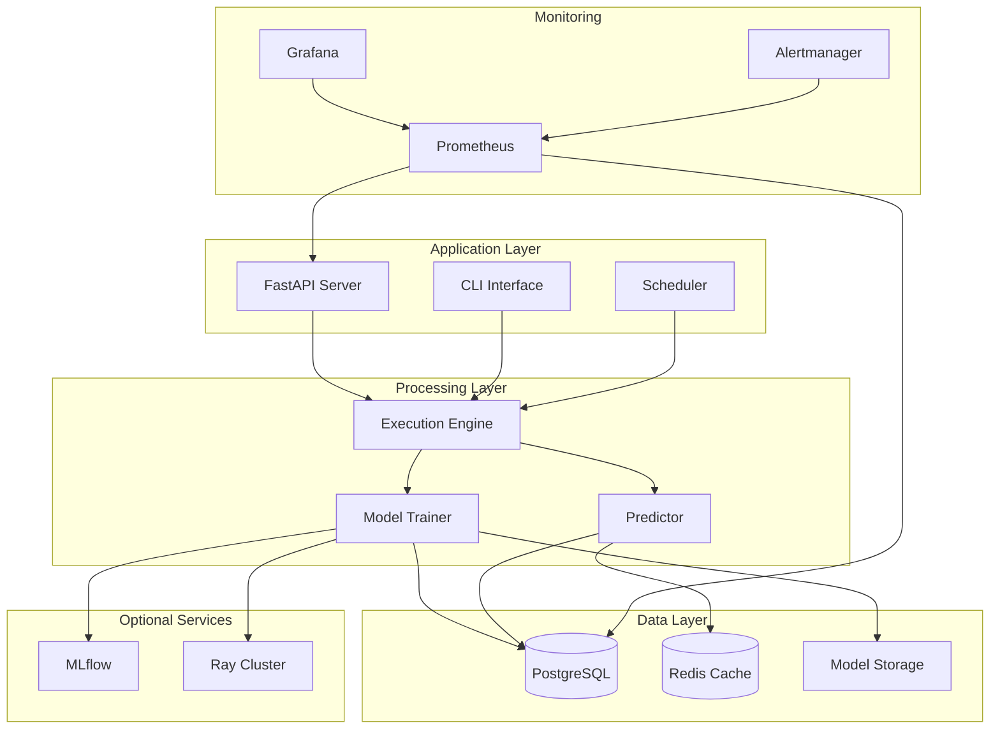
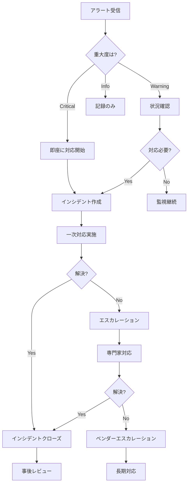
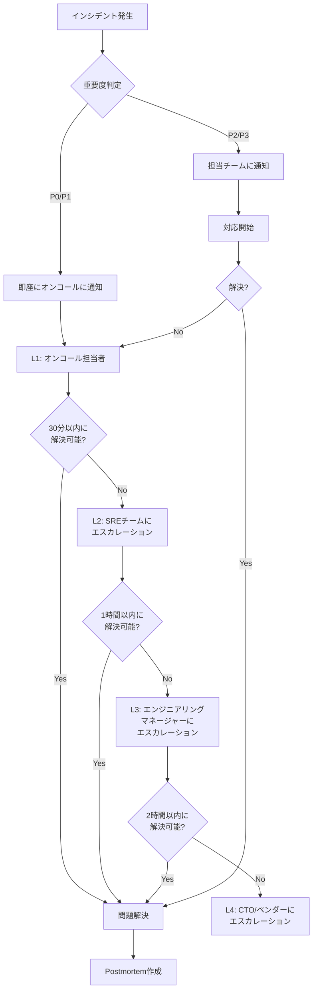
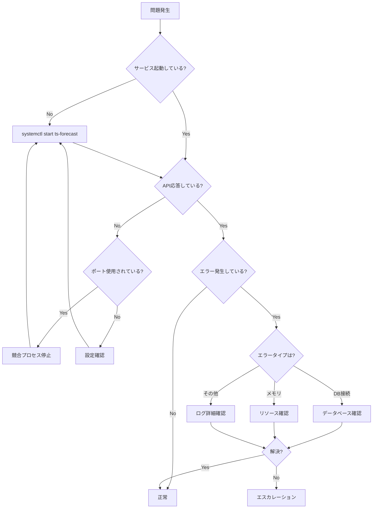

# 📖 11_OPERATIONS_RUNBOOK.md - 運用手順書

**Time Series Forecasting System - Operations Runbook**

---

## 📋 目次

1. [概要](#1-概要)
2. [システム概要](#2-システム概要)
3. [日常運用タスク](#3-日常運用タスク)
4. [システム監視](#4-システム監視)
5. [障害対応手順](#5-障害対応手順)
6. [パフォーマンスチューニング](#6-パフォーマンスチューニング)
7. [スケーリング手順](#7-スケーリング手順)
8. [メンテナンス作業](#8-メンテナンス作業)
9. [インシデント管理](#9-インシデント管理)
10. [エスカレーションパス](#10-エスカレーションパス)
11. [オンコール対応](#11-オンコール対応)
12. [ナレッジベース](#12-ナレッジベース)
13. [付録](#13-付録)

---

## 1. 概要

### 1.1 ドキュメントの目的

本運用手順書（Operations Runbook）は、時系列予測システムの日常運用、障害対応、メンテナンス作業の標準手順を提供します。

### 1.2 対象読者

- **運用担当者**: 日常のシステム監視・運用
- **オンコール担当者**: 障害対応・エスカレーション
- **SREエンジニア**: パフォーマンスチューニング・キャパシティ管理
- **マネージャー**: インシデント管理・レポート作成

### 1.3 関連ドキュメント

| ドキュメント | 説明 |
|------------|------|
| `10_DEPLOYMENT_GUIDE.md` | デプロイ手順 |
| `12_MONITORING_GUIDE.md` | 監視設定 |
| `02_NON_FUNCTIONAL_REQUIREMENTS.md` | 非機能要件・SLO |
| `09_TESTING_STRATEGY.md` | テスト戦略 |

---

## 2. システム概要

### 2.1 アーキテクチャ概要



---

### 2.2 主要コンポーネント

| コンポーネント | 役割 | 重要度 | ポート |
|--------------|------|--------|-------|
| **FastAPI Server** | Web API提供 | Critical | 8000 |
| **PostgreSQL** | データ永続化 | Critical | 5432 |
| **Model Storage** | モデルファイル保存 | High | - |
| **MLflow** | 実験トラッキング | Medium | 5000 |
| **Ray Cluster** | 分散実行 | Medium | 8265 |
| **Prometheus** | メトリクス収集 | High | 9090 |
| **Grafana** | ダッシュボード | High | 3000 |
| **Redis** | キャッシュ（将来） | Low | 6379 |

---

### 2.3 サービスレベル目標（SLO）

| 指標 | 目標値 | 測定期間 |
|-----|--------|---------|
| **月間稼働率** | ≥99.0% | 月次 |
| **API成功率** | ≥99.9% | 月次 |
| **予測レイテンシ（p95）** | <500ms | 日次 |
| **学習完了率** | ≥98% | 週次 |
| **MTTR** | <1時間 | インシデント毎 |

---

## 3. 日常運用タスク

### 3.1 デイリータスク

#### 3.1.1 朝の健全性チェック（9:00）

**チェックリスト**:

```bash
#!/bin/bash
# daily_health_check.sh

echo "=========================================="
echo "Daily Health Check - $(date)"
echo "=========================================="

# 1. サービス状態確認
echo -e "\n[1/8] Checking service status..."
systemctl status ts-forecast || docker compose ps

# 2. ディスク使用量確認
echo -e "\n[2/8] Checking disk usage..."
df -h | grep -E 'Filesystem|/data|/models|/logs'

# 3. データベース接続確認
echo -e "\n[3/8] Checking database connection..."
psql -h localhost -U postgres -d ts_forecast_system -c "SELECT 1;" > /dev/null 2>&1
if [ $? -eq 0 ]; then
    echo "✓ Database connection OK"
else
    echo "✗ Database connection FAILED"
fi

# 4. API健全性確認
echo -e "\n[4/8] Checking API health..."
curl -f http://localhost:8000/health > /dev/null 2>&1
if [ $? -eq 0 ]; then
    echo "✓ API health OK"
else
    echo "✗ API health FAILED"
fi

# 5. アクティブRun数確認
echo -e "\n[5/8] Checking active runs..."
ACTIVE_RUNS=$(psql -h localhost -U postgres -d ts_forecast_system -t -c \
    "SELECT COUNT(*) FROM runs WHERE status='running';")
echo "Active runs: ${ACTIVE_RUNS}"

# 6. 前日のエラー数確認
echo -e "\n[6/8] Checking yesterday's errors..."
ERROR_COUNT=$(psql -h localhost -U postgres -d ts_forecast_system -t -c \
    "SELECT COUNT(*) FROM system_logs WHERE log_level='ERROR' AND created_at > NOW() - INTERVAL '24 hours';")
echo "Errors in last 24h: ${ERROR_COUNT}"

# 7. メモリ使用量確認
echo -e "\n[7/8] Checking memory usage..."
free -h

# 8. 最新バックアップ確認
echo -e "\n[8/8] Checking latest backup..."
LATEST_BACKUP=$(ls -t /backup/postgres/full_*.dump.gz 2>/dev/null | head -n1)
if [ -n "${LATEST_BACKUP}" ]; then
    echo "✓ Latest backup: ${LATEST_BACKUP}"
    echo "  Age: $(find ${LATEST_BACKUP} -mtime -1 2>/dev/null && echo '<24h' || echo '>24h')"
else
    echo "✗ No backup found!"
fi

echo -e "\n=========================================="
echo "Health check completed"
echo "=========================================="
```

**実行**:
```bash
chmod +x /usr/local/bin/daily_health_check.sh
/usr/local/bin/daily_health_check.sh | tee /var/log/health_check_$(date +%Y%m%d).log
```

---

#### 3.1.2 ログ確認（随時）

**エラーログ確認**:

```bash
# 直近1時間のエラーログ
tail -n 100 /app/logs/app/error.log

# または PostgreSQLから
psql -h localhost -U postgres -d ts_forecast_system << EOF
SELECT 
    created_at,
    log_level,
    log_message,
    run_id
FROM system_logs
WHERE log_level IN ('ERROR', 'CRITICAL')
  AND created_at > NOW() - INTERVAL '1 hour'
ORDER BY created_at DESC
LIMIT 20;
EOF
```

**アプリケーションログ監視**:

```bash
# リアルタイム監視
tail -f /app/logs/app/app.log | grep -E 'ERROR|WARNING'

# Docker環境
docker compose logs -f app | grep -E 'ERROR|WARNING'
```

---

#### 3.1.3 実行状況確認（随時）

**アクティブRun確認**:

```sql
-- アクティブな実行状況
SELECT 
    r.run_id,
    r.run_name,
    r.status,
    r.start_time,
    NOW() - r.start_time AS duration,
    e.experiment_name
FROM runs r
JOIN experiments e ON r.experiment_id = e.experiment_id
WHERE r.status = 'running'
ORDER BY r.start_time;
```

**キュー状況確認**:

```sql
-- スケジュール済みだが未実行のRun
SELECT 
    COUNT(*) as queued_runs,
    MIN(created_at) as oldest_queued
FROM runs
WHERE status = 'scheduled';
```

---

### 3.2 ウィークリータスク

#### 3.2.1 週次メンテナンス（日曜日 2:00）

```bash
#!/bin/bash
# weekly_maintenance.sh

set -e

echo "[$(date)] Starting weekly maintenance"

# 1. データベースVACUUM
echo "[$(date)] Running VACUUM ANALYZE..."
psql -h localhost -U postgres -d ts_forecast_system -c "VACUUM ANALYZE;"

# 2. 未使用インデックス確認
echo "[$(date)] Checking unused indexes..."
psql -h localhost -U postgres -d ts_forecast_system << EOF
SELECT
    schemaname,
    tablename,
    indexname,
    idx_scan,
    pg_size_pretty(pg_relation_size(indexrelid)) AS index_size
FROM pg_stat_user_indexes
WHERE schemaname = 'public'
  AND idx_scan = 0
  AND pg_relation_size(indexrelid) > 10485760  -- 10MB以上
ORDER BY pg_relation_size(indexrelid) DESC;
EOF

# 3. テーブルブロート確認
echo "[$(date)] Checking table bloat..."
psql -h localhost -U postgres -d ts_forecast_system << EOF
SELECT
    schemaname,
    tablename,
    pg_size_pretty(pg_total_relation_size(schemaname||'.'||tablename)) AS size,
    n_live_tup AS live_rows,
    n_dead_tup AS dead_rows,
    ROUND(n_dead_tup * 100.0 / NULLIF(n_live_tup + n_dead_tup, 0), 2) AS dead_ratio
FROM pg_stat_user_tables
WHERE schemaname = 'public'
  AND n_dead_tup > 1000
ORDER BY n_dead_tup DESC
LIMIT 10;
EOF

# 4. 長期間実行中のRun確認
echo "[$(date)] Checking long-running jobs..."
psql -h localhost -U postgres -d ts_forecast_system << EOF
SELECT 
    run_id,
    run_name,
    status,
    start_time,
    NOW() - start_time AS duration
FROM runs
WHERE status = 'running'
  AND start_time < NOW() - INTERVAL '24 hours'
ORDER BY start_time;
EOF

# 5. 古いログのアーカイブ（90日以上前）
echo "[$(date)] Archiving old logs..."
psql -h localhost -U postgres -d ts_forecast_system << EOF
DELETE FROM system_logs
WHERE created_at < NOW() - INTERVAL '90 days';
EOF

# 6. Materialized View更新
echo "[$(date)] Refreshing materialized views..."
psql -h localhost -U postgres -d ts_forecast_system << EOF
REFRESH MATERIALIZED VIEW CONCURRENTLY mv_experiment_summary;
REFRESH MATERIALIZED VIEW CONCURRENTLY mv_model_performance;
EOF

echo "[$(date)] Weekly maintenance completed"
```

**cron設定**:

```bash
# crontab -e
0 2 * * 0 /usr/local/bin/weekly_maintenance.sh >> /var/log/weekly_maintenance.log 2>&1
```

---

#### 3.2.2 パフォーマンスレポート作成（金曜日）

```bash
#!/bin/bash
# weekly_performance_report.sh

REPORT_FILE="/var/log/reports/performance_report_$(date +%Y%m%d).txt"
mkdir -p /var/log/reports

cat > "${REPORT_FILE}" << 'EOF'
========================================
Weekly Performance Report
========================================
Report Date: $(date)

## 1. System Performance

### CPU Usage
$(top -bn1 | grep "Cpu(s)" | sed "s/.*, *\([0-9.]*\)%* id.*/\1/" | awk '{print 100 - $1"%"}')

### Memory Usage
$(free -h | grep Mem | awk '{print "Used: "$3" / Total: "$2" ("$3/$2*100"%)"}')

### Disk Usage
$(df -h | grep -E '/data|/models|/logs')

## 2. Database Performance

### Database Size
$(psql -h localhost -U postgres -d ts_forecast_system -t -c "SELECT pg_size_pretty(pg_database_size('ts_forecast_system'));")

### Top 10 Slowest Queries (Last 7 days)
$(psql -h localhost -U postgres -d ts_forecast_system -c "
SELECT 
    query,
    calls,
    mean_exec_time,
    max_exec_time
FROM pg_stat_statements
WHERE query NOT LIKE '%pg_%'
ORDER BY mean_exec_time DESC
LIMIT 10;
")

## 3. Application Performance

### Runs Summary (Last 7 days)
$(psql -h localhost -U postgres -d ts_forecast_system -c "
SELECT 
    status,
    COUNT(*) as count,
    ROUND(AVG(execution_duration_seconds), 2) as avg_duration_sec
FROM runs
WHERE start_time > NOW() - INTERVAL '7 days'
GROUP BY status;
")

### Average Training Time by Model (Last 7 days)
$(psql -h localhost -U postgres -d ts_forecast_system -c "
SELECT 
    m.model_name,
    COUNT(*) as runs,
    ROUND(AVG(m.training_duration_seconds), 2) as avg_training_sec,
    ROUND(AVG(m.model_size_bytes / 1048576.0), 2) as avg_size_mb
FROM models m
JOIN runs r ON m.run_id = r.run_id
WHERE r.start_time > NOW() - INTERVAL '7 days'
GROUP BY m.model_name
ORDER BY avg_training_sec DESC;
")

## 4. Error Summary

### Error Count by Level (Last 7 days)
$(psql -h localhost -U postgres -d ts_forecast_system -c "
SELECT 
    log_level,
    COUNT(*) as count
FROM system_logs
WHERE created_at > NOW() - INTERVAL '7 days'
  AND log_level IN ('ERROR', 'CRITICAL')
GROUP BY log_level
ORDER BY log_level;
")

========================================
End of Report
========================================
EOF

# レポート送信（オプション）
# mail -s "Weekly Performance Report" ops@example.com < "${REPORT_FILE}"

echo "Report generated: ${REPORT_FILE}"
```

---

### 3.3 マンスリータスク

#### 3.3.1 月次レビュー（毎月1日）

**キャパシティレビュー**:

```sql
-- 月次データ増加量
SELECT 
    DATE_TRUNC('month', created_at) AS month,
    COUNT(*) as runs_created,
    SUM(CASE WHEN status = 'completed' THEN 1 ELSE 0 END) as completed,
    SUM(CASE WHEN status = 'failed' THEN 1 ELSE 0 END) as failed,
    ROUND(AVG(execution_duration_seconds / 60.0), 2) as avg_duration_min
FROM runs
WHERE created_at > NOW() - INTERVAL '6 months'
GROUP BY DATE_TRUNC('month', created_at)
ORDER BY month DESC;

-- データベースサイズトレンド
SELECT 
    pg_size_pretty(pg_database_size('ts_forecast_system')) as current_size;

-- モデルストレージ使用量
SELECT 
    SUM(model_size_bytes) / 1073741824.0 as total_models_gb
FROM models;
```

---

#### 3.3.2 セキュリティレビュー

```bash
#!/bin/bash
# monthly_security_review.sh

echo "=========================================="
echo "Monthly Security Review - $(date)"
echo "=========================================="

# 1. パッケージ脆弱性スキャン
echo -e "\n[1/5] Running security scan..."
pip-audit --desc

# 2. 不審なログイン試行確認
echo -e "\n[2/5] Checking failed login attempts..."
psql -h localhost -U postgres -d ts_forecast_system << EOF
SELECT 
    DATE(created_at) as date,
    COUNT(*) as failed_logins
FROM system_logs
WHERE log_message LIKE '%authentication failed%'
  AND created_at > NOW() - INTERVAL '30 days'
GROUP BY DATE(created_at)
ORDER BY date DESC;
EOF

# 3. 環境変数確認
echo -e "\n[3/5] Checking for secrets in environment..."
env | grep -i 'password\|secret\|key' | sed 's/=.*/=***REDACTED***/'

# 4. ファイル権限確認
echo -e "\n[4/5] Checking file permissions..."
find /app -type f -perm /go+w -ls | head -10

# 5. 証明書有効期限確認
echo -e "\n[5/5] Checking SSL certificate expiry..."
echo | openssl s_client -servername ts-forecast.example.com \
    -connect ts-forecast.example.com:443 2>/dev/null | \
    openssl x509 -noout -dates

echo -e "\n=========================================="
echo "Security review completed"
echo "=========================================="
```

---

#### 3.3.3 古いデータのアーカイブ

```bash
#!/bin/bash
# monthly_archive.sh

set -e

ARCHIVE_DIR="/archive/$(date +%Y%m)"
mkdir -p "${ARCHIVE_DIR}"

echo "[$(date)] Starting monthly archive..."

# 1. 6ヶ月以上前の完了Runをアーカイブ
psql -h localhost -U postgres -d ts_forecast_system << EOF
COPY (
    SELECT * FROM runs
    WHERE status IN ('completed', 'failed')
      AND end_time < NOW() - INTERVAL '6 months'
) TO '${ARCHIVE_DIR}/runs_archive.csv' WITH CSV HEADER;

-- アーカイブ後削除
DELETE FROM runs
WHERE status IN ('completed', 'failed')
  AND end_time < NOW() - INTERVAL '6 months';
EOF

# 2. アーカイブファイルを圧縮
gzip "${ARCHIVE_DIR}/runs_archive.csv"

# 3. S3へアップロード（オプション）
# aws s3 cp "${ARCHIVE_DIR}/runs_archive.csv.gz" \
#     "s3://ts-forecast-archive/$(date +%Y/%m)/"

echo "[$(date)] Monthly archive completed"
```

---

## 4. システム監視

### 4.1 監視ダッシュボード

#### 4.1.1 Grafanaダッシュボード

**アクセス**: https://grafana.example.com/d/ts-forecast

**主要パネル**:

1. **System Overview**
   - CPU使用率
   - メモリ使用率
   - ディスク使用率
   - ネットワークI/O

2. **Application Metrics**
   - アクティブRun数
   - 実行完了率
   - 平均実行時間
   - エラー率

3. **Database Metrics**
   - 接続数
   - クエリレイテンシ
   - トランザクション率
   - キャッシュヒット率

4. **Performance Metrics**
   - API応答時間（p50/p95/p99）
   - 学習時間分布
   - 予測レイテンシ
   - スループット

---

#### 4.1.2 主要メトリクス

| メトリクス | 正常範囲 | 警告閾値 | 重大閾値 |
|----------|---------|---------|---------|
| **CPU使用率** | <70% | >80% | >95% |
| **メモリ使用率** | <75% | >85% | >95% |
| **ディスク使用率** | <80% | >85% | >95% |
| **API応答時間（p95）** | <500ms | >1s | >2s |
| **エラー率** | <1% | >5% | >10% |
| **アクティブRun数** | <50 | >80 | >100 |
| **DB接続数** | <100 | >150 | >180 |

---

### 4.2 アラート設定

#### 4.2.1 Critical アラート

**システムダウン**:

```yaml
# alertmanager/alerts/critical.yml

groups:
  - name: critical_alerts
    interval: 30s
    rules:
      - alert: ServiceDown
        expr: up{job="ts-forecast-app"} == 0
        for: 2m
        labels:
          severity: critical
        annotations:
          summary: "Service {{ $labels.instance }} is down"
          description: "{{ $labels.job }} on {{ $labels.instance }} has been down for more than 2 minutes."
      
      - alert: DatabaseDown
        expr: up{job="postgres"} == 0
        for: 1m
        labels:
          severity: critical
        annotations:
          summary: "Database is down"
          description: "PostgreSQL database is unreachable."
      
      - alert: HighErrorRate
        expr: rate(http_requests_total{status=~"5.."}[5m]) > 0.1
        for: 5m
        labels:
          severity: critical
        annotations:
          summary: "High error rate detected"
          description: "Error rate is {{ $value | humanizePercentage }} over the last 5 minutes."
```

---

#### 4.2.2 Warning アラート

```yaml
groups:
  - name: warning_alerts
    interval: 1m
    rules:
      - alert: HighMemoryUsage
        expr: (node_memory_MemTotal_bytes - node_memory_MemAvailable_bytes) / node_memory_MemTotal_bytes > 0.85
        for: 10m
        labels:
          severity: warning
        annotations:
          summary: "High memory usage"
          description: "Memory usage is above 85% for more than 10 minutes."
      
      - alert: HighDiskUsage
        expr: (node_filesystem_size_bytes - node_filesystem_avail_bytes) / node_filesystem_size_bytes > 0.85
        for: 5m
        labels:
          severity: warning
        annotations:
          summary: "High disk usage"
          description: "Disk usage on {{ $labels.device }} is above 85%."
      
      - alert: LongRunningJob
        expr: time() - ts_forecast_run_start_time > 7200
        labels:
          severity: warning
        annotations:
          summary: "Long running job detected"
          description: "Run {{ $labels.run_id }} has been running for more than 2 hours."
      
      - alert: QueueBacklog
        expr: ts_forecast_queued_runs > 50
        for: 15m
        labels:
          severity: warning
        annotations:
          summary: "Job queue backlog"
          description: "There are {{ $value }} jobs waiting in the queue."
```

---

### 4.3 ログ分析

#### 4.3.1 エラーパターン検出

```bash
#!/bin/bash
# analyze_errors.sh

# 直近24時間のエラーパターン
psql -h localhost -U postgres -d ts_forecast_system << EOF
SELECT 
    exception_type,
    COUNT(*) as occurrences,
    array_agg(DISTINCT log_message ORDER BY log_message) as sample_messages
FROM system_logs
WHERE log_level = 'ERROR'
  AND created_at > NOW() - INTERVAL '24 hours'
GROUP BY exception_type
ORDER BY occurrences DESC
LIMIT 10;
EOF
```

---

#### 4.3.2 パフォーマンスログ分析

```sql
-- 遅いRun TOP 10
SELECT 
    r.run_id,
    r.run_name,
    r.execution_duration_seconds / 60.0 as duration_minutes,
    m.model_name,
    r.start_time
FROM runs r
LEFT JOIN models m ON r.run_id = m.run_id
WHERE r.status = 'completed'
  AND r.start_time > NOW() - INTERVAL '7 days'
ORDER BY r.execution_duration_seconds DESC
LIMIT 10;

-- モデル別平均実行時間
SELECT 
    m.model_name,
    COUNT(*) as runs,
    ROUND(AVG(m.training_duration_seconds / 60.0), 2) as avg_training_min,
    ROUND(MIN(m.training_duration_seconds / 60.0), 2) as min_training_min,
    ROUND(MAX(m.training_duration_seconds / 60.0), 2) as max_training_min
FROM models m
JOIN runs r ON m.run_id = r.run_id
WHERE r.start_time > NOW() - INTERVAL '30 days'
  AND r.status = 'completed'
GROUP BY m.model_name
ORDER BY avg_training_min DESC;
```

---

## 5. 障害対応手順

### 5.1 障害対応フロー



---

### 5.2 一般的な障害パターン

#### 5.2.1 サービスが起動しない

**症状**:
```
systemctl status ts-forecast
● ts-forecast.service - Time Series Forecasting Service
   Loaded: loaded
   Active: failed (Result: exit-code)
```

**診断手順**:

```bash
# 1. ログ確認
journalctl -u ts-forecast -n 50 --no-pager

# 2. 設定ファイル確認
python -m nf_auto_runner.app.main --check-config

# 3. 依存サービス確認
systemctl status postgresql
docker ps | grep postgres

# 4. ポート競合確認
lsof -i :8000
```

**対応手順**:

```bash
# Case 1: データベース接続エラー
# → PostgreSQL起動確認
systemctl start postgresql

# Case 2: ポート競合
# → 競合プロセス停止
kill -9 <PID>

# Case 3: 設定エラー
# → 設定ファイル修正
vi /app/conf/config.yaml

# サービス再起動
systemctl restart ts-forecast

# 確認
systemctl status ts-forecast
curl http://localhost:8000/health
```

---

#### 5.2.2 データベース接続エラー

**症状**:
```
sqlalchemy.exc.OperationalError: could not connect to server
```

**診断手順**:

```bash
# 1. PostgreSQL稼働確認
systemctl status postgresql
docker ps | grep postgres

# 2. 接続テスト
psql -h localhost -U postgres -d ts_forecast_system -c "SELECT 1;"

# 3. 接続数確認
psql -h localhost -U postgres -d ts_forecast_system -c "
SELECT 
    count(*),
    state
FROM pg_stat_activity
GROUP BY state;
"

# 4. ロック確認
psql -h localhost -U postgres -d ts_forecast_system -c "
SELECT 
    pid,
    state,
    wait_event_type,
    wait_event,
    query
FROM pg_stat_activity
WHERE wait_event IS NOT NULL;
"
```

**対応手順**:

```bash
# Case 1: PostgreSQL停止
systemctl start postgresql

# Case 2: 接続プール枯渇
# アイドル接続を強制終了
psql -h localhost -U postgres -d ts_forecast_system -c "
SELECT pg_terminate_backend(pid)
FROM pg_stat_activity
WHERE state = 'idle'
  AND state_change < NOW() - INTERVAL '1 hour';
"

# Case 3: ロック競合
# ブロッキングクエリを特定して終了
psql -h localhost -U postgres -d ts_forecast_system -c "
SELECT pg_terminate_backend(<blocking_pid>);
"

# 確認
curl http://localhost:8000/health
```

---

#### 5.2.3 メモリ不足

**症状**:
```
RuntimeError: CUDA out of memory
MemoryError: Unable to allocate array
```

**診断手順**:

```bash
# 1. メモリ使用状況
free -h
htop

# 2. GPU メモリ（GPU使用時）
nvidia-smi

# 3. プロセスメモリ使用量
ps aux --sort=-%mem | head -20

# 4. アクティブRun数
psql -h localhost -U postgres -d ts_forecast_system -c "
SELECT COUNT(*) FROM runs WHERE status='running';
"
```

**対応手順**:

```bash
# Case 1: メモリリーク疑い
# → サービス再起動
systemctl restart ts-forecast

# Case 2: 並列実行数過多
# → 実行中Runの一部を停止
psql -h localhost -U postgres -d ts_forecast_system -c "
UPDATE runs 
SET status='cancelled', 
    end_time=NOW() 
WHERE status='running' 
  AND run_id IN (
    SELECT run_id FROM runs WHERE status='running' ORDER BY start_time DESC LIMIT 5
  );
"

# Case 3: GPU メモリ不足
# → GPU メモリクリア
python << EOF
import torch
torch.cuda.empty_cache()
EOF

# 環境変数調整
export GPU_MEMORY_LIMIT=0.7
export MAX_PARALLEL_RUNS=2

systemctl restart ts-forecast
```

---

#### 5.2.4 ディスク容量不足

**症状**:
```
OSError: [Errno 28] No space left on device
```

**診断手順**:

```bash
# 1. ディスク使用状況
df -h

# 2. 大きなファイル特定
du -h --max-depth=2 /app | sort -hr | head -20

# 3. ログサイズ確認
du -sh /app/logs/*

# 4. モデルサイズ確認
du -sh /app/models/*
```

**対応手順**:

```bash
# Case 1: ログファイル肥大化
# → 古いログ削除
find /app/logs -name "*.log" -mtime +30 -delete
find /app/logs -name "*.log.*" -mtime +7 -delete

# Case 2: モデルファイル蓄積
# → 古いモデル削除
find /app/models -name "*.pth" -mtime +90 -delete

# Case 3: データベース肥大化
# → VACUUM実行
psql -h localhost -U postgres -d ts_forecast_system -c "VACUUM FULL;"

# Case 4: 緊急対応
# → tmpファイル削除
find /tmp -type f -atime +7 -delete

# 確認
df -h
```

---

#### 5.2.5 API応答遅延

**症状**:
```
API response time p95 > 2s
```

**診断手順**:

```bash
# 1. CPU/メモリ確認
top
htop

# 2. アクティブ接続数
curl http://localhost:8000/metrics | grep http_requests_in_progress

# 3. データベース遅延
psql -h localhost -U postgres -d ts_forecast_system -c "
SELECT 
    query,
    state,
    NOW() - query_start AS duration
FROM pg_stat_activity
WHERE state != 'idle'
ORDER BY duration DESC
LIMIT 10;
"

# 4. ネットワークレイテンシ
ping -c 10 <database_host>
```

**対応手順**:

```bash
# Case 1: データベーススロークエリ
# → EXPLAIN ANALYZEで分析
psql -h localhost -U postgres -d ts_forecast_system -c "
EXPLAIN ANALYZE <slow_query>;
"

# インデックス追加検討
psql -h localhost -U postgres -d ts_forecast_system -c "
CREATE INDEX CONCURRENTLY idx_<table>_<column> ON <table>(<column>);
"

# Case 2: CPU高負荷
# → ワーカー数削減
export MAX_PARALLEL_RUNS=2
systemctl restart ts-forecast

# Case 3: キャッシュミス
# → データベース統計更新
psql -h localhost -U postgres -d ts_forecast_system -c "ANALYZE;"

# 確認
curl -w "@curl-format.txt" -o /dev/null -s http://localhost:8000/health
```

---

### 5.3 障害復旧手順

#### 5.3.1 サービス再起動手順

```bash
#!/bin/bash
# service_restart.sh

set -e

echo "[$(date)] Starting service restart procedure..."

# 1. 現在の状態確認
echo "[$(date)] Checking current status..."
systemctl status ts-forecast || true

# 2. グレースフル停止（30秒タイムアウト）
echo "[$(date)] Stopping service gracefully..."
systemctl stop ts-forecast || true
sleep 5

# 3. プロセス強制終了（必要な場合）
if pgrep -f "nf_auto_runner" > /dev/null; then
    echo "[$(date)] Force killing remaining processes..."
    pkill -9 -f "nf_auto_runner"
    sleep 2
fi

# 4. クリーンアップ
echo "[$(date)] Cleaning up..."
rm -f /var/run/ts-forecast.pid
rm -f /tmp/ts-forecast-*.sock

# 5. サービス起動
echo "[$(date)] Starting service..."
systemctl start ts-forecast

# 6. 起動確認
echo "[$(date)] Waiting for service to be ready..."
for i in {1..30}; do
    if curl -f http://localhost:8000/health > /dev/null 2>&1; then
        echo "[$(date)] Service is healthy"
        exit 0
    fi
    echo "Attempt $i/30..."
    sleep 2
done

echo "[$(date)] ERROR: Service failed to start"
systemctl status ts-forecast
exit 1
```

---

#### 5.3.2 データベース復旧手順

```bash
#!/bin/bash
# database_recovery.sh

set -e

echo "[$(date)] Starting database recovery..."

# 1. バックアップファイル確認
LATEST_BACKUP=$(ls -t /backup/postgres/full_*.dump.gz | head -n1)
if [ -z "${LATEST_BACKUP}" ]; then
    echo "ERROR: No backup found"
    exit 1
fi

echo "[$(date)] Using backup: ${LATEST_BACKUP}"

# 2. 現在のDBバックアップ（念のため）
echo "[$(date)] Creating safety backup..."
pg_dump -h localhost -U postgres -d ts_forecast_system \
    -Fc -f /tmp/safety_backup_$(date +%Y%m%d_%H%M%S).dump

# 3. アプリケーション停止
echo "[$(date)] Stopping application..."
systemctl stop ts-forecast

# 4. データベース削除・再作成
echo "[$(date)] Dropping and recreating database..."
psql -h localhost -U postgres << EOF
SELECT pg_terminate_backend(pid)
FROM pg_stat_activity
WHERE datname = 'ts_forecast_system'
  AND pid != pg_backend_pid();

DROP DATABASE IF EXISTS ts_forecast_system;
CREATE DATABASE ts_forecast_system;
EOF

# 5. リストア
echo "[$(date)] Restoring database..."
gunzip -c "${LATEST_BACKUP}" | \
    pg_restore -h localhost -U postgres -d ts_forecast_system -Fc

# 6. 統計情報更新
echo "[$(date)] Analyzing database..."
psql -h localhost -U postgres -d ts_forecast_system -c "ANALYZE;"

# 7. アプリケーション起動
echo "[$(date)] Starting application..."
systemctl start ts-forecast

# 8. 確認
echo "[$(date)] Verifying recovery..."
sleep 10
curl -f http://localhost:8000/health

echo "[$(date)] Database recovery completed successfully"
```

---

## 6. パフォーマンスチューニング

### 6.1 データベースチューニング

#### 6.1.1 スロークエリ最適化

```sql
-- 1. スロークエリ特定
SELECT 
    query,
    calls,
    total_exec_time,
    mean_exec_time,
    max_exec_time
FROM pg_stat_statements
WHERE query NOT LIKE '%pg_%'
ORDER BY mean_exec_time DESC
LIMIT 20;

-- 2. EXPLAIN ANALYZEで分析
EXPLAIN (ANALYZE, BUFFERS) 
SELECT * FROM runs WHERE status = 'running';

-- 3. インデックス候補確認
SELECT 
    schemaname,
    tablename,
    attname,
    n_distinct,
    correlation
FROM pg_stats
WHERE schemaname = 'public'
  AND tablename = 'runs'
ORDER BY n_distinct DESC;

-- 4. インデックス作成（CONCURRENTLY）
CREATE INDEX CONCURRENTLY idx_runs_status_start_time 
    ON runs(status, start_time DESC);
```

---

#### 6.1.2 接続プール設定最適化

```python
# src/nf_auto_runner/db/connection.py

from sqlalchemy import create_engine
from sqlalchemy.pool import QueuePool
import os

# 最適な設定
engine = create_engine(
    os.getenv('DATABASE_URL'),
    poolclass=QueuePool,
    pool_size=20,              # 基本接続数: CPU数 * 2
    max_overflow=40,           # 追加接続数: pool_size * 2
    pool_timeout=30,           # タイムアウト: 30秒
    pool_recycle=3600,         # 接続再利用: 1時間
    pool_pre_ping=True,        # 接続チェック有効化
    echo=False
)
```

---

### 6.2 アプリケーションチューニング

#### 6.2.1 並列実行数の調整

```bash
# CPU bound処理
export MAX_PARALLEL_RUNS=$(nproc)  # CPU数

# GPU bound処理
export MAX_PARALLEL_RUNS=2  # GPU数 * 1-2

# メモリ bound処理
TOTAL_MEM_GB=$(free -g | awk '/^Mem:/{print $2}')
AVG_MEM_PER_RUN_GB=4
export MAX_PARALLEL_RUNS=$((TOTAL_MEM_GB / AVG_MEM_PER_RUN_GB))

echo "Optimal MAX_PARALLEL_RUNS: ${MAX_PARALLEL_RUNS}"
```

---

#### 6.2.2 キャッシング戦略

```python
# 設定ファイルキャッシング
from functools import lru_cache
from pathlib import Path
import yaml

@lru_cache(maxsize=1)
def load_config(config_path: Path) -> dict:
    """設定ファイルをキャッシュして読み込み"""
    with open(config_path) as f:
        return yaml.safe_load(f)

# データキャッシング（Redis使用例）
import redis
import pickle

cache = redis.Redis(host='localhost', port=6379, db=0)

def get_or_compute(key: str, compute_fn, ttl: int = 3600):
    """キャッシュから取得、なければ計算"""
    cached = cache.get(key)
    if cached:
        return pickle.loads(cached)
    
    result = compute_fn()
    cache.setex(key, ttl, pickle.dumps(result))
    return result
```

---

### 6.3 システムレベルチューニング

#### 6.3.1 カーネルパラメータ調整

```bash
# /etc/sysctl.conf

# ネットワーク性能向上
net.core.somaxconn = 1024
net.core.netdev_max_backlog = 5000
net.ipv4.tcp_max_syn_backlog = 2048
net.ipv4.tcp_fin_timeout = 30

# ファイルディスクリプタ
fs.file-max = 2097152

# 共有メモリ（PostgreSQL用）
kernel.shmmax = 17179869184  # 16GB
kernel.shmall = 4194304

# 適用
sudo sysctl -p
```

---

#### 6.3.2 ulimit設定

```bash
# /etc/security/limits.conf

# ファイルディスクリプタ
*  soft  nofile  65536
*  hard  nofile  65536

# プロセス数
*  soft  nproc   32768
*  hard  nproc   32768

# コアダンプサイズ
*  soft  core    0
*  hard  core    0
```

---

## 7. スケーリング手順

### 7.1 垂直スケーリング（Scale Up）

#### 7.1.1 リソース追加手順

```bash
#!/bin/bash
# scale_up.sh

# 1. 現在のリソース確認
echo "Current resources:"
echo "CPU: $(nproc) cores"
echo "Memory: $(free -h | awk '/^Mem:/{print $2}')"
echo "Disk: $(df -h / | awk 'NR==2{print $2}')"

# 2. サービス停止
echo "Stopping service..."
systemctl stop ts-forecast

# 3. リソース調整（例：メモリ）
# → クラウドコンソールでインスタンスタイプ変更

# 4. 設定更新
# PostgreSQL設定更新
NEW_MEM_GB=$(free -g | awk '/^Mem:/{print $2}')
SHARED_BUFFERS=$((NEW_MEM_GB * 1024 / 4))  # メモリの25%

sudo tee -a /etc/postgresql/14/main/postgresql.conf << EOF
shared_buffers = ${SHARED_BUFFERS}MB
effective_cache_size = $((SHARED_BUFFERS * 3))MB
EOF

# アプリケーション設定更新
export MAX_PARALLEL_RUNS=$(nproc)

# 5. サービス起動
echo "Starting services..."
systemctl restart postgresql
systemctl start ts-forecast

# 6. 確認
echo "Verifying..."
curl -f http://localhost:8000/health
```

---

### 7.2 水平スケーリング（Scale Out）

#### 7.2.1 ワーカーノード追加

```bash
#!/bin/bash
# add_worker_node.sh

# 1. 新ノードの準備
NEW_NODE=$1
if [ -z "${NEW_NODE}" ]; then
    echo "Usage: $0 <new_node_hostname>"
    exit 1
fi

# 2. ソフトウェアインストール
ssh ${NEW_NODE} << 'EOF'
# Python環境セットアップ
sudo apt update
sudo apt install -y python3.11 python3.11-venv

# アプリケーションデプロイ
git clone https://github.com/your-org/ts-forecast.git
cd ts-forecast
python3.11 -m venv .venv
source .venv/bin/activate
pip install -r requirements.txt
EOF

# 3. 設定ファイル転送
scp /app/.env ${NEW_NODE}:/app/.env
scp /app/conf/config.yaml ${NEW_NODE}:/app/conf/config.yaml

# 4. ワーカーモード起動
ssh ${NEW_NODE} << 'EOF'
cd ts-forecast
source .venv/bin/activate

# Rayワーカーとして起動
ray start --address='ray-head:6379' \
    --num-cpus=$(nproc) \
    --num-gpus=$(nvidia-smi --list-gpus | wc -l)
EOF

# 5. 確認
ray status
```

---

#### 7.2.2 ロードバランサー設定

```nginx
# /etc/nginx/conf.d/ts-forecast.conf

upstream ts_forecast_backend {
    least_conn;  # 最小接続数方式
    
    server app1.example.com:8000 max_fails=3 fail_timeout=30s;
    server app2.example.com:8000 max_fails=3 fail_timeout=30s;
    server app3.example.com:8000 max_fails=3 fail_timeout=30s;
    
    keepalive 32;
}

server {
    listen 80;
    server_name ts-forecast.example.com;
    
    location / {
        proxy_pass http://ts_forecast_backend;
        proxy_http_version 1.1;
        proxy_set_header Connection "";
        proxy_set_header Host $host;
        proxy_set_header X-Real-IP $remote_addr;
        proxy_set_header X-Forwarded-For $proxy_add_x_forwarded_for;
        proxy_set_header X-Forwarded-Proto $scheme;
        
        # タイムアウト設定
        proxy_connect_timeout 60s;
        proxy_send_timeout 60s;
        proxy_read_timeout 60s;
    }
    
    location /health {
        access_log off;
        proxy_pass http://ts_forecast_backend/health;
    }
}
```

---

### 7.3 データベーススケーリング

#### 7.3.1 Read Replica追加

```bash
#!/bin/bash
# add_read_replica.sh

REPLICA_HOST=$1
MASTER_HOST="localhost"

# 1. マスターでベースバックアップ
ssh ${MASTER_HOST} << 'EOF'
# WALアーカイブ有効化
psql -U postgres -c "ALTER SYSTEM SET wal_level = replica;"
psql -U postgres -c "ALTER SYSTEM SET archive_mode = on;"
psql -U postgres -c "ALTER SYSTEM SET max_wal_senders = 10;"
systemctl restart postgresql

# レプリケーションユーザー作成
psql -U postgres << EOSQL
CREATE USER replicator WITH REPLICATION ENCRYPTED PASSWORD 'repl_password';
EOSQL

# ベースバックアップ
pg_basebackup -h localhost -U replicator \
    -D /tmp/replica_backup \
    -Fp -Xs -P -R
EOSQL
EOF

# 2. レプリカノードにバックアップ転送
rsync -av ${MASTER_HOST}:/tmp/replica_backup/ ${REPLICA_HOST}:/var/lib/postgresql/14/main/

# 3. レプリカ起動
ssh ${REPLICA_HOST} << 'EOF'
chown -R postgres:postgres /var/lib/postgresql/14/main
systemctl start postgresql
EOF

# 4. レプリケーション確認
psql -h ${MASTER_HOST} -U postgres -c "SELECT * FROM pg_stat_replication;"
```

---

## 8. メンテナンス作業

### 8.1 計画メンテナンス

#### 8.1.1 メンテナンス計画テンプレート

```markdown
# メンテナンス計画書

## 基本情報
- **日時**: 2025-11-10 02:00-06:00 JST
- **担当者**: SRE Team
- **影響範囲**: 全サービス停止
- **通知**: 1週間前、3日前、1日前

## 作業内容
1. データベースメジャーアップグレード（PostgreSQL 14 → 15）
2. OSセキュリティパッチ適用
3. ストレージ拡張

## 作業手順
### 事前準備
- [ ] フルバックアップ取得
- [ ] ロールバック手順確認
- [ ] 通知送信

### 作業実施
- [ ] サービス停止
- [ ] データベースアップグレード
- [ ] OSパッチ適用
- [ ] サービス起動

### 事後確認
- [ ] ヘルスチェック
- [ ] パフォーマンステスト
- [ ] ユーザー通知

## ロールバックプラン
障害発生時は即座にバックアップからリストア

## リスク評価
- **発生確率**: Low
- **影響度**: High
- **対策**: 事前テスト環境で検証済み
```

---

#### 8.1.2 メンテナンスモード切り替え

```python
# scripts/maintenance_mode.py

import sys
from pathlib import Path

def enable_maintenance_mode():
    """メンテナンスモードを有効化"""
    maintenance_file = Path("/app/.maintenance")
    maintenance_file.touch()
    
    # NGINX設定更新
    nginx_conf = """
    server {
        listen 80 default_server;
        return 503;
        
        location / {
            return 503 "Service under maintenance. We'll be back soon.";
            add_header Content-Type text/plain;
        }
    }
    """
    
    with open("/etc/nginx/sites-available/maintenance", "w") as f:
        f.write(nginx_conf)
    
    # NGINX再読み込み
    import subprocess
    subprocess.run(["sudo", "nginx", "-s", "reload"])
    
    print("Maintenance mode enabled")


def disable_maintenance_mode():
    """メンテナンスモード無効化"""
    maintenance_file = Path("/app/.maintenance")
    maintenance_file.unlink(missing_ok=True)
    
    # NGINX設定を戻す
    import subprocess
    subprocess.run(["sudo", "nginx", "-s", "reload"])
    
    print("Maintenance mode disabled")


if __name__ == "__main__":
    if len(sys.argv) != 2 or sys.argv[1] not in ["on", "off"]:
        print("Usage: python maintenance_mode.py <on|off>")
        sys.exit(1)
    
    if sys.argv[1] == "on":
        enable_maintenance_mode()
    else:
        disable_maintenance_mode()
```

---

### 8.2 緊急メンテナンス

#### 8.2.1 セキュリティパッチ緊急適用

```bash
#!/bin/bash
# emergency_patch.sh

set -e

PATCH_TYPE=$1  # system, python, database

echo "[$(date)] Starting emergency patch: ${PATCH_TYPE}"

# バックアップ
echo "[$(date)] Creating backup..."
/usr/local/bin/full_backup.sh

case "${PATCH_TYPE}" in
    system)
        # OSパッチ
        sudo apt update
        sudo apt upgrade -y
        ;;
    
    python)
        # Pythonパッケージ更新
        source /app/.venv/bin/activate
        pip install --upgrade $(pip list --outdated | awk 'NR>2 {print $1}')
        ;;
    
    database)
        # データベースパッチ
        sudo apt update
        sudo apt install --only-upgrade postgresql-14
        ;;
    
    *)
        echo "Unknown patch type: ${PATCH_TYPE}"
        exit 1
        ;;
esac

# サービス再起動
echo "[$(date)] Restarting services..."
systemctl restart ts-forecast

# 確認
echo "[$(date)] Verifying..."
curl -f http://localhost:8000/health

echo "[$(date)] Emergency patch completed successfully"
```

---

### 8.3 データベースメンテナンス

#### 8.3.1 VACUUM実行

```bash
#!/bin/bash
# vacuum_database.sh

# 通常VACUUM（オンライン）
psql -h localhost -U postgres -d ts_forecast_system << EOF
VACUUM ANALYZE;
EOF

# テーブル個別VACUUM
psql -h localhost -U postgres -d ts_forecast_system << EOF
VACUUM ANALYZE runs;
VACUUM ANALYZE models;
VACUUM ANALYZE metrics;
EOF

# VACUUM FULL（オフライン、ロック必要）
# メンテナンスウィンドウで実行
psql -h localhost -U postgres -d ts_forecast_system << EOF
VACUUM FULL runs;
EOF
```

---

#### 8.3.2 インデックス再構築

```sql
-- インデックスのブロート確認
SELECT 
    schemaname,
    tablename,
    indexname,
    pg_size_pretty(pg_relation_size(indexrelid)) AS index_size,
    idx_scan,
    idx_tup_read,
    idx_tup_fetch
FROM pg_stat_user_indexes
WHERE schemaname = 'public'
ORDER BY pg_relation_size(indexrelid) DESC;

-- インデックス再構築（オンライン）
REINDEX INDEX CONCURRENTLY idx_runs_status;
REINDEX INDEX CONCURRENTLY idx_models_run_id;

-- テーブル全体の再構築（オフライン）
REINDEX TABLE runs;
```

---

## 9. インシデント管理

### 9.1 インシデント分類

| 重要度 | 定義 | 対応時間 | 例 |
|-------|------|---------|---|
| **P0 - Critical** | 全サービス停止 | 即時 | データベースダウン |
| **P1 - High** | 主要機能停止 | 30分以内 | API全エラー |
| **P2 - Medium** | 一部機能影響 | 2時間以内 | 学習処理失敗 |
| **P3 - Low** | 軽微な影響 | 1営業日以内 | ログ出力異常 |

---

### 9.2 インシデント対応プロセス

#### 9.2.1 インシデント記録テンプレート

```markdown
# インシデントレポート

## 基本情報
- **インシデントID**: INC-2025-001
- **重要度**: P1 - High
- **検出日時**: 2025-11-03 14:30 JST
- **解決日時**: 2025-11-03 15:45 JST
- **担当者**: ops-team@example.com
- **ステータス**: Resolved

## 概要
APIが500エラーを返し、予測リクエストが失敗

## 影響範囲
- **影響サービス**: 予測API
- **影響ユーザー**: 全ユーザー
- **失敗リクエスト数**: 約150件
- **ダウンタイム**: 75分

## タイムライン
| 時刻 | イベント |
|-----|---------|
| 14:30 | アラート受信（High Error Rate） |
| 14:32 | オンコール担当者が対応開始 |
| 14:35 | データベース接続エラーと判明 |
| 14:40 | 接続プール枯渇が原因と特定 |
| 14:50 | アイドル接続を強制終了 |
| 15:00 | サービス再起動 |
| 15:15 | 正常化確認 |
| 15:45 | インシデントクローズ |

## 根本原因
データベース接続プールが枯渇。
長時間実行中のクエリがアイドル接続を保持。

## 対応内容
1. アイドル接続の強制終了
2. 接続タイムアウト設定追加
3. サービス再起動

## 恒久対策
- [ ] 接続プール監視アラート追加
- [ ] クエリタイムアウト設定（30秒）
- [ ] アイドル接続自動クリーンアップ（1時間）

## 教訓
- 接続プール監視が不十分だった
- エスカレーション手順が機能した
```

---

#### 9.2.2 インシデント管理コマンド

```bash
#!/bin/bash
# incident_tool.sh

INCIDENT_ID=$1
ACTION=$2

case "${ACTION}" in
    create)
        # 新規インシデント作成
        cat > "/var/log/incidents/INC-${INCIDENT_ID}.md" << EOF
# Incident INC-${INCIDENT_ID}
Created: $(date)
Status: Open
Severity: TBD

## Description
TBD

## Timeline
- $(date): Incident detected
EOF
        echo "Incident INC-${INCIDENT_ID} created"
        ;;
    
    update)
        # インシデント更新
        echo "- $(date): $3" >> "/var/log/incidents/INC-${INCIDENT_ID}.md"
        ;;
    
    close)
        # インシデントクローズ
        sed -i "s/Status: Open/Status: Closed/" "/var/log/incidents/INC-${INCIDENT_ID}.md"
        echo "Resolved: $(date)" >> "/var/log/incidents/INC-${INCIDENT_ID}.md"
        ;;
    
    *)
        echo "Usage: $0 <incident_id> <create|update|close> [note]"
        exit 1
        ;;
esac
```

---

### 9.3 事後レビュー（Postmortem）

#### 9.3.1 Postmortemテンプレート

```markdown
# Postmortem: [タイトル]

## メタデータ
- **日付**: 2025-11-03
- **著者**: SRE Team
- **レビュアー**: Engineering Manager
- **重要度**: P1

## 要約（TL;DR）
3行で要約

## インパクト
- **ダウンタイム**: 75分
- **影響ユーザー数**: 全ユーザー
- **失敗リクエスト**: 150件
- **ビジネスインパクト**: 推定$XXX損失

## 根本原因
技術的な根本原因を詳細に記述

## トリガー
何がインシデントを引き起こしたか

## 解決策
どのように問題を解決したか

## 検出
どのように問題を検出したか

## アクションアイテム
| アクション | 担当者 | 期限 | 優先度 |
|-----------|-------|------|--------|
| 接続プール監視追加 | @ops-team | 2025-11-10 | High |
| クエリタイムアウト設定 | @dev-team | 2025-11-07 | High |
| Runbookアップデート | @sre-team | 2025-11-05 | Medium |

## 教訓
### うまくいったこと
- エスカレーションが迅速
- バックアップから即座に復旧可能だった

### うまくいかなかったこと
- 接続プール枯渇の早期検出ができなかった
- ドキュメントが古く混乱した

### 幸運だったこと
- ピーク時間外だった
- データ損失なし

## タイムライン
詳細なタイムラインをここに記載
```

---

## 10. エスカレーションパス

### 10.1 エスカレーションフロー



---

### 10.2 連絡先リスト

| レベル | 役割 | 連絡先 | 対応時間 |
|-------|------|-------|---------|
| **L1** | オンコール担当 | oncall@example.com<br/>+81-XX-XXXX-XXXX | 24/7 |
| **L2** | SREチーム | sre-team@example.com<br/>Slack: #sre-oncall | 24/7 |
| **L3** | Engineering Manager | eng-manager@example.com<br/>+81-XX-XXXX-XXXX | 24/7 |
| **L4** | CTO | cto@example.com<br/>+81-XX-XXXX-XXXX | 9-22 JST |
| **Vendor** | Anthropic Support | support@anthropic.com | 9-18 PST |

---

### 10.3 エスカレーション基準

| 状況 | エスカレーション先 | タイミング |
|-----|-----------------|----------|
| P0インシデント | L2 SREチーム | 即座 |
| 30分以内に解決不可 | L2 SREチーム | 30分 |
| データ損失の可能性 | L3 Manager | 即座 |
| 1時間以内に解決不可 | L3 Manager | 1時間 |
| セキュリティインシデント | L3 Manager + Security | 即座 |
| 2時間以内に解決不可 | L4 CTO | 2時間 |
| ベンダー関連問題 | Vendor Support | 判明次第 |

---

## 11. オンコール対応

### 11.1 オンコール体制

#### 11.1.1 ローテーション

| 週 | 一次対応（L1） | 二次対応（L2） | バックアップ |
|----|--------------|--------------|------------|
| Week 1 | Engineer A | SRE X | Manager 1 |
| Week 2 | Engineer B | SRE Y | Manager 1 |
| Week 3 | Engineer C | SRE X | Manager 2 |
| Week 4 | Engineer D | SRE Y | Manager 2 |

**ローテーション期間**: 日曜 9:00 - 翌日曜 9:00 JST

---

#### 11.1.2 オンコール準備チェックリスト

```markdown
## オンコール開始前
- [ ] PagerDutyにログイン確認
- [ ] Slackの通知設定確認
- [ ] ノートPCとWi-Fi動作確認
- [ ] VPN接続確認
- [ ] 管理者権限の確認
- [ ] 連絡先リストの確認
- [ ] Runbookレビュー
- [ ] 前週の引き継ぎ事項確認

## オンコール中
- [ ] アラート受信から5分以内に確認応答
- [ ] 15分以内に初期対応開始
- [ ] 30分ごとにステータス更新
- [ ] 重大インシデントは即座にエスカレーション
- [ ] 全インシデントを記録

## オンコール終了後
- [ ] 未解決インシデントの引き継ぎ
- [ ] インシデントレポート作成
- [ ] Runbookの更新（必要に応じて）
- [ ] 改善提案の提出
```

---

### 11.2 オンコール対応ガイド

#### 11.2.1 アラート受信時の対応

```bash
#!/bin/bash
# oncall_response.sh

ALERT_ID=$1
ALERT_SEVERITY=$2

echo "[$(date)] Oncall alert received: ${ALERT_ID} (${ALERT_SEVERITY})"

# 1. アラート確認応答（5分以内）
echo "[$(date)] Acknowledging alert..."
curl -X POST https://api.pagerduty.com/incidents/${ALERT_ID}/acknowledge \
    -H "Authorization: Token ${PAGERDUTY_TOKEN}"

# 2. Slack通知
curl -X POST ${SLACK_WEBHOOK_URL} \
    -H 'Content-Type: application/json' \
    -d "{\"text\": \"Oncall: Responding to ${ALERT_ID} (${ALERT_SEVERITY})\"}"

# 3. 初期診断実施
echo "[$(date)] Running initial diagnostics..."
/usr/local/bin/daily_health_check.sh > /tmp/diagnostics_${ALERT_ID}.log

# 4. ログ確認
echo "[$(date)] Checking logs..."
tail -n 100 /app/logs/app/error.log

# 5. インシデント作成（P0/P1の場合）
if [[ "${ALERT_SEVERITY}" == "critical" ]] || [[ "${ALERT_SEVERITY}" == "high" ]]; then
    /usr/local/bin/incident_tool.sh ${ALERT_ID} create
fi

echo "[$(date)] Initial response completed"
```

---

#### 11.2.2 オンコール中のコミュニケーション

**Slackテンプレート**:

```markdown
# P0インシデント通知
@here 🚨 **P0 Incident**

**Incident ID**: INC-2025-001
**Severity**: Critical
**Status**: Investigating
**Impact**: All API requests failing
**Oncall**: @engineer-a

**Timeline**:
- 14:30 JST: Alert received
- 14:32 JST: Investigation started

**Updates**: Will post every 15 minutes

---

# 進捗更新
**Update @ 14:45 JST**

Root cause identified: Database connection pool exhausted
Working on fix...
ETA: 15 minutes

---

# 解決通知
**Resolved @ 15:00 JST** ✅

Issue resolved. All systems operational.
Total downtime: 30 minutes

Postmortem will be shared tomorrow.
```

---

### 11.3 オンコール中のツール

#### 11.3.1 クイックコマンド

```bash
# ~/.bashrc または ~/.zshrc に追加

# システム状態確認
alias health='systemctl status ts-forecast && curl http://localhost:8000/health'

# アクティブRun確認
alias active='psql -h localhost -U postgres -d ts_forecast_system -c "SELECT COUNT(*) FROM runs WHERE status='"'"'running'"'"';"'

# 直近のエラー
alias errors='psql -h localhost -U postgres -d ts_forecast_system -c "SELECT * FROM system_logs WHERE log_level='"'"'ERROR'"'"' ORDER BY created_at DESC LIMIT 10;"'

# ログ監視
alias watchlogs='tail -f /app/logs/app/app.log'

# 緊急再起動
alias emergency-restart='/usr/local/bin/service_restart.sh'

# メトリクス確認
alias metrics='curl http://localhost:8000/metrics'
```

---

#### 11.3.2 診断スクリプト

```bash
#!/bin/bash
# quick_diagnosis.sh

echo "=========================================="
echo "Quick Diagnosis - $(date)"
echo "=========================================="

# システム状態
echo -e "\n## System Status"
systemctl status ts-forecast | head -5

# API健全性
echo -e "\n## API Health"
curl -s http://localhost:8000/health | jq '.'

# リソース使用状況
echo -e "\n## Resource Usage"
echo "CPU: $(top -bn1 | grep "Cpu(s)" | sed "s/.*, *\([0-9.]*\)%* id.*/\1/" | awk '{print 100 - $1"%"}')"
echo "Memory: $(free | grep Mem | awk '{printf "%.1f%%", $3/$2 * 100.0}')"
echo "Disk: $(df -h / | awk 'NR==2 {print $5}')"

# アクティブRun
echo -e "\n## Active Runs"
psql -h localhost -U postgres -d ts_forecast_system -t -c \
    "SELECT COUNT(*) FROM runs WHERE status='running';"

# 直近のエラー
echo -e "\n## Recent Errors (last 10)"
psql -h localhost -U postgres -d ts_forecast_system -c \
    "SELECT created_at, log_level, log_message FROM system_logs WHERE log_level IN ('ERROR', 'CRITICAL') ORDER BY created_at DESC LIMIT 10;"

echo -e "\n=========================================="
echo "Diagnosis completed"
echo "=========================================="
```

---

## 12. ナレッジベース

### 12.1 よくある質問（FAQ）

#### Q1: バックアップはどこにありますか？

**A**: 
```bash
# ローカルバックアップ
ls -lh /backup/postgres/

# 最新バックアップ
ls -t /backup/postgres/full_*.dump.gz | head -1

# S3バックアップ（設定している場合）
aws s3 ls s3://ts-forecast-backups/
```

---

#### Q2: サービスが応答しない場合は？

**A**: 以下の順で確認：

```bash
# 1. サービス状態確認
systemctl status ts-forecast

# 2. ポート確認
lsof -i :8000

# 3. ログ確認
journalctl -u ts-forecast -n 50

# 4. データベース接続確認
psql -h localhost -U postgres -d ts_forecast_system -c "SELECT 1;"

# 5. 再起動
systemctl restart ts-forecast

# 6. 確認
curl http://localhost:8000/health
```

---

#### Q3: ディスク容量が足りない場合は？

**A**: 

```bash
# 1. 使用状況確認
df -h
du -sh /app/* | sort -hr

# 2. 古いログ削除
find /app/logs -name "*.log" -mtime +30 -delete

# 3. 古いモデル削除
find /app/models -name "*.pth" -mtime +90 -delete

# 4. データベースVACUUM
psql -h localhost -U postgres -d ts_forecast_system -c "VACUUM FULL;"

# 5. Docker不要イメージ削除
docker system prune -a
```

---

#### Q4: モデル学習が遅い場合は？

**A**:

```sql
-- 1. 並列実行数確認
SELECT COUNT(*) FROM runs WHERE status='running';

-- 2. リソース使用状況確認
-- CPU
SELECT * FROM pg_stat_activity WHERE state = 'active';

-- 3. GPU使用状況（GPU使用時）
-- nvidia-smi

-- 4. 調整
-- 並列数削減
-- export MAX_PARALLEL_RUNS=2
```

---

### 12.2 トラブルシューティングフローチャート



---

### 12.3 コマンドリファレンス

#### 12.3.1 サービス管理

```bash
# サービス制御
systemctl start ts-forecast      # 起動
systemctl stop ts-forecast       # 停止
systemctl restart ts-forecast    # 再起動
systemctl status ts-forecast     # 状態確認
systemctl enable ts-forecast     # 自動起動有効化

# Docker環境
docker compose up -d             # 起動
docker compose down              # 停止
docker compose restart app       # 再起動
docker compose ps                # 状態確認
docker compose logs -f app       # ログ監視
```

---

#### 12.3.2 データベース操作

```bash
# 接続
psql -h localhost -U postgres -d ts_forecast_system

# バックアップ
pg_dump -h localhost -U postgres -d ts_forecast_system \
    -Fc -f backup.dump

# リストア
pg_restore -h localhost -U postgres -d ts_forecast_system \
    -v backup.dump

# VACUUM
psql -h localhost -U postgres -d ts_forecast_system \
    -c "VACUUM ANALYZE;"

# 統計情報更新
psql -h localhost -U postgres -d ts_forecast_system \
    -c "ANALYZE;"
```

---

#### 12.3.3 ログ操作

```bash
# リアルタイム監視
tail -f /app/logs/app/app.log

# エラーのみ
grep ERROR /app/logs/app/app.log

# 直近100行
tail -n 100 /app/logs/app/app.log

# 特定期間
journalctl -u ts-forecast --since "1 hour ago"

# Docker環境
docker compose logs -f --tail=100 app
```

---

#### 12.3.4 監視コマンド

```bash
# システムリソース
top
htop
free -h
df -h

# GPU（GPU使用時）
nvidia-smi
watch -n 1 nvidia-smi

# ネットワーク
netstat -tulpn
ss -tulpn

# プロセス
ps aux | grep python
pgrep -fa "nf_auto_runner"
```

---

## 13. 付録

### 13.1 用語集

| 用語 | 説明 |
|-----|------|
| **MTBF** | Mean Time Between Failures（平均故障間隔） |
| **MTTR** | Mean Time To Repair（平均修復時間） |
| **MTTD** | Mean Time To Detect（平均検出時間） |
| **SLO** | Service Level Objective（サービスレベル目標） |
| **SLI** | Service Level Indicator（サービスレベル指標） |
| **RTO** | Recovery Time Objective（目標復旧時間） |
| **RPO** | Recovery Point Objective（目標復旧時点） |
| **Postmortem** | 事後分析レポート |
| **Runbook** | 運用手順書 |
| **Oncall** | 当番・オンコール |

---

### 13.2 関連リンク

| リソース | URL |
|---------|-----|
| **システムダッシュボード** | https://grafana.example.com/d/ts-forecast |
| **アラートマネージャー** | https://alertmanager.example.com |
| **ドキュメント** | https://docs.example.com/ts-forecast |
| **Slack チャンネル** | #ts-forecast-ops |
| **Incident Management** | https://pagerduty.com |
| **Runbook Repository** | https://github.com/your-org/runbooks |

---

### 13.3 変更履歴

| 日付 | バージョン | 変更内容 | 担当者 |
|------|-----------|---------|--------|
| 2025-11-03 | v1.0.0 | 初版作成 | SRE Team |

---

### 13.4 レビューサイクル

- **定期レビュー**: 四半期ごと
- **次回レビュー**: 2026-02-01
- **レビュー担当**: SRE Manager
- **承認者**: Engineering Manager

---

## ✨ まとめ

本運用手順書は、時系列予測システムの安定運用に必要なすべての手順を提供しています。

### 運用のポイント

- ✅ **日常運用**: デイリー/ウィークリー/マンスリーの定期タスク
- ✅ **監視**: Grafana/Prometheus による包括的監視
- ✅ **障害対応**: 症状別の明確な対応手順
- ✅ **パフォーマンス**: データベース・アプリケーションチューニング
- ✅ **スケーリング**: 垂直/水平スケーリング手順
- ✅ **メンテナンス**: 計画/緊急メンテナンス手順
- ✅ **インシデント管理**: 分類・対応・エスカレーション
- ✅ **オンコール**: 24/7対応体制とツール
- ✅ **ナレッジ**: FAQ・トラブルシューティング

### 次のステップ

1. ✅ **本運用手順書を読了**
2. 🔧 日常運用タスクの自動化
3. 📊 監視ダッシュボードの確認
4. 🚨 アラート設定の最適化
5. 📝 インシデント対応訓練
6. 🔄 Runbookの定期更新
7. 📖 チームへの周知徹底

---

**Stay Operational! 🚀**

---
**End of Document**
