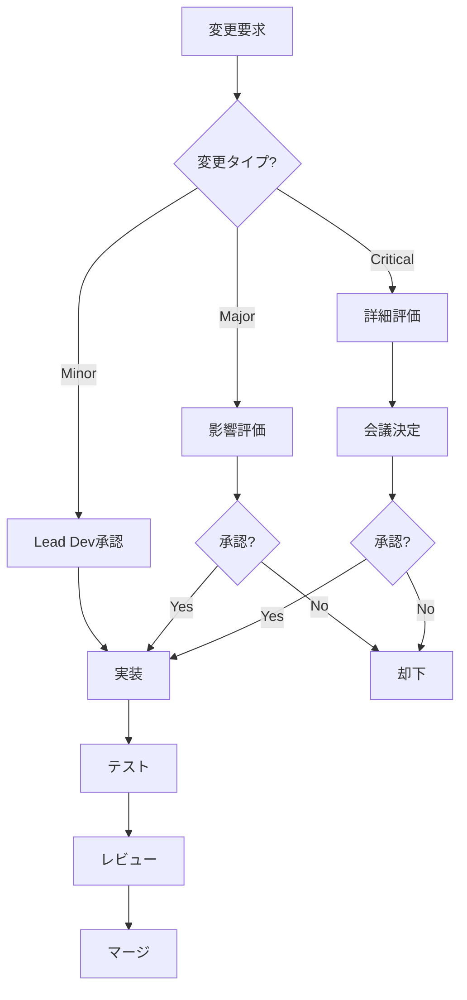

# プロジェクト開発工程管理表
**Project Development Schedule & Management for Time Series Forecasting System**

---

## 📋 ドキュメント情報

| 項目 | 内容 |
|-----|------|
| **プロジェクト名** | 時系列予測システム (NeuralForecast Auto Runner) |
| **バージョン** | v1.0.0 |
| **作成日** | 2025-11-03 |
| **最終更新日** | 2025-11-03 |
| **プロジェクト期間** | 10-17週間（2.5-4ヶ月） |
| **対象読者** | PM、PL、開発者、ステークホルダー |

---

## 目次

1. [プロジェクト概要](#1-プロジェクト概要)
2. [全体スケジュール](#2-全体スケジュール)
3. [フェーズ別詳細計画](#3-フェーズ別詳細計画)
4. [タスク管理表](#4-タスク管理表)
5. [リソース管理](#5-リソース管理)
6. [マイルストーン管理](#6-マイルストーン管理)
7. [成果物管理](#7-成果物管理)
8. [品質ゲート](#8-品質ゲート)
9. [リスク管理](#9-リスク管理)
10. [進捗管理](#10-進捗管理)
11. [コミュニケーション計画](#11-コミュニケーション計画)
12. [変更管理](#12-変更管理)
13. [付録](#13-付録)

---

## 1. プロジェクト概要

### 1.1 プロジェクト目標

時系列予測システム（NeuralForecast Auto Runner）を、9層のクリーンアーキテクチャで実装し、高品質（カバレッジ>90%、Pylint≥8.5）で保守性・拡張性の高いシステムを構築する。

#### 主要目標

1. **機能性**: 全機能要件の実装完了
2. **品質**: テストカバレッジ>90%、Pylint≥8.5
3. **性能**: 単一モデル学習<10分、100モデル並列<2時間
4. **保守性**: SOLID原則遵守、低結合・高凝集
5. **拡張性**: プラグイン可能なアーキテクチャ

---

### 1.2 プロジェクト範囲

#### スコープ内

- ✅ Configuration層（設定管理）
- ✅ Data層（データ処理）
- ✅ Model Discovery層（モデル検出）
- ✅ Hyperparameter層（ハイパーパラメータ最適化）
- ✅ Execution Plan層（実行計画）
- ✅ Execution層（実行エンジン）
- ✅ Artifact Management層（アーティファクト管理）
- ✅ Logging層（ロギング・トラッキング）
- ✅ Application層（アプリケーション）
- ✅ 包括的なテスト
- ✅ ドキュメント整備
- ✅ CI/CD構築
- ✅ 監視システム構築

#### スコープ外

- ❌ 本番環境へのデプロイ（将来対応）
- ❌ クラウドインフラ構築
- ❌ ユーザー認証・認可（将来対応）
- ❌ マルチテナント対応

---

### 1.3 前提条件

| 項目 | 条件 |
|-----|------|
| **開発環境** | Python 3.11+, Ubuntu 24 |
| **ハードウェア** | CPU: 8コア以上、メモリ: 16GB以上、GPU: オプション |
| **開発体制** | 開発者2-3名 |
| **作業時間** | 週30-40時間/人 |
| **リリース期限** | 3ヶ月以内（最大4ヶ月） |

---

## 2. 全体スケジュール

### 2.1 プロジェクトタイムライン

```
プロジェクト期間: 10-17週間（2.5-4ヶ月）
開始予定日: 2025-11-04
終了予定日: 2026-01-20 - 2026-02-24

週 1  2  3  4  5  6  7  8  9  10 11 12 13 14 15 16 17
━━━━━━━━━━━━━━━━━━━━━━━━━━━━━━━━━━━━━━━━━━━━━━━━━━━
Phase 1  ██████
Phase 2        ██████
Phase 3              ████████████
Phase 4                    ████████████
Phase 5                                  ████
Phase 6                                      ██████
Phase 7                                            ██████
Phase 8                                                  ████
Phase 9                                                      ████
Testing  ░░░░░░░░░░░░░░░░░░░░░░░░░░░░░░░░░░░░░░░░░░░░░░░░
Review   ░░░░░░░░░░░░░░░░░░░░░░░░░░░░░░░░░░░░░░░░░░░░░░░░
```

**凡例**:
- `██` = メイン開発作業
- `░░` = 継続的活動（テスト、レビュー）

---

### 2.2 フェーズサマリー

| Phase | 名称 | 期間 | 開始日 | 終了日 | 工数 | ステータス |
|-------|------|------|--------|--------|------|-----------|
| **Phase 1** | Foundation | 1-2週 | Week 1 | Week 2 | 60-80h | 未着手 |
| **Phase 2** | Data Pipeline | 1-2週 | Week 3 | Week 4 | 60-80h | 未着手 |
| **Phase 3** | Model Infrastructure | 2-3週 | Week 5 | Week 7 | 120-180h | 未着手 |
| **Phase 4** | Execution Engine | 2-3週 | Week 8 | Week 10 | 120-180h | 未着手 |
| **Phase 5** | Artifact Management | 1週 | Week 11 | Week 11 | 40-60h | 未着手 |
| **Phase 6** | Observability | 1-2週 | Week 12 | Week 13 | 60-80h | 未着手 |
| **Phase 7** | Application | 1-2週 | Week 14 | Week 15 | 60-80h | 未着手 |
| **Phase 8** | Integration | 1週 | Week 16 | Week 16 | 40-60h | 未着手 |
| **Phase 9** | Production Readiness | 1週 | Week 17 | Week 17 | 40-60h | 未着手 |

**合計工数**: 600-900時間（2-3人月）

---

### 2.3 ガントチャート（Markdown形式）

| フェーズ | タスク | W1 | W2 | W3 | W4 | W5 | W6 | W7 | W8 | W9 | W10 | W11 | W12 | W13 | W14 | W15 | W16 | W17 |
|---------|-------|----|----|----|----|----|----|----|----|----|----|----|----|----|----|----|----|-----|
| **Phase 1** | Foundation | ██ | ██ |    |    |    |    |    |    |    |    |    |    |    |    |    |    |    |
| | Config実装 | ██ | ░░ |    |    |    |    |    |    |    |    |    |    |    |    |    |    |    |
| | CI/CD設定 | ░░ | ██ |    |    |    |    |    |    |    |    |    |    |    |    |    |    |    |
| **Phase 2** | Data Pipeline |    |    | ██ | ██ |    |    |    |    |    |    |    |    |    |    |    |    |    |
| | DataLoader |    |    | ██ | ░░ |    |    |    |    |    |    |    |    |    |    |    |    |    |
| | Validator |    |    | ░░ | ██ |    |    |    |    |    |    |    |    |    |    |    |    |    |
| **Phase 3** | Model Infra |    |    |    |    | ██ | ██ | ██ |    |    |    |    |    |    |    |    |    |    |
| | Discovery |    |    |    |    | ██ | ░░ | ░░ |    |    |    |    |    |    |    |    |    |    |
| | Registry |    |    |    |    | ░░ | ██ | ░░ |    |    |    |    |    |    |    |    |    |    |
| | Hyperparameter |    |    |    |    | ░░ | ░░ | ██ |    |    |    |    |    |    |    |    |    |    |
| **Phase 4** | Execution |    |    |    |    |    |    |    | ██ | ██ | ██ |    |    |    |    |    |    |    |
| | Plan Generator |    |    |    |    |    |    |    | ██ | ░░ | ░░ |    |    |    |    |    |    |    |
| | Executor |    |    |    |    |    |    |    | ░░ | ██ | ░░ |    |    |    |    |    |    |    |
| | Parallel |    |    |    |    |    |    |    | ░░ | ░░ | ██ |    |    |    |    |    |    |    |
| **Phase 5** | Artifacts |    |    |    |    |    |    |    |    |    |    | ██ |    |    |    |    |    |    |
| **Phase 6** | Observability |    |    |    |    |    |    |    |    |    |    |    | ██ | ██ |    |    |    |    |
| | Logging |    |    |    |    |    |    |    |    |    |    |    | ██ | ░░ |    |    |    |    |
| | Tracking |    |    |    |    |    |    |    |    |    |    |    | ░░ | ██ |    |    |    |    |
| **Phase 7** | Application |    |    |    |    |    |    |    |    |    |    |    |    |    | ██ | ██ |    |    |
| | CLI |    |    |    |    |    |    |    |    |    |    |    |    |    | ██ | ░░ |    |    |
| | Orchestrator |    |    |    |    |    |    |    |    |    |    |    |    |    | ░░ | ██ |    |    |
| **Phase 8** | Integration |    |    |    |    |    |    |    |    |    |    |    |    |    |    |    | ██ |    |
| **Phase 9** | Production |    |    |    |    |    |    |    |    |    |    |    |    |    |    |    |    | ██ |
| **継続** | Testing | ░░ | ░░ | ░░ | ░░ | ░░ | ░░ | ░░ | ░░ | ░░ | ░░ | ░░ | ░░ | ░░ | ░░ | ░░ | ░░ | ░░ |
| | Code Review | ░░ | ░░ | ░░ | ░░ | ░░ | ░░ | ░░ | ░░ | ░░ | ░░ | ░░ | ░░ | ░░ | ░░ | ░░ | ░░ | ░░ |
| | Documentation | ░░ | ░░ | ░░ | ░░ | ░░ | ░░ | ░░ | ░░ | ░░ | ░░ | ░░ | ░░ | ░░ | ░░ | ░░ | ░░ | ░░ |

**凡例**:
- `██` = メイン作業（その週の主要タスク）
- `░░` = サブ作業（継続的またはサポート的タスク）

---

## 3. フェーズ別詳細計画

### Phase 1: Foundation（基礎）

**期間**: Week 1-2（1-2週間）  
**工数**: 60-80時間  
**担当**: Lead Developer + Developer

#### 主要タスク

| ID | タスク名 | 期間 | 担当 | 依存関係 | 優先度 |
|----|---------|------|------|---------|--------|
| 1.1 | プロジェクト構造作成 | 0.5日 | Lead | - | P0 |
| 1.2 | 開発環境セットアップ | 1日 | All | 1.1 | P0 |
| 1.3 | CI/CD基本設定 | 2日 | Lead | 1.2 | P0 |
| 1.4 | Config基底クラス実装 | 1日 | Dev1 | 1.2 | P0 |
| 1.5 | PathConfig実装 | 1日 | Dev1 | 1.4 | P0 |
| 1.6 | ExecutionConfig実装 | 1日 | Dev1 | 1.4 | P0 |
| 1.7 | ModelSelectionConfig実装 | 1日 | Dev1 | 1.4 | P0 |
| 1.8 | ConfigLoader実装 | 1日 | Dev1 | 1.5-1.7 | P0 |
| 1.9 | 単体テスト作成 | 2日 | Dev1 | 1.4-1.8 | P0 |
| 1.10 | ドキュメント作成 | 1日 | Dev1 | 1.9 | P1 |

**成果物**:
- Configuration層の完全実装
- プロジェクト構造
- CI/CD パイプライン
- 単体テスト（カバレッジ>90%）

**品質ゲート**:
- [ ] Pylint ≥8.5
- [ ] MyPy strict mode pass
- [ ] テストカバレッジ >90%
- [ ] CI/CDパイプライン動作確認

---

### Phase 2: Data Pipeline（データパイプライン）

**期間**: Week 3-4（1-2週間）  
**工数**: 60-80時間  
**担当**: Developer 1 + Developer 2

#### 主要タスク

| ID | タスク名 | 期間 | 担当 | 依存関係 | 優先度 |
|----|---------|------|------|---------|--------|
| 2.1 | DataLoader実装 | 2日 | Dev1 | Phase 1 | P0 |
| 2.2 | DataPreprocessor実装 | 2日 | Dev1 | 2.1 | P0 |
| 2.3 | ExogVariableEncoder実装 | 1日 | Dev2 | 2.1 | P0 |
| 2.4 | FrequencyInferrer実装 | 1日 | Dev2 | 2.1 | P0 |
| 2.5 | DataValidator実装 | 1.5日 | Dev2 | 2.1-2.4 | P0 |
| 2.6 | 単体テスト作成 | 2日 | All | 2.1-2.5 | P0 |
| 2.7 | 統合テスト作成 | 1日 | Dev1 | 2.6 | P1 |
| 2.8 | ドキュメント作成 | 0.5日 | Dev1 | 2.7 | P1 |

**成果物**:
- Data層の完全実装
- データ検証パイプライン
- 前処理パイプライン
- 単体・統合テスト

**品質ゲート**:
- [ ] データ品質チェック実装
- [ ] スキーマ検証
- [ ] テストカバレッジ >90%
- [ ] パフォーマンステスト（100万行<10秒）

---

### Phase 3: Model Infrastructure（モデル基盤）

**期間**: Week 5-7（2-3週間）  
**工数**: 120-180時間  
**担当**: All Developers

#### 主要タスク

| ID | タスク名 | 期間 | 担当 | 依存関係 | 優先度 |
|----|---------|------|------|---------|--------|
| 3.1 | ModelDiscovery実装 | 2日 | Dev1 | Phase 2 | P0 |
| 3.2 | CapabilityAnalyzer実装 | 2日 | Dev1 | 3.1 | P0 |
| 3.3 | ModelRegistry実装 | 2日 | Dev1 | 3.1 | P0 |
| 3.4 | LossRegistry実装 | 1日 | Dev2 | 3.1 | P0 |
| 3.5 | HyperparameterSearch実装 | 2日 | Dev2 | 3.3 | P0 |
| 3.6 | SearchSpaceGenerator実装 | 2日 | Dev2 | 3.5 | P0 |
| 3.7 | OptunaAdapter実装 | 1.5日 | Dev2 | 3.5 | P1 |
| 3.8 | RayAdapter実装 | 1.5日 | Dev2 | 3.5 | P2 |
| 3.9 | 単体テスト作成 | 3日 | All | 3.1-3.8 | P0 |
| 3.10 | 統合テスト作成 | 2日 | Dev1 | 3.9 | P1 |
| 3.11 | ドキュメント作成 | 1日 | Dev1 | 3.10 | P1 |

**成果物**:
- Model Discovery層実装
- Hyperparameter層実装
- モデルレジストリ
- 探索空間生成器

**品質ゲート**:
- [ ] 全モデル検出テスト
- [ ] 能力分析実装
- [ ] テストカバレッジ >90%
- [ ] OptunaとRay統合テスト

---

### Phase 4: Execution Engine（実行エンジン）

**期間**: Week 8-10（2-3週間）  
**工数**: 120-180時間  
**担当**: All Developers

#### 主要タスク

| ID | タスク名 | 期間 | 担当 | 依存関係 | 優先度 |
|----|---------|------|------|---------|--------|
| 4.1 | CombinationGenerator実装 | 2日 | Dev1 | Phase 3 | P0 |
| 4.2 | DuplicateDetector実装 | 1日 | Dev1 | 4.1 | P0 |
| 4.3 | ExecutionPlan実装 | 2日 | Dev1 | 4.1, 4.2 | P0 |
| 4.4 | ResourceEstimator実装 | 1.5日 | Dev1 | 4.3 | P1 |
| 4.5 | SerialExecutor実装 | 2日 | Dev2 | 4.3 | P0 |
| 4.6 | ParallelExecutor実装 | 2日 | Dev2 | 4.5 | P0 |
| 4.7 | RayExecutor実装 | 2日 | Dev2 | 4.5 | P1 |
| 4.8 | ResourceMonitor実装 | 1.5日 | Dev2 | 4.5-4.7 | P1 |
| 4.9 | 単体テスト作成 | 3日 | All | 4.1-4.8 | P0 |
| 4.10 | 並列実行テスト | 2日 | All | 4.9 | P0 |
| 4.11 | パフォーマンステスト | 1日 | Dev1 | 4.10 | P1 |
| 4.12 | ドキュメント作成 | 1日 | Dev1 | 4.11 | P1 |

**成果物**:
- Execution Plan層実装
- Execution層実装
- 並列実行エンジン
- リソースモニタリング

**品質ゲート**:
- [ ] 直列/並列実行テスト
- [ ] リソース監視動作確認
- [ ] テストカバレッジ >85%
- [ ] パフォーマンス要件達成

---

### Phase 5: Artifact Management（アーティファクト管理）

**期間**: Week 11（1週間）  
**工数**: 40-60時間  
**担当**: Developer 1

#### 主要タスク

| ID | タスク名 | 期間 | 担当 | 依存関係 | 優先度 |
|----|---------|------|------|---------|--------|
| 5.1 | ArtifactManager実装 | 1.5日 | Dev1 | Phase 4 | P0 |
| 5.2 | ModelSaver実装 | 1日 | Dev1 | 5.1 | P0 |
| 5.3 | PredictionSaver実装 | 1日 | Dev1 | 5.1 | P0 |
| 5.4 | MetadataSaver実装 | 1日 | Dev1 | 5.1 | P0 |
| 5.5 | 単体テスト作成 | 1日 | Dev1 | 5.1-5.4 | P0 |
| 5.6 | 統合テスト作成 | 0.5日 | Dev1 | 5.5 | P1 |
| 5.7 | ドキュメント作成 | 0.5日 | Dev1 | 5.6 | P1 |

**成果物**:
- Artifact層実装
- モデル保存機能
- メタデータ管理
- バージョニング

**品質ゲート**:
- [ ] 保存/読み込みテスト
- [ ] バージョニング動作確認
- [ ] テストカバレッジ >90%
- [ ] 大規模ファイル対応

---

### Phase 6: Observability（可観測性）

**期間**: Week 12-13（1-2週間）  
**工数**: 60-80時間  
**担当**: Developer 2

#### 主要タスク

| ID | タスク名 | 期間 | 担当 | 依存関係 | 優先度 |
|----|---------|------|------|---------|--------|
| 6.1 | StructuredLogger実装 | 1.5日 | Dev2 | Phase 5 | P0 |
| 6.2 | ProgressTracker実装 | 1日 | Dev2 | 6.1 | P0 |
| 6.3 | MLflowBridge実装 | 1.5日 | Dev2 | 6.1 | P1 |
| 6.4 | WandBBridge実装 | 1.5日 | Dev2 | 6.1 | P2 |
| 6.5 | MetricsCollector実装 | 1日 | Dev2 | 6.1 | P1 |
| 6.6 | 単体テスト作成 | 1.5日 | Dev2 | 6.1-6.5 | P0 |
| 6.7 | 統合テスト作成 | 1日 | Dev2 | 6.6 | P1 |
| 6.8 | ドキュメント作成 | 0.5日 | Dev2 | 6.7 | P1 |

**成果物**:
- Logging層実装
- トラッキング統合（MLflow, W&B）
- メトリクス収集
- 監視ダッシュボード設定

**品質ゲート**:
- [ ] 構造化ログ実装
- [ ] MLflow/W&B統合
- [ ] テストカバレッジ >90%
- [ ] ダッシュボード動作確認

---

### Phase 7: Application（アプリケーション）

**期間**: Week 14-15（1-2週間）  
**工数**: 60-80時間  
**担当**: All Developers

#### 主要タスク

| ID | タスク名 | 期間 | 担当 | 依存関係 | 優先度 |
|----|---------|------|------|---------|--------|
| 7.1 | CLI実装 | 2日 | Dev1 | Phase 6 | P0 |
| 7.2 | Orchestrator実装 | 2日 | Dev1 | 7.1 | P0 |
| 7.3 | MainApplication実装 | 1.5日 | Dev1 | 7.1, 7.2 | P0 |
| 7.4 | E2Eテスト作成 | 2日 | All | 7.1-7.3 | P0 |
| 7.5 | パフォーマンステスト | 1日 | Dev2 | 7.4 | P1 |
| 7.6 | ユーザビリティテスト | 1日 | All | 7.4 | P2 |
| 7.7 | ドキュメント作成 | 1日 | Dev1 | 7.6 | P0 |

**成果物**:
- Application層実装
- CLI
- オーケストレーター
- E2Eテスト

**品質ゲート**:
- [ ] E2Eテスト全Pass
- [ ] CLI動作確認
- [ ] テストカバレッジ >85%
- [ ] ユーザビリティテスト合格

---

### Phase 8: Integration（統合）

**期間**: Week 16（1週間）  
**工数**: 40-60時間  
**担当**: All Developers

#### 主要タスク

| ID | タスク名 | 期間 | 担当 | 依存関係 | 優先度 |
|----|---------|------|------|---------|--------|
| 8.1 | 統合テスト追加 | 2日 | All | Phase 7 | P0 |
| 8.2 | パフォーマンステスト | 1日 | Dev2 | 8.1 | P0 |
| 8.3 | 負荷テスト | 1日 | Dev2 | 8.1 | P1 |
| 8.4 | セキュリティテスト | 0.5日 | Dev1 | 8.1 | P1 |
| 8.5 | バグ修正 | 1日 | All | 8.1-8.4 | P0 |
| 8.6 | リファクタリング | 0.5日 | All | 8.5 | P1 |
| 8.7 | ドキュメント更新 | 0.5日 | Dev1 | 8.6 | P1 |

**成果物**:
- 統合テスト完了
- パフォーマンステスト完了
- 全バグ修正

**品質ゲート**:
- [ ] 全統合テストPass
- [ ] パフォーマンス基準達成
- [ ] セキュリティスキャンPass
- [ ] ドキュメント完備

---

### Phase 9: Production Readiness（本番対応）

**期間**: Week 17（1週間）  
**工数**: 40-60時間  
**担当**: Lead Developer

#### 主要タスク

| ID | タスク名 | 期間 | 担当 | 依存関係 | 優先度 |
|----|---------|------|------|---------|--------|
| 9.1 | 運用ドキュメント作成 | 1.5日 | Lead | Phase 8 | P0 |
| 9.2 | デプロイガイド作成 | 1日 | Lead | 9.1 | P0 |
| 9.3 | 監視設定完了 | 1日 | Dev2 | 9.1 | P0 |
| 9.4 | アラート設定 | 0.5日 | Dev2 | 9.3 | P0 |
| 9.5 | バックアップ手順確立 | 0.5日 | Lead | 9.1 | P1 |
| 9.6 | ロールバック手順確立 | 0.5日 | Lead | 9.1 | P1 |
| 9.7 | セキュリティレビュー | 0.5日 | All | 9.1-9.6 | P0 |
| 9.8 | 最終レビュー | 0.5日 | All | 9.7 | P0 |

**成果物**:
- 運用ドキュメント
- モニタリング設定
- デプロイスクリプト
- バックアップ・復旧手順

**品質ゲート**:
- [ ] 運用手順書完備
- [ ] ロールバック手順確認
- [ ] セキュリティレビュー合格
- [ ] 最終レビュー合格

---

## 4. タスク管理表

### 4.1 全タスク一覧（サマリー）

| Phase | タスク数 | 完了 | 進捗率 | ステータス |
|-------|---------|------|--------|----------|
| Phase 1 | 10 | 0 | 0% | 未着手 |
| Phase 2 | 8 | 0 | 0% | 未着手 |
| Phase 3 | 11 | 0 | 0% | 未着手 |
| Phase 4 | 12 | 0 | 0% | 未着手 |
| Phase 5 | 7 | 0 | 0% | 未着手 |
| Phase 6 | 8 | 0 | 0% | 未着手 |
| Phase 7 | 7 | 0 | 0% | 未着手 |
| Phase 8 | 7 | 0 | 0% | 未着手 |
| Phase 9 | 8 | 0 | 0% | 未着手 |
| **合計** | **78** | **0** | **0%** | **未着手** |

---

### 4.2 タスク詳細管理テンプレート

```markdown
## タスク: [タスク名]

### 基本情報
- **ID**: [タスクID]
- **担当者**: [担当者名]
- **期間**: [開始日] - [終了日]
- **工数**: [見積もり時間]
- **優先度**: [P0/P1/P2/P3]
- **ステータス**: [未着手/進行中/レビュー中/完了]

### 依存関係
- **前提タスク**: [タスクID1, タスクID2, ...]
- **後続タスク**: [タスクID1, タスクID2, ...]
- **ブロッカー**: [あれば記載]

### 成果物
- [ ] [成果物1]
- [ ] [成果物2]
- [ ] [成果物3]

### 受け入れ基準
- [ ] [基準1]
- [ ] [基準2]
- [ ] [基準3]

### 進捗
- **開始日**: [実績開始日]
- **完了日**: [実績完了日]
- **実績工数**: [実績時間]
- **進捗率**: [0-100%]

### メモ
[課題、懸念事項、備考など]
```

---

### 4.3 週次タスク管理表

#### Week 1: Phase 1開始

| タスクID | タスク名 | 担当 | 計画工数 | 実績工数 | ステータス | 進捗率 |
|---------|---------|------|---------|---------|----------|--------|
| 1.1 | プロジェクト構造作成 | Lead | 4h | - | 未着手 | 0% |
| 1.2 | 開発環境セットアップ | All | 8h | - | 未着手 | 0% |
| 1.3 | CI/CD基本設定 | Lead | 16h | - | 未着手 | 0% |
| 1.4 | Config基底クラス実装 | Dev1 | 8h | - | 未着手 | 0% |
| 1.5 | PathConfig実装 | Dev1 | 8h | - | 未着手 | 0% |

**週次目標**: プロジェクト基盤完成

---

## 5. リソース管理

### 5.1 人員配置

#### チーム構成

| 役割 | 人数 | 担当者 | 稼働率 | 備考 |
|-----|------|-------|--------|------|
| **Lead Developer** | 1 | TBD | 100% | アーキテクチャ、レビュー |
| **Developer 1** | 1 | TBD | 100% | バックエンド実装 |
| **Developer 2** | 1 | TBD | 100% | データパイプライン、監視 |

**合計人員**: 3名

---

### 5.2 フェーズ別リソース配分

| Phase | Lead Dev | Dev 1 | Dev 2 | 合計工数 |
|-------|----------|-------|-------|---------|
| Phase 1 | 40% | 60% | - | 70h |
| Phase 2 | 20% | 50% | 50% | 70h |
| Phase 3 | 30% | 40% | 40% | 150h |
| Phase 4 | 30% | 40% | 40% | 150h |
| Phase 5 | 20% | 80% | - | 50h |
| Phase 6 | 20% | 20% | 80% | 70h |
| Phase 7 | 40% | 40% | 30% | 70h |
| Phase 8 | 30% | 40% | 40% | 50h |
| Phase 9 | 80% | 10% | 20% | 50h |

---

### 5.3 スキルマトリックス

| スキル | Lead Dev | Dev 1 | Dev 2 | 必要レベル |
|-------|----------|-------|-------|-----------|
| **Python** | ★★★★★ | ★★★★☆ | ★★★★☆ | ★★★★☆ |
| **OOP/SOLID** | ★★★★★ | ★★★★☆ | ★★★☆☆ | ★★★★☆ |
| **TDD** | ★★★★★ | ★★★★☆ | ★★★☆☆ | ★★★★☆ |
| **PyTorch** | ★★★★☆ | ★★★☆☆ | ★★★★☆ | ★★★☆☆ |
| **PostgreSQL** | ★★★★☆ | ★★★☆☆ | ★★★☆☆ | ★★★☆☆ |
| **CI/CD** | ★★★★★ | ★★★☆☆ | ★★★☆☆ | ★★★☆☆ |
| **Prometheus/Grafana** | ★★★★☆ | ★★★☆☆ | ★★★★☆ | ★★★☆☆ |
| **MLflow/W&B** | ★★★★☆ | ★★★☆☆ | ★★★★☆ | ★★★☆☆ |

**評価**: ★☆☆☆☆ = 初級、★★★☆☆ = 中級、★★★★★ = エキスパート

---

### 5.4 工数見積もり

#### 総工数

| 項目 | 最小 | 最大 | 平均 |
|-----|------|------|------|
| **開発工数** | 600h | 900h | 750h |
| **テスト工数** | 150h | 200h | 175h |
| **レビュー工数** | 80h | 120h | 100h |
| **ドキュメント工数** | 60h | 80h | 70h |
| **バッファ（10%）** | 89h | 130h | 110h |
| **合計** | 979h | 1430h | 1205h |

**人月換算**: 約5.5-8人月（1人月=180時間換算）

---

### 5.5 コスト見積もり

| 項目 | 単価 | 数量 | 金額 | 備考 |
|-----|------|------|------|------|
| **開発人件費** | ¥5,000/h | 750h | ¥3,750,000 | 平均単価 |
| **インフラコスト** | ¥50,000/月 | 4ヶ月 | ¥200,000 | AWS/GCP |
| **ツール・ライセンス** | ¥20,000/月 | 4ヶ月 | ¥80,000 | MLflow, 監視ツール |
| **その他経費** | - | - | ¥170,000 | 雑費 |
| **合計** | - | - | **¥4,200,000** | |

---

## 6. マイルストーン管理

### 6.1 主要マイルストーン

| MS | マイルストーン名 | 予定日 | 完了日 | 成果物 | ステータス |
|----|---------------|--------|--------|--------|----------|
| **M1** | Foundation完了 | Week 2 | - | Configuration層 | 未達成 |
| **M2** | Data Pipeline完了 | Week 4 | - | Data層 | 未達成 |
| **M3** | Model Infra完了 | Week 7 | - | Model/HP層 | 未達成 |
| **M4** | Execution完了 | Week 10 | - | Execution層 | 未達成 |
| **M5** | Core完了 | Week 11 | - | コア機能 | 未達成 |
| **M6** | Observability完了 | Week 13 | - | 監視機能 | 未達成 |
| **M7** | Application完了 | Week 15 | - | CLI/UI | 未達成 |
| **M8** | Integration完了 | Week 16 | - | 統合完了 | 未達成 |
| **M9** | Production Ready | Week 17 | - | 本番準備完了 | 未達成 |

---

### 6.2 マイルストーン詳細

#### M1: Foundation完了（Week 2）

**達成基準**:
- [ ] Configuration層の全クラス実装完了
- [ ] 単体テストカバレッジ >90%
- [ ] Pylintスコア ≥8.5
- [ ] MyPy strict mode pass
- [ ] CI/CDパイプライン動作
- [ ] ドキュメント完備

**成果物**:
- `nf_auto_runner/config/` 配下の全ファイル
- テストコード
- CI/CD設定ファイル

**レビュー会議**: Week 2金曜日

---

#### M2: Data Pipeline完了（Week 4）

**達成基準**:
- [ ] Data層の全クラス実装完了
- [ ] データ検証パイプライン動作
- [ ] 前処理パイプライン動作
- [ ] 単体テストカバレッジ >90%
- [ ] 統合テストPass
- [ ] パフォーマンステストPass（100万行<10秒）

**成果物**:
- `nf_auto_runner/data/` 配下の全ファイル
- テストコード
- パフォーマンステスト結果

**レビュー会議**: Week 4金曜日

---

## 7. 成果物管理

### 7.1 成果物一覧

#### コード成果物

| 成果物名 | パス | 担当 | 完了予定 | ステータス |
|---------|------|------|---------|----------|
| **Configuration層** | `nf_auto_runner/config/` | Dev1 | Week 2 | 未作成 |
| **Data層** | `nf_auto_runner/data/` | Dev1 | Week 4 | 未作成 |
| **Model Discovery層** | `nf_auto_runner/discovery/` | Dev1 | Week 7 | 未作成 |
| **Hyperparameter層** | `nf_auto_runner/hyperparameter/` | Dev2 | Week 7 | 未作成 |
| **Execution Plan層** | `nf_auto_runner/planning/` | Dev1 | Week 10 | 未作成 |
| **Execution層** | `nf_auto_runner/execution/` | Dev2 | Week 10 | 未作成 |
| **Artifact層** | `nf_auto_runner/artifact/` | Dev1 | Week 11 | 未作成 |
| **Logging層** | `nf_auto_runner/logging/` | Dev2 | Week 13 | 未作成 |
| **Application層** | `nf_auto_runner/application/` | Dev1 | Week 15 | 未作成 |

---

#### テスト成果物

| 成果物名 | パス | 担当 | 完了予定 | カバレッジ目標 |
|---------|------|------|---------|---------------|
| **Unit Tests** | `tests/unit/` | All | 各Phase | >90% |
| **Integration Tests** | `tests/integration/` | All | Week 16 | >80% |
| **E2E Tests** | `tests/e2e/` | All | Week 15 | >70% |
| **Performance Tests** | `tests/performance/` | Dev2 | Week 16 | - |

---

#### ドキュメント成果物

| 成果物名 | パス | 担当 | 完了予定 | ステータス |
|---------|------|------|---------|----------|
| **README** | `README.md` | Lead | Week 17 | 未作成 |
| **API Documentation** | `docs/api/` | All | Week 17 | 未作成 |
| **User Guide** | `docs/user_guide.md` | Lead | Week 17 | 未作成 |
| **Developer Guide** | `docs/developer_guide.md` | Lead | Week 17 | 未作成 |
| **Operations Runbook** | `docs/operations_runbook.md` | Lead | Week 17 | 未作成 |
| **Deployment Guide** | `docs/deployment_guide.md` | Lead | Week 17 | 未作成 |
| **Monitoring Guide** | `docs/monitoring_guide.md` | Dev2 | Week 17 | 未作成 |

---

### 7.2 成果物チェックリスト

#### コード成果物

```markdown
- [ ] ソースコードがリポジトリにコミット済み
- [ ] コーディング規約に準拠（Black, isort, Pylint≥8.5）
- [ ] 型ヒント完備（MyPy strict pass）
- [ ] Docstring完備（Google形式）
- [ ] 単体テスト作成（カバレッジ>90%）
- [ ] 統合テスト作成（該当する場合）
- [ ] コードレビュー完了
- [ ] CI/CDパイプラインPass
```

#### ドキュメント成果物

```markdown
- [ ] 内容が正確
- [ ] 図表が適切
- [ ] コード例が動作する
- [ ] レビュー完了
- [ ] 最新版がリポジトリにコミット済み
```

---

## 8. 品質ゲート

### 8.1 フェーズ完了基準

各フェーズの完了時に以下の品質ゲートをクリアする必要があります。

#### Phase 1-7: 開発フェーズ

| 項目 | 基準 | チェック方法 |
|-----|------|------------|
| **コードカバレッジ** | >90% (Unit), >80% (Integration) | pytest --cov |
| **Pylintスコア** | ≥8.5 | pylint |
| **MyPy** | strict mode pass | mypy --strict |
| **Black** | フォーマット済み | black --check |
| **isort** | インポート整理済み | isort --check |
| **コードレビュー** | 2名以上のApproval | GitHub PR |
| **CI/CD** | 全テストPass | GitHub Actions |
| **ドキュメント** | 該当部分完備 | 目視確認 |

---

#### Phase 8: Integration

| 項目 | 基準 | チェック方法 |
|-----|------|------------|
| **統合テスト** | 全Pass | pytest tests/integration/ |
| **E2Eテスト** | 全Pass | pytest tests/e2e/ |
| **パフォーマンステスト** | 要件達成 | カスタムスクリプト |
| **負荷テスト** | 要件達成 | locust |
| **セキュリティスキャン** | Critical/High 0件 | bandit, safety |

---

#### Phase 9: Production Readiness

| 項目 | 基準 | チェック方法 |
|-----|------|------------|
| **運用ドキュメント** | 完備 | 目視確認 |
| **監視設定** | 完了 | Grafana確認 |
| **アラート設定** | 完了 | Alert Manager確認 |
| **バックアップ手順** | 確認済み | 手順実行 |
| **ロールバック手順** | 確認済み | 手順実行 |
| **セキュリティレビュー** | 合格 | レビュー会議 |

---

### 8.2 品質チェックリスト

#### コード品質

```bash
# 自動化スクリプト
#!/bin/bash

echo "=== Running Quality Checks ==="

# 1. テストカバレッジ
echo "1. Test Coverage..."
pytest tests/unit/ --cov=nf_auto_runner --cov-report=term-missing --cov-fail-under=90

# 2. Pylint
echo "2. Pylint..."
pylint nf_auto_runner/ --fail-under=8.5

# 3. MyPy
echo "3. MyPy..."
mypy nf_auto_runner/ --strict

# 4. Black
echo "4. Black..."
black --check nf_auto_runner/

# 5. isort
echo "5. isort..."
isort --check nf_auto_runner/

# 6. Bandit (セキュリティ)
echo "6. Bandit..."
bandit -r nf_auto_runner/ -ll

# 7. Safety (依存関係の脆弱性)
echo "7. Safety..."
safety check

echo "=== Quality Checks Complete ==="
```

---

### 8.3 レビュー基準

#### コードレビューチェックリスト

**設計**:
- [ ] SOLID原則に準拠
- [ ] 適切なデザインパターンの使用
- [ ] 責務が明確

**実装**:
- [ ] コーディング規約に準拠
- [ ] 適切な変数名・関数名
- [ ] 複雑度が低い（<10）
- [ ] 重複コードがない

**テスト**:
- [ ] 十分なテストケース
- [ ] エッジケースのテスト
- [ ] モックの適切な使用

**ドキュメント**:
- [ ] Docstring完備
- [ ] 複雑なロジックにコメント
- [ ] README更新

**セキュリティ**:
- [ ] SQLインジェクション対策
- [ ] パストラバーサル対策
- [ ] 秘密情報のハードコード禁止

---

## 9. リスク管理

### 9.1 リスク一覧

| ID | リスク内容 | 発生確率 | 影響度 | リスクレベル | 対策 | 担当 |
|----|----------|---------|--------|-------------|------|------|
| R1 | NeuralForecastのAPI変更 | 中 | 高 | 高 | バージョン固定、Adapter Pattern | Lead |
| R2 | GPU環境の不足 | 低 | 中 | 中 | CPU対応、クラウドGPU利用 | Dev2 |
| R3 | パフォーマンス要件未達 | 中 | 高 | 高 | 早期ベンチマーク、最適化 | All |
| R4 | メンバーの離脱 | 低 | 高 | 中 | ドキュメント充実、ペアプロ | Lead |
| R5 | スケジュール遅延 | 中 | 中 | 中 | バッファ確保、優先度管理 | Lead |
| R6 | 技術的負債の蓄積 | 中 | 中 | 中 | リファクタリング週、コードレビュー | All |
| R7 | 依存ライブラリの脆弱性 | 低 | 中 | 低 | 定期スキャン、迅速な更新 | Dev1 |
| R8 | データ品質問題 | 中 | 高 | 高 | 厳格なバリデーション、テスト | Dev1 |

**リスクレベル**: 低 = 1-3, 中 = 4-6, 高 = 7-9

---

### 9.2 リスク対策詳細

#### R1: NeuralForecastのAPI変更

**リスク内容**: NeuralForecastライブラリのバージョンアップでAPIが変更される

**発生確率**: 中（30-50%）

**影響度**: 高
- 既存コードの大幅な修正が必要
- スケジュール遅延（1-2週間）

**対策**:
1. **予防策**
   - バージョンを固定（requirements.txt）
   - Adapter Patternで抽象化
   - 互換性テストの自動化

2. **発生時対応**
   - マイグレーションガイドの確認
   - 影響範囲の特定
   - 段階的な移行

**担当**: Lead Developer

**モニタリング**: 毎週リリースノート確認

---

#### R3: パフォーマンス要件未達

**リスク内容**: 性能要件（単一モデル<10分、並列<2時間）を達成できない

**発生確率**: 中（30-50%）

**影響度**: 高
- システムの使用性低下
- 再設計が必要

**対策**:
1. **予防策**
   - Phase 1から継続的なベンチマーク
   - 早期の性能測定
   - プロファイリングの実施

2. **発生時対応**
   - ボトルネックの特定
   - 並列化の強化
   - キャッシングの導入
   - GPUの活用

**担当**: All Developers

**モニタリング**: 各Phase完了時にパフォーマンステスト

---

#### R5: スケジュール遅延

**リスク内容**: 計画より開発が遅れる

**発生確率**: 中（50-70%）

**影響度**: 中
- リリース日の延期
- コストの増加

**対策**:
1. **予防策**
   - 10%のバッファを確保
   - 優先度の明確化（P0-P3）
   - 週次の進捗レビュー
   - 早期の問題検出

2. **発生時対応**
   - スコープの調整（P2-P3を削減）
   - リソースの追加
   - 並行作業の増加

**担当**: Lead Developer

**モニタリング**: 毎週の進捗レビュー

---

### 9.3 リスクモニタリング計画

| リスク | モニタリング方法 | 頻度 | トリガー | アクション |
|-------|---------------|------|---------|----------|
| R1 | GitHub Releases確認 | 週次 | API変更検出 | 影響評価 |
| R2 | GPU使用率確認 | 日次 | 使用率>80% | クラウド検討 |
| R3 | ベンチマーク実行 | Phase完了時 | 要件未達 | 最適化実施 |
| R4 | チーム状況確認 | 週次 | 離脱兆候 | 面談実施 |
| R5 | 進捗レビュー | 週次 | 遅延>10% | スコープ調整 |
| R6 | コード品質測定 | 日次 | Pylint<8.0 | リファクタリング |
| R7 | 脆弱性スキャン | 週次 | Critical検出 | 即座に対応 |
| R8 | テスト結果確認 | 日次 | 失敗検出 | バグ修正 |

---

## 10. 進捗管理

### 10.1 進捗測定方法

#### Earned Value Management (EVM)

| 指標 | 略称 | 説明 | 計算式 |
|-----|------|------|--------|
| **Planned Value** | PV | 計画価値（予定工数） | 計画工数 × 完了予定% |
| **Earned Value** | EV | 出来高（実際完了分） | 計画工数 × 実際完了% |
| **Actual Cost** | AC | 実コスト（実績工数） | 実績工数 |
| **Schedule Variance** | SV | スケジュール差異 | EV - PV |
| **Cost Variance** | CV | コスト差異 | EV - AC |
| **Schedule Performance Index** | SPI | スケジュール効率 | EV / PV |
| **Cost Performance Index** | CPI | コスト効率 | EV / AC |

**健全性の判断**:
- SPI ≥ 1.0: スケジュール通り or 前倒し
- SPI < 1.0: スケジュール遅延
- CPI ≥ 1.0: 予算内 or 予算節約
- CPI < 1.0: 予算超過

---

### 10.2 進捗レポートテンプレート

#### 週次進捗レポート

```markdown
# 週次進捗レポート

## 基本情報
- **報告期間**: [開始日] - [終了日]
- **報告者**: [名前]
- **プロジェクト週**: Week X / 17

---

## 進捗サマリー

| 指標 | 計画 | 実績 | 差異 |
|-----|------|------|------|
| **完了タスク数** | X件 | Y件 | ±Z件 |
| **工数** | XYZh | ABCh | ±DEFh |
| **進捗率** | X% | Y% | ±Z% |

---

## 当週の完了タスク
- [x] タスク1 (完了日: XX/XX)
- [x] タスク2 (完了日: XX/XX)
- [x] タスク3 (完了日: XX/XX)

---

## 進行中のタスク
- [ ] タスク4 (進捗率: 60%, 予定完了: XX/XX)
- [ ] タスク5 (進捗率: 30%, 予定完了: XX/XX)

---

## 来週の予定タスク
- [ ] タスク6 (予定開始: XX/XX)
- [ ] タスク7 (予定開始: XX/XX)

---

## 課題・リスク
1. **課題1**: [内容]
   - 影響: [高/中/低]
   - 対応: [対応策]
   - 担当: [担当者]

2. **リスク1**: [内容]
   - 発生確率: [高/中/低]
   - 影響度: [高/中/低]
   - 対策: [対策]

---

## 品質メトリクス
- テストカバレッジ: XX%
- Pylintスコア: X.X
- CI/CDステータス: ✅ Pass / ❌ Fail
- バグ数: Open X件 / Closed Y件

---

## コメント
[その他の報告事項、気づき、提案など]
```

---

### 10.3 マイルストーン進捗

#### M1-M9 進捗トラッキング

| MS | マイルストーン | 計画 | 予測 | 差異 | ステータス | RAG |
|----|-------------|------|------|------|----------|-----|
| M1 | Foundation | Week 2 | - | - | 未着手 | 🔵 |
| M2 | Data Pipeline | Week 4 | - | - | 未着手 | 🔵 |
| M3 | Model Infra | Week 7 | - | - | 未着手 | 🔵 |
| M4 | Execution | Week 10 | - | - | 未着手 | 🔵 |
| M5 | Core完了 | Week 11 | - | - | 未着手 | 🔵 |
| M6 | Observability | Week 13 | - | - | 未着手 | 🔵 |
| M7 | Application | Week 15 | - | - | 未着手 | 🔵 |
| M8 | Integration | Week 16 | - | - | 未着手 | 🔵 |
| M9 | Production | Week 17 | - | - | 未着手 | 🔵 |

**RAG Status**:
- 🟢 Green: 順調（差異 ≤3日）
- 🟡 Yellow: 注意（差異 4-7日）
- 🔴 Red: 遅延（差異 >7日）
- 🔵 Blue: 未着手

---

### 10.4 タスクボード（Kanban）

```
┌─────────────┬─────────────┬─────────────┬─────────────┬─────────────┐
│   Backlog   │   To Do     │ In Progress │   Review    │    Done     │
├─────────────┼─────────────┼─────────────┼─────────────┼─────────────┤
│ Phase 2     │ 1.1 Setup   │             │             │             │
│ Phase 3     │ 1.2 Config  │             │             │             │
│ Phase 4     │ 1.3 CI/CD   │             │             │             │
│ Phase 5     │ 1.4 Tests   │             │             │             │
│ Phase 6     │             │             │             │             │
│ Phase 7     │             │             │             │             │
│ Phase 8     │             │             │             │             │
│ Phase 9     │             │             │             │             │
│             │             │             │             │             │
└─────────────┴─────────────┴─────────────┴─────────────┴─────────────┘
```

**ルール**:
- WIP (Work In Progress) 制限: 各開発者最大3タスク
- To Do → In Progress: 着手時に移動
- In Progress → Review: 実装完了、レビュー待ち
- Review → Done: レビューApproval、マージ完了
- Done → Backlog: 却下の場合（稀）

---

### 10.5 バーンダウンチャート

```
工数
(h) │
900 │ ●━━━━━━━━━━━━━━━━━━━━━━━━┓         理想線
    │  ╲                       ┃
800 │   ╲                      ┃
    │    ╲                     ┃
700 │     ○━━━━━━━━━━━━━┓     ┃         実績線
    │      ╲             ┃     ┃
600 │       ╲            ┃     ┃
    │        ╲           ┃     ┃
500 │         ╲          ┃     ┃
    │          ╲         ┃     ┃
400 │           ╲        ┃     ┃
    │            ╲       ┃     ┃
300 │             ╲      ┃     ┃
    │              ╲     ┃     ┃
200 │               ╲    ┃     ┃
    │                ╲   ┃     ┃
100 │                 ╲  ┃     ┃
    │                  ╲ ┃     ┃
  0 │───────────────────●┃─────●────
    1   3   5   7   9  11  13  15  17 (週)
```

**凡例**:
- `●━━━` = 理想線（計画）
- `○━━━` = 実績線
- ● = 完了時点

---

## 11. コミュニケーション計画

### 11.1 会議体

#### 定例会議

| 会議名 | 頻度 | 参加者 | 時間 | 目的 |
|-------|------|-------|------|------|
| **Daily Standup** | 毎日 | All | 15分 | 進捗共有、ブロッカー確認 |
| **Weekly Review** | 毎週金曜 | All | 60分 | 週次進捗レビュー、計画調整 |
| **Phase Review** | Phase完了時 | All | 90分 | 成果物レビュー、品質ゲート |
| **Retrospective** | Phase完了時 | All | 60分 | KPT、プロセス改善 |
| **Stakeholder Report** | 月次 | Lead + Stakeholders | 30分 | 進捗報告、課題共有 |

---

#### Daily Standup フォーマット

**各メンバー3分以内**:
1. **昨日やったこと** (Done)
2. **今日やること** (To Do)
3. **ブロッカー・課題** (Blockers)

**例**:
```
[Dev1]
✅ Done: PathConfig実装完了、単体テスト作成
📋 To Do: ExecutionConfig実装開始
⚠️ Blockers: なし

[Dev2]
✅ Done: CI/CD設定調査
📋 To Do: GitHub Actions設定
⚠️ Blockers: なし

[Lead]
✅ Done: アーキテクチャレビュー、ドキュメント作成
📋 To Do: Code Review、次週計画
⚠️ Blockers: なし
```

---

#### Weekly Review アジェンダ

1. **進捗確認** (15分)
   - 完了タスク
   - 進行中タスク
   - 遅延タスク

2. **品質メトリクス** (10分)
   - テストカバレッジ
   - Pylintスコア
   - バグ数

3. **リスク・課題** (15分)
   - 新規リスク
   - 既存課題の状況
   - 対策の効果

4. **来週の計画** (15分)
   - 予定タスク
   - 優先順位
   - リソース配分

5. **その他** (5分)

---

### 11.2 コミュニケーションツール

| ツール | 用途 | 頻度 | 備考 |
|-------|------|------|------|
| **Slack** | 日常コミュニケーション | 常時 | #dev-ts-forecasting |
| **GitHub** | コードレビュー、Issue管理 | 常時 | PR必須 |
| **Google Meet** | オンライン会議 | 定例 | 録画推奨 |
| **Notion/Confluence** | ドキュメント管理 | 常時 | 議事録、設計書 |
| **Jira/GitHub Projects** | タスク管理 | 常時 | Kanbanボード |
| **Email** | 公式連絡 | 必要時 | 重要事項のみ |

---

### 11.3 レポーティング

#### 週次レポート

**提出**: 毎週金曜17:00  
**宛先**: Lead Developer, Stakeholders  
**フォーマット**: Markdown（テンプレート使用）

#### 月次レポート

**提出**: 月末最終金曜  
**宛先**: Management, Stakeholders  
**内容**:
- 進捗サマリー
- マイルストーン達成状況
- リスク・課題
- 品質メトリクス
- 次月の計画

---

## 12. 変更管理

### 12.1 変更管理プロセス

#### 変更要求の分類

| 変更タイプ | 説明 | 承認者 | プロセス |
|----------|------|-------|---------|
| **Minor** | バグ修正、小規模改善 | Lead Dev | 即座に対応 |
| **Major** | 機能追加、設計変更 | Lead Dev + PM | 影響評価後に承認 |
| **Critical** | アーキテクチャ変更 | All Stakeholders | 詳細評価、会議決定 |

---

#### 変更要求フロー



---

### 12.2 変更要求テンプレート

```markdown
# 変更要求 (Change Request)

## 基本情報
- **CR ID**: CR-XXXX
- **要求者**: [名前]
- **日付**: YYYY-MM-DD
- **変更タイプ**: [Minor/Major/Critical]

---

## 変更内容
### 現状
[現在の状況・問題点]

### 変更後
[変更後の状態]

### 変更理由
[なぜこの変更が必要か]

---

## 影響評価

### スコープへの影響
- [ ] 機能追加/削除
- [ ] 設計変更
- [ ] パフォーマンス影響
- [ ] その他: [記述]

### スケジュールへの影響
- 追加工数: [XX時間]
- 遅延: [X日/週]

### コストへの影響
- 追加コスト: [¥XXX,XXX]

### リスク
[新たに発生するリスク]

---

## 代替案
1. [代替案1]
2. [代替案2]

---

## 推奨
[推奨する対応]

---

## 承認
- Lead Developer: [ ] 承認 / [ ] 却下
- PM: [ ] 承認 / [ ] 却下
- Stakeholder: [ ] 承認 / [ ] 却下

---

## 実装計画
[承認後に記入]
- 開始日: YYYY-MM-DD
- 完了予定日: YYYY-MM-DD
- 担当者: [名前]
```

---

### 12.3 スコープ変更の管理

#### スコープクリープの防止

**原則**:
1. **明確な要件定義**: 変更余地を最小化
2. **優先度管理**: P0-P3の厳格な適用
3. **変更の可視化**: 全変更を記録
4. **影響評価**: 必ず実施
5. **ステークホルダー合意**: 書面で確認

---

#### スコープ変更ログ

| 日付 | CR ID | 変更内容 | 影響 | ステータス |
|------|-------|---------|------|----------|
| - | - | - | - | - |

**記録内容**:
- 変更日
- 変更要求ID
- 変更内容サマリー
- スケジュール/コストへの影響
- 承認/却下ステータス

---

## 13. 付録

### 13.1 ツール・テンプレート一覧

#### ドキュメントテンプレート

| テンプレート名 | パス | 用途 |
|-------------|------|------|
| タスク詳細管理 | `templates/task_detail.md` | タスク管理 |
| 週次進捗レポート | `templates/weekly_report.md` | 週次報告 |
| 変更要求 | `templates/change_request.md` | 変更管理 |
| Phase完了レポート | `templates/phase_completion.md` | フェーズ完了報告 |

---

#### スクリプト

| スクリプト名 | パス | 用途 |
|-----------|------|------|
| 品質チェック | `scripts/quality_check.sh` | 自動品質チェック |
| 進捗集計 | `scripts/progress_calc.py` | EVM計算 |
| レポート生成 | `scripts/generate_report.py` | 週次レポート自動生成 |

---

### 13.2 参考資料

#### 内部ドキュメント

- 📄 `00_INTEGRATED_DESIGN_OVERVIEW.md` - 統合設計概要
- 📄 `01_REQUIREMENTS_SPECIFICATION_DETAILED.md` - 詳細要件定義
- 📄 `02_NON_FUNCTIONAL_REQUIREMENTS.md` - 非機能要件
- 📄 `03_ARCHITECTURE_DESIGN_DETAILED.md` - アーキテクチャ設計
- 📄 `04_CLASS_DESIGN_DETAILED.md` - クラス設計
- 📄 `05_DATABASE_DESIGN_DETAILED.md` - データベース設計
- 📄 `06_API_DESIGN_DETAILED.md` - API設計
- 📄 `07_IMPLEMENTATION_GUIDE.md` - 実装ガイド
- 📄 `08_CODING_STANDARDS.md` - コーディング規約
- 📄 `09_TESTING_STRATEGY.md` - テスト戦略
- 📄 `10_DEPLOYMENT_GUIDE.md` - デプロイガイド
- 📄 `11_OPERATIONS_RUNBOOK.md` - 運用手順書
- 📄 `12_MONITORING_GUIDE.md` - 監視ガイド

---

#### 外部参考資料

**プロジェクト管理**:
- PMBOK Guide (PMI)
- Agile Practice Guide
- Scrum Guide

**開発手法**:
- Clean Architecture (Robert C. Martin)
- Design Patterns (Gang of Four)
- Test Driven Development (Kent Beck)

**Python**:
- PEP 8 - Style Guide for Python Code
- Google Python Style Guide
- Effective Python (Brett Slatkin)

---

### 13.3 用語集

| 用語 | 説明 |
|-----|------|
| **Phase** | 開発フェーズ、9つに分割 |
| **Sprint** | 1-2週間の開発期間 |
| **Milestone** | 主要な達成点 |
| **Deliverable** | 成果物 |
| **Quality Gate** | 品質基準、フェーズ完了条件 |
| **WIP** | Work In Progress、進行中作業 |
| **RAG Status** | Red/Amber/Green、進捗ステータス |
| **EVM** | Earned Value Management、出来高管理 |
| **Blocker** | 作業を妨げる障害 |
| **Technical Debt** | 技術的負債 |

---

### 13.4 連絡先

| 役割 | 名前 | Email | Slack |
|-----|------|-------|-------|
| **Lead Developer** | TBD | lead@example.com | @lead |
| **Developer 1** | TBD | dev1@example.com | @dev1 |
| **Developer 2** | TBD | dev2@example.com | @dev2 |
| **PM** | TBD | pm@example.com | @pm |
| **Stakeholder** | TBD | stakeholder@example.com | @stakeholder |

---

### 13.5 変更履歴

| 日付 | バージョン | 変更内容 | 変更者 |
|------|-----------|----------|--------|
| 2025-11-03 | v1.0.0 | 初版作成 | Lead Developer |

---

## ✨ まとめ

本開発工程管理表は、時系列予測システムの開発プロジェクトを成功に導くための包括的な管理ドキュメントです。

### 管理の重要ポイント

- ✅ **明確なスケジュール**: 17週間、9フェーズ
- ✅ **詳細なタスク管理**: 78タスク、依存関係明確
- ✅ **リソース最適化**: 3名体制、工数750時間
- ✅ **品質ゲート**: 各フェーズで明確な基準
- ✅ **リスク管理**: 8つの主要リスクと対策
- ✅ **進捗可視化**: EVM、バーンダウンチャート
- ✅ **変更管理**: 明確なプロセス

### プロジェクト成功の鍵

1. **計画に従う**: スケジュール、品質基準を守る
2. **早期の問題検出**: 週次レビュー、日次スタンドアップ
3. **柔軟な対応**: リスク管理、変更管理
4. **コミュニケーション**: 透明性、報告・連絡・相談
5. **品質第一**: テストカバレッジ、コードレビュー

### 使い方

1. **プロジェクト開始時**: 全体スケジュール確認、チーム編成
2. **各Phase開始時**: Phase計画確認、タスク割り当て
3. **日次**: スタンドアップ、タスク更新
4. **週次**: 進捗レビュー、週次レポート
5. **Phase完了時**: 品質ゲート確認、マイルストーンレビュー

---

**Plan your work, work your plan! 📊🚀**

---
**End of Document**
