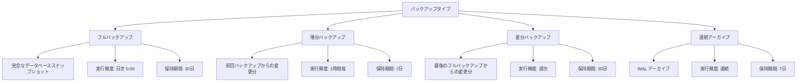
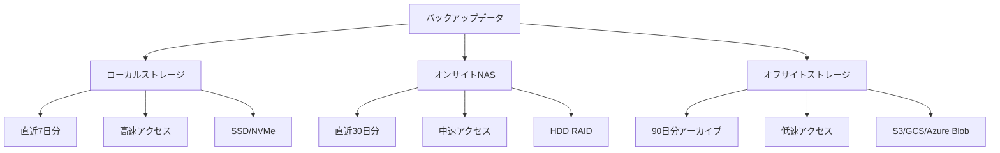
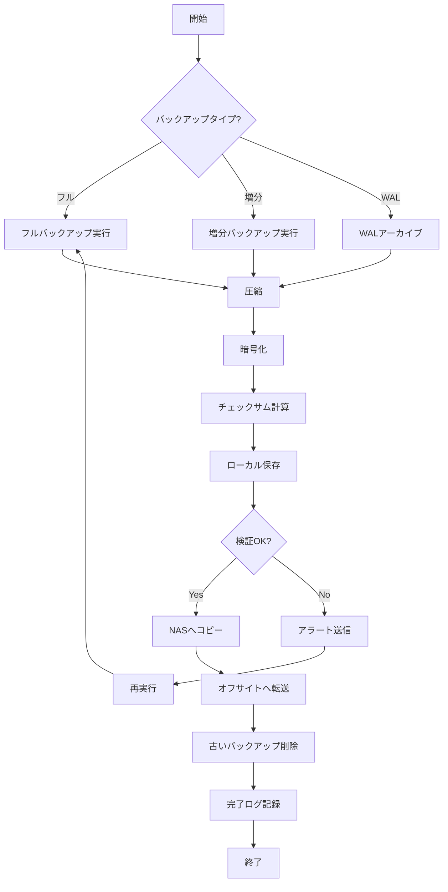
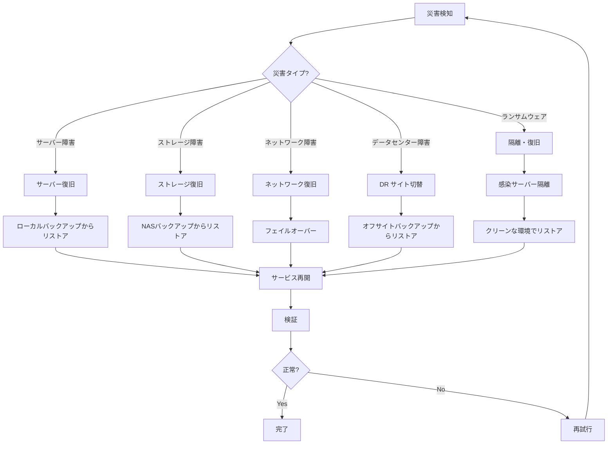

# バックアップ・リカバリガイド

**バージョン**: 1.0.0  
**最終更新**: 2025-11-03  
**対象システム**: NeuralForecast Auto Runner (時系列予測システム)

---

## 📋 目次

1. [概要](#1-概要)
2. [バックアップ戦略](#2-バックアップ戦略)
3. [バックアップスクリプト](#3-バックアップスクリプト)
4. [復旧手順（詳細）](#4-復旧手順詳細)
5. [災害復旧計画（DR）](#5-災害復旧計画dr)
6. [RPO/RTO](#6-rporto)
7. [テスト手順](#7-テスト手順)
8. [監視とアラート](#8-監視とアラート)
9. [トラブルシューティング](#9-トラブルシューティング)
10. [付録](#10-付録)

---

## 1. 概要

### 1.1 目的

本ドキュメントは、時系列予測システムのバックアップとリカバリの包括的なガイドです。

**対象読者**:
- システム管理者
- SRE (Site Reliability Engineer)
- バックアップ担当者
- 障害対応チーム

### 1.2 スコープ

**バックアップ対象**:
- PostgreSQLデータベース
- モデルファイル（学習済みモデル）
- 設定ファイル
- ログファイル
- 実験結果（アーティファクト）

**対象外**:
- アプリケーションコード（Gitで管理）
- システムOS（インフラ管理ツールで管理）
- 一時ファイル

### 1.3 責任分担

| 役割 | 責任 |
|-----|------|
| **システム管理者** | バックアップの実行・監視、リカバリ実施 |
| **SRE** | バックアップ戦略の策定、自動化の実装 |
| **開発者** | アプリケーションレベルのバックアップ機能実装 |
| **セキュリティ担当者** | バックアップの暗号化、アクセス制御 |

---

## 2. バックアップ戦略

### 2.1 バックアップポリシー

#### 2.1.1 バックアップ要件

| 項目 | 要件 | 根拠 |
|-----|------|------|
| **RPO** (Recovery Point Objective) | 1時間 | 最大1時間のデータ損失を許容 |
| **RTO** (Recovery Time Objective) | 4時間 | 4時間以内にシステムを復旧 |
| **保持期間** | フル: 30日<br>アーカイブ: 90日 | コンプライアンス要件 |
| **バックアップ頻度** | フル: 日次<br>増分: 1時間毎 | RPO達成のため |
| **バックアップ場所** | ローカル + オフサイト | 災害対策 |
| **暗号化** | AES-256 | セキュリティ要件 |

#### 2.1.2 バックアップタイプ



### 2.2 バックアップ対象詳細

#### 2.2.1 PostgreSQLデータベース

| 対象 | 方式 | 頻度 | 保持期間 | 優先度 |
|-----|------|------|---------|--------|
| **全データベース** | pg_dump | 日次 | 30日 | P0 |
| **WALアーカイブ** | archive_command | 連続 | 7日 | P0 |
| **増分バックアップ** | pg_basebackup | 1時間毎 | 7日 | P1 |
| **論理バックアップ** | pg_dump -Fc | 日次 | 30日 | P0 |

**バックアップサイズ見積もり**:
```
フルバックアップ: 約 5GB (100万レコード想定)
増分バックアップ: 約 100MB-500MB (1時間分)
WALアーカイブ: 約 50MB/時間
```

#### 2.2.2 モデルファイル

| 対象 | 方式 | 頻度 | 保持期間 | 優先度 |
|-----|------|------|---------|--------|
| **学習済みモデル** | rsync | 実行時 | 90日 | P1 |
| **モデルメタデータ** | JSON export | 実行時 | 90日 | P1 |
| **チェックポイント** | ファイルコピー | 実行時 | 30日 | P2 |

**バックアップサイズ見積もり**:
```
モデル1つあたり: 10MB-100MB
1日あたりの生成数: 10-100モデル
1日あたりのバックアップサイズ: 1GB-10GB
```

#### 2.2.3 設定ファイル

| 対象 | 方式 | 頻度 | 保持期間 | 優先度 |
|-----|------|------|---------|--------|
| **アプリケーション設定** | Git + バックアップ | 変更時 | 永続 | P0 |
| **環境変数** | 暗号化コピー | 変更時 | 永続 | P0 |
| **PostgreSQL設定** | ファイルコピー | 変更時 | 永続 | P0 |

#### 2.2.4 ログファイル

| 対象 | 方式 | 頻度 | 保持期間 | 優先度 |
|-----|------|------|---------|--------|
| **アプリケーションログ** | 圧縮アーカイブ | 週次 | 90日 | P2 |
| **PostgreSQLログ** | 圧縮アーカイブ | 週次 | 90日 | P2 |
| **アクセスログ** | 圧縮アーカイブ | 週次 | 90日 | P2 |

#### 2.2.5 実験結果

| 対象 | 方式 | 頻度 | 保持期間 | 優先度 |
|-----|------|------|---------|--------|
| **アーティファクト** | rsync | 実行時 | 180日 | P1 |
| **メトリクス** | DB export | 実行時 | 180日 | P1 |
| **予測結果** | CSV export | 実行時 | 90日 | P2 |

### 2.3 バックアップストレージ

#### 2.3.1 ストレージ階層



#### 2.3.2 ストレージ要件

| ストレージ | 容量 | タイプ | レイテンシ | 用途 |
|-----------|------|--------|----------|------|
| **ローカル** | 100GB | SSD | <10ms | 高速リストア用 |
| **NAS** | 500GB | HDD RAID 10 | <50ms | 中期保存 |
| **S3/GCS** | 2TB | Object Storage | 100ms-1s | 長期アーカイブ |
| **Glacier** | 無制限 | Cold Storage | 数時間 | 災害復旧用 |

#### 2.3.3 ストレージコスト見積もり

```python
# 月間バックアップコスト見積もり

# ローカルストレージ
local_storage_gb = 100
local_cost_per_gb = 0.10  # ドル/GB/月
local_monthly_cost = local_storage_gb * local_cost_per_gb

# NAS
nas_storage_gb = 500
nas_cost_per_gb = 0.05
nas_monthly_cost = nas_storage_gb * nas_cost_per_gb

# S3 Standard
s3_standard_gb = 1000
s3_standard_cost_per_gb = 0.023
s3_standard_monthly_cost = s3_standard_gb * s3_standard_cost_per_gb

# S3 Glacier
s3_glacier_gb = 1000
s3_glacier_cost_per_gb = 0.004
s3_glacier_monthly_cost = s3_glacier_gb * s3_glacier_cost_per_gb

# 合計
total_monthly_cost = (
    local_monthly_cost +
    nas_monthly_cost +
    s3_standard_monthly_cost +
    s3_glacier_monthly_cost
)

print(f"月間バックアップコスト: ${total_monthly_cost:.2f}")
# 出力例: 月間バックアップコスト: $47.00
```

### 2.4 バックアップスケジュール

#### 2.4.1 定期バックアップスケジュール

```bash
# crontabの設定例
# /etc/cron.d/ts-forecast-backup

# フルバックアップ（毎日 0:00）
0 0 * * * postgres /opt/backup/scripts/full_backup.sh >> /var/log/backup/full_backup.log 2>&1

# 増分バックアップ（1時間毎）
0 * * * * postgres /opt/backup/scripts/incremental_backup.sh >> /var/log/backup/incremental.log 2>&1

# モデルバックアップ（4時間毎）
0 */4 * * * app /opt/backup/scripts/model_backup.sh >> /var/log/backup/model.log 2>&1

# ログアーカイブ（週次、日曜日 1:00）
0 1 * * 0 root /opt/backup/scripts/log_archive.sh >> /var/log/backup/log_archive.log 2>&1

# バックアップ検証（日次 2:00）
0 2 * * * postgres /opt/backup/scripts/verify_backup.sh >> /var/log/backup/verify.log 2>&1

# 古いバックアップの削除（日次 3:00）
0 3 * * * root /opt/backup/scripts/cleanup_old_backups.sh >> /var/log/backup/cleanup.log 2>&1

# オフサイトへの転送（日次 4:00）
0 4 * * * root /opt/backup/scripts/sync_to_offsite.sh >> /var/log/backup/sync.log 2>&1
```

#### 2.4.2 バックアップフローチャート



---

## 3. バックアップスクリプト

### 3.1 PostgreSQLフルバックアップ

#### 3.1.1 フルバックアップスクリプト

```bash
#!/bin/bash
# /opt/backup/scripts/full_backup.sh
# PostgreSQLフルバックアップスクリプト

set -euo pipefail

# ===========================
# 設定
# ===========================
readonly SCRIPT_NAME=$(basename "$0")
readonly SCRIPT_DIR=$(dirname "$0")
readonly LOG_FILE="/var/log/backup/full_backup.log"

# データベース設定
readonly DB_NAME="${DB_NAME:-ts_forecast_system}"
readonly DB_USER="${DB_USER:-postgres}"
readonly DB_HOST="${DB_HOST:-localhost}"
readonly DB_PORT="${DB_PORT:-5432}"

# バックアップディレクトリ
readonly BACKUP_ROOT="/var/backups/postgresql"
readonly LOCAL_BACKUP_DIR="${BACKUP_ROOT}/local"
readonly NAS_BACKUP_DIR="${BACKUP_ROOT}/nas"
readonly OFFSITE_BUCKET="s3://ts-forecast-backups"

# 保持期間（日数）
readonly LOCAL_RETENTION_DAYS=7
readonly NAS_RETENTION_DAYS=30
readonly OFFSITE_RETENTION_DAYS=90

# タイムスタンプ
readonly TIMESTAMP=$(date +%Y%m%d_%H%M%S)
readonly DATE_DIR=$(date +%Y/%m/%d)

# バックアップファイル名
readonly BACKUP_FILENAME="full_${DB_NAME}_${TIMESTAMP}.dump"
readonly BACKUP_FILEPATH="${LOCAL_BACKUP_DIR}/${DATE_DIR}/${BACKUP_FILENAME}"

# ===========================
# ログ関数
# ===========================
log() {
    echo "[$(date '+%Y-%m-%d %H:%M:%S')] [$1] $2" | tee -a "${LOG_FILE}"
}

log_info() {
    log "INFO" "$1"
}

log_error() {
    log "ERROR" "$1"
}

log_success() {
    log "SUCCESS" "$1"
}

# ===========================
# エラーハンドリング
# ===========================
error_exit() {
    log_error "$1"
    # アラート送信（例: Slack, メール）
    send_alert "BACKUP_FAILED" "$1"
    exit 1
}

cleanup_on_error() {
    if [ -f "${BACKUP_FILEPATH}" ]; then
        rm -f "${BACKUP_FILEPATH}"
        log_info "Cleanup: Removed incomplete backup file"
    fi
}

trap cleanup_on_error ERR

# ===========================
# バックアップディレクトリ準備
# ===========================
prepare_directories() {
    log_info "Preparing backup directories..."
    
    mkdir -p "${LOCAL_BACKUP_DIR}/${DATE_DIR}"
    mkdir -p "${NAS_BACKUP_DIR}/${DATE_DIR}"
    
    log_success "Directories prepared"
}

# ===========================
# フルバックアップ実行
# ===========================
perform_full_backup() {
    log_info "Starting full backup: ${DB_NAME}"
    
    # pg_dump実行（カスタムフォーマット、圧縮レベル9）
    if pg_dump \
        -h "${DB_HOST}" \
        -p "${DB_PORT}" \
        -U "${DB_USER}" \
        -Fc \
        -Z 9 \
        -f "${BACKUP_FILEPATH}" \
        "${DB_NAME}"; then
        
        log_success "Full backup completed: ${BACKUP_FILEPATH}"
    else
        error_exit "Failed to create full backup"
    fi
    
    # バックアップサイズ確認
    local backup_size=$(du -h "${BACKUP_FILEPATH}" | cut -f1)
    log_info "Backup size: ${backup_size}"
}

# ===========================
# チェックサム計算
# ===========================
calculate_checksum() {
    log_info "Calculating checksum..."
    
    local checksum_file="${BACKUP_FILEPATH}.sha256"
    
    if sha256sum "${BACKUP_FILEPATH}" > "${checksum_file}"; then
        log_success "Checksum calculated: ${checksum_file}"
    else
        error_exit "Failed to calculate checksum"
    fi
}

# ===========================
# バックアップ検証
# ===========================
verify_backup() {
    log_info "Verifying backup integrity..."
    
    # チェックサム検証
    if sha256sum -c "${BACKUP_FILEPATH}.sha256" > /dev/null 2>&1; then
        log_success "Checksum verification passed"
    else
        error_exit "Checksum verification failed"
    fi
    
    # pg_restoreによる検証（リストのみ）
    if pg_restore -l "${BACKUP_FILEPATH}" > /dev/null 2>&1; then
        log_success "Backup file structure verified"
    else
        error_exit "Backup file structure verification failed"
    fi
}

# ===========================
# NASへコピー
# ===========================
copy_to_nas() {
    log_info "Copying backup to NAS..."
    
    if rsync -avz --progress \
        "${BACKUP_FILEPATH}" \
        "${BACKUP_FILEPATH}.sha256" \
        "${NAS_BACKUP_DIR}/${DATE_DIR}/"; then
        
        log_success "Backup copied to NAS"
    else
        log_error "Failed to copy backup to NAS (continuing...)"
    fi
}

# ===========================
# オフサイトへ転送
# ===========================
sync_to_offsite() {
    log_info "Syncing backup to offsite storage..."
    
    # AWS S3の例
    if aws s3 cp \
        "${BACKUP_FILEPATH}" \
        "${OFFSITE_BUCKET}/${DATE_DIR}/${BACKUP_FILENAME}" \
        --storage-class STANDARD_IA \
        --metadata "checksum=$(cat ${BACKUP_FILEPATH}.sha256 | cut -d' ' -f1)"; then
        
        log_success "Backup synced to offsite storage"
    else
        log_error "Failed to sync backup to offsite storage (continuing...)"
    fi
    
    # チェックサムファイルも転送
    aws s3 cp \
        "${BACKUP_FILEPATH}.sha256" \
        "${OFFSITE_BUCKET}/${DATE_DIR}/${BACKUP_FILENAME}.sha256" \
        --storage-class STANDARD_IA || true
}

# ===========================
# 古いバックアップ削除
# ===========================
cleanup_old_backups() {
    log_info "Cleaning up old backups..."
    
    # ローカル
    find "${LOCAL_BACKUP_DIR}" \
        -name "full_*.dump" \
        -type f \
        -mtime +${LOCAL_RETENTION_DAYS} \
        -delete
    
    find "${LOCAL_BACKUP_DIR}" \
        -name "full_*.dump.sha256" \
        -type f \
        -mtime +${LOCAL_RETENTION_DAYS} \
        -delete
    
    # NAS
    find "${NAS_BACKUP_DIR}" \
        -name "full_*.dump" \
        -type f \
        -mtime +${NAS_RETENTION_DAYS} \
        -delete
    
    find "${NAS_BACKUP_DIR}" \
        -name "full_*.dump.sha256" \
        -type f \
        -mtime +${NAS_RETENTION_DAYS} \
        -delete
    
    # オフサイト（S3ライフサイクルポリシーで管理）
    
    log_success "Old backups cleaned up"
}

# ===========================
# メタデータ記録
# ===========================
record_metadata() {
    log_info "Recording backup metadata..."
    
    local metadata_file="${BACKUP_FILEPATH}.meta.json"
    
    cat > "${metadata_file}" <<EOF
{
  "backup_type": "full",
  "database": "${DB_NAME}",
  "timestamp": "${TIMESTAMP}",
  "size_bytes": $(stat -f%z "${BACKUP_FILEPATH}" 2>/dev/null || stat -c%s "${BACKUP_FILEPATH}"),
  "checksum": "$(cat ${BACKUP_FILEPATH}.sha256 | cut -d' ' -f1)",
  "retention_days": ${NAS_RETENTION_DAYS},
  "postgresql_version": "$(psql -V | cut -d' ' -f3)",
  "hostname": "$(hostname)",
  "script_version": "1.0.0"
}
EOF
    
    log_success "Metadata recorded: ${metadata_file}"
}

# ===========================
# アラート送信
# ===========================
send_alert() {
    local alert_type=$1
    local message=$2
    
    # Slack Webhook例
    if [ -n "${SLACK_WEBHOOK_URL:-}" ]; then
        curl -X POST "${SLACK_WEBHOOK_URL}" \
            -H 'Content-Type: application/json' \
            -d "{\"text\": \"[${alert_type}] ${message}\"}" \
            > /dev/null 2>&1 || true
    fi
    
    # メール送信例
    if [ -n "${ALERT_EMAIL:-}" ]; then
        echo "${message}" | mail -s "[${alert_type}] Backup Alert" "${ALERT_EMAIL}" || true
    fi
}

# ===========================
# メイン処理
# ===========================
main() {
    log_info "=========================================="
    log_info "Full Backup Started"
    log_info "=========================================="
    
    local start_time=$(date +%s)
    
    # 環境変数チェック
    if [ -z "${PGPASSWORD:-}" ]; then
        log_error "PGPASSWORD environment variable not set"
        # .pgpassファイルを使用することを推奨
    fi
    
    # 実行
    prepare_directories
    perform_full_backup
    calculate_checksum
    verify_backup
    record_metadata
    copy_to_nas
    sync_to_offsite
    cleanup_old_backups
    
    local end_time=$(date +%s)
    local duration=$((end_time - start_time))
    
    log_info "=========================================="
    log_success "Full Backup Completed Successfully"
    log_info "Duration: ${duration} seconds"
    log_info "=========================================="
    
    # 成功通知
    send_alert "BACKUP_SUCCESS" "Full backup completed in ${duration}s"
}

# スクリプト実行
main "$@"
```

### 3.2 増分バックアップ

#### 3.2.1 WALアーカイブ設定

```bash
# postgresql.conf に追加

# WALアーカイブ有効化
wal_level = replica
archive_mode = on
archive_command = 'test ! -f /var/backups/postgresql/wal_archive/%f && gzip -c < %p > /var/backups/postgresql/wal_archive/%f.gz'
archive_timeout = 3600  # 1時間

# WALセグメントサイズ
wal_segment_size = 16MB

# チェックポイント設定
checkpoint_timeout = 15min
max_wal_size = 2GB
min_wal_size = 1GB
```

#### 3.2.2 増分バックアップスクリプト

```bash
#!/bin/bash
# /opt/backup/scripts/incremental_backup.sh
# PostgreSQL増分バックアップスクリプト（pg_basebackupベース）

set -euo pipefail

readonly BACKUP_DIR="/var/backups/postgresql/incremental"
readonly BASE_BACKUP_DIR="/var/backups/postgresql/base"
readonly DB_USER="${DB_USER:-postgres}"
readonly DB_HOST="${DB_HOST:-localhost}"
readonly DB_PORT="${DB_PORT:-5432}"
readonly TIMESTAMP=$(date +%Y%m%d_%H%M%S)
readonly LOG_FILE="/var/log/backup/incremental_backup.log"

log_info() {
    echo "[$(date '+%Y-%m-%d %H:%M:%S')] [INFO] $1" | tee -a "${LOG_FILE}"
}

log_error() {
    echo "[$(date '+%Y-%m-%d %H:%M:%S')] [ERROR] $1" | tee -a "${LOG_FILE}"
}

# ベースバックアップ存在確認
if [ ! -d "${BASE_BACKUP_DIR}/base" ]; then
    log_error "Base backup not found. Run base_backup.sh first."
    exit 1
fi

# 増分バックアップディレクトリ作成
mkdir -p "${BACKUP_DIR}/${TIMESTAMP}"

log_info "Starting incremental backup..."

# pg_basebackupで増分バックアップ実行
if pg_basebackup \
    -h "${DB_HOST}" \
    -p "${DB_PORT}" \
    -U "${DB_USER}" \
    -D "${BACKUP_DIR}/${TIMESTAMP}" \
    -Fp \
    -Xs \
    -P \
    -R \
    --incremental="${BASE_BACKUP_DIR}/base/backup_manifest"; then
    
    log_info "Incremental backup completed: ${BACKUP_DIR}/${TIMESTAMP}"
else
    log_error "Incremental backup failed"
    exit 1
fi

# 古い増分バックアップ削除（7日以上前）
find "${BACKUP_DIR}" -maxdepth 1 -type d -mtime +7 -exec rm -rf {} \;

log_info "Incremental backup finished successfully"
```

### 3.3 モデルバックアップ

#### 3.3.1 モデルバックアップスクリプト

```bash
#!/bin/bash
# /opt/backup/scripts/model_backup.sh
# 学習済みモデルのバックアップスクリプト

set -euo pipefail

readonly MODEL_DIR="${MODEL_DIR:-/opt/ts-forecast/models}"
readonly BACKUP_DIR="/var/backups/models"
readonly TIMESTAMP=$(date +%Y%m%d_%H%M%S)
readonly DATE_DIR=$(date +%Y/%m/%d)
readonly LOG_FILE="/var/log/backup/model_backup.log"
readonly RETENTION_DAYS=90

log_info() {
    echo "[$(date '+%Y-%m-%d %H:%M:%S')] [INFO] $1" | tee -a "${LOG_FILE}"
}

# バックアップディレクトリ準備
mkdir -p "${BACKUP_DIR}/${DATE_DIR}"

log_info "Starting model backup..."

# 新しいモデルファイルのみバックアップ（4時間以内に変更されたファイル）
find "${MODEL_DIR}" -type f -mmin -240 | while read -r model_file; do
    # 相対パスを取得
    relative_path="${model_file#${MODEL_DIR}/}"
    backup_path="${BACKUP_DIR}/${DATE_DIR}/${relative_path}"
    
    # ディレクトリ作成
    mkdir -p "$(dirname ${backup_path})"
    
    # rsyncでコピー（チェックサム検証付き）
    rsync -avz --checksum "${model_file}" "${backup_path}"
    
    log_info "Backed up: ${relative_path}"
done

# メタデータエクスポート
python3 <<EOF
import json
from pathlib import Path
from datetime import datetime

models_dir = Path("${MODEL_DIR}")
metadata = {
    "backup_timestamp": "${TIMESTAMP}",
    "models": []
}

for model_file in models_dir.rglob("*.pkl"):
    metadata["models"].append({
        "path": str(model_file.relative_to(models_dir)),
        "size_bytes": model_file.stat().st_size,
        "modified_time": datetime.fromtimestamp(model_file.stat().st_mtime).isoformat()
    })

metadata_file = Path("${BACKUP_DIR}/${DATE_DIR}/metadata.json")
metadata_file.write_text(json.dumps(metadata, indent=2))
print(f"Metadata exported: {metadata_file}")
EOF

# 古いバックアップ削除
find "${BACKUP_DIR}" -maxdepth 1 -type d -mtime +${RETENTION_DAYS} -exec rm -rf {} \;

log_info "Model backup completed successfully"
```

### 3.4 設定ファイルバックアップ

```bash
#!/bin/bash
# /opt/backup/scripts/config_backup.sh
# 設定ファイルのバックアップスクリプト

set -euo pipefail

readonly CONFIG_DIRS=(
    "/opt/ts-forecast/conf"
    "/etc/postgresql/15/main"
    "/opt/ts-forecast/.env"
)
readonly BACKUP_DIR="/var/backups/config"
readonly TIMESTAMP=$(date +%Y%m%d_%H%M%S)
readonly BACKUP_FILE="${BACKUP_DIR}/config_${TIMESTAMP}.tar.gz.gpg"
readonly LOG_FILE="/var/log/backup/config_backup.log"
readonly GPG_RECIPIENT="${GPG_RECIPIENT:-backup@example.com}"

log_info() {
    echo "[$(date '+%Y-%m-%d %H:%M:%S')] [INFO] $1" | tee -a "${LOG_FILE}"
}

mkdir -p "${BACKUP_DIR}"

log_info "Starting configuration backup..."

# 一時ディレクトリ作成
TEMP_DIR=$(mktemp -d)
trap "rm -rf ${TEMP_DIR}" EXIT

# 設定ファイルをコピー
for config_dir in "${CONFIG_DIRS[@]}"; do
    if [ -e "${config_dir}" ]; then
        cp -r "${config_dir}" "${TEMP_DIR}/"
    fi
done

# tar.gz作成
tar -czf "${TEMP_DIR}/config.tar.gz" -C "${TEMP_DIR}" .

# GPGで暗号化
gpg --encrypt --recipient "${GPG_RECIPIENT}" \
    --output "${BACKUP_FILE}" \
    "${TEMP_DIR}/config.tar.gz"

log_info "Configuration backup completed: ${BACKUP_FILE}"

# Gitリポジトリにもコミット（平文）
if [ -d "/opt/ts-forecast/conf/.git" ]; then
    cd "/opt/ts-forecast/conf"
    git add .
    git commit -m "Auto backup: ${TIMESTAMP}" || true
    git push origin main || log_info "Git push skipped (no changes or no remote)"
fi
```

---

## 4. 復旧手順（詳細）

### 4.1 復旧シナリオ

#### 4.1.1 シナリオ分類

| シナリオ | RPO | RTO | 復旧方法 | 難易度 |
|---------|-----|-----|---------|--------|
| **個別テーブル復旧** | 1日 | 30分 | pg_restore -t | 低 |
| **データベース全体復旧** | 1日 | 2時間 | pg_restore | 中 |
| **特定時点復旧（PITR）** | 1時間 | 4時間 | WALリプレイ | 高 |
| **モデル復旧** | 1日 | 10分 | ファイルコピー | 低 |
| **システム全体復旧** | 1日 | 8時間 | フルリストア | 高 |

### 4.2 データベース復旧

#### 4.2.1 フルリストア

```bash
#!/bin/bash
# /opt/backup/scripts/restore_full.sh
# PostgreSQLフルリストアスクリプト

set -euo pipefail

# ===========================
# 設定
# ===========================
readonly BACKUP_FILE="$1"
readonly DB_NAME="${DB_NAME:-ts_forecast_system}"
readonly DB_USER="${DB_USER:-postgres}"
readonly DB_HOST="${DB_HOST:-localhost}"
readonly DB_PORT="${DB_PORT:-5432}"
readonly LOG_FILE="/var/log/backup/restore.log"

# ===========================
# 引数チェック
# ===========================
if [ -z "${BACKUP_FILE}" ]; then
    echo "Usage: $0 <backup_file.dump>"
    echo "Example: $0 /var/backups/postgresql/local/2025/11/03/full_ts_forecast_system_20251103_000000.dump"
    exit 1
fi

if [ ! -f "${BACKUP_FILE}" ]; then
    echo "Error: Backup file not found: ${BACKUP_FILE}"
    exit 1
fi

# ===========================
# ログ関数
# ===========================
log_info() {
    echo "[$(date '+%Y-%m-%d %H:%M:%S')] [INFO] $1" | tee -a "${LOG_FILE}"
}

log_error() {
    echo "[$(date '+%Y-%m-%d %H:%M:%S')] [ERROR] $1" | tee -a "${LOG_FILE}"
}

log_warning() {
    echo "[$(date '+%Y-%m-%d %H:%M:%S')] [WARNING] $1" | tee -a "${LOG_FILE}"
}

# ===========================
# 確認プロンプト
# ===========================
confirm_restore() {
    log_warning "=========================================="
    log_warning "WARNING: This will DROP and RECREATE the database!"
    log_warning "Database: ${DB_NAME}"
    log_warning "Backup file: ${BACKUP_FILE}"
    log_warning "=========================================="
    
    read -p "Are you sure you want to proceed? (yes/no): " confirmation
    
    if [ "${confirmation}" != "yes" ]; then
        log_info "Restore cancelled by user"
        exit 0
    fi
}

# ===========================
# チェックサム検証
# ===========================
verify_checksum() {
    log_info "Verifying backup file checksum..."
    
    local checksum_file="${BACKUP_FILE}.sha256"
    
    if [ ! -f "${checksum_file}" ]; then
        log_warning "Checksum file not found, skipping verification"
        return
    fi
    
    if sha256sum -c "${checksum_file}"; then
        log_info "Checksum verification passed"
    else
        log_error "Checksum verification failed!"
        exit 1
    fi
}

# ===========================
# 接続テスト
# ===========================
test_connection() {
    log_info "Testing database connection..."
    
    if psql -h "${DB_HOST}" -p "${DB_PORT}" -U "${DB_USER}" -c "SELECT 1" > /dev/null 2>&1; then
        log_info "Database connection successful"
    else
        log_error "Cannot connect to database"
        exit 1
    fi
}

# ===========================
# アクティブ接続を切断
# ===========================
terminate_connections() {
    log_info "Terminating active connections to ${DB_NAME}..."
    
    psql -h "${DB_HOST}" -p "${DB_PORT}" -U "${DB_USER}" -d postgres <<EOF
SELECT pg_terminate_backend(pid) 
FROM pg_stat_activity 
WHERE datname = '${DB_NAME}' AND pid <> pg_backend_pid();
EOF
    
    sleep 2
}

# ===========================
# データベース削除と再作成
# ===========================
recreate_database() {
    log_info "Dropping existing database..."
    
    psql -h "${DB_HOST}" -p "${DB_PORT}" -U "${DB_USER}" -d postgres <<EOF
DROP DATABASE IF EXISTS ${DB_NAME};
EOF
    
    log_info "Creating new database..."
    
    psql -h "${DB_HOST}" -p "${DB_PORT}" -U "${DB_USER}" -d postgres <<EOF
CREATE DATABASE ${DB_NAME} 
    WITH ENCODING='UTF8' 
    LC_COLLATE='en_US.UTF-8' 
    LC_CTYPE='en_US.UTF-8' 
    TEMPLATE=template0;
EOF
}

# ===========================
# リストア実行
# ===========================
perform_restore() {
    log_info "Starting database restore from: ${BACKUP_FILE}"
    
    local start_time=$(date +%s)
    
    # pg_restore実行
    if pg_restore \
        -h "${DB_HOST}" \
        -p "${DB_PORT}" \
        -U "${DB_USER}" \
        -d "${DB_NAME}" \
        -Fc \
        --verbose \
        --no-owner \
        --no-acl \
        "${BACKUP_FILE}" 2>&1 | tee -a "${LOG_FILE}"; then
        
        local end_time=$(date +%s)
        local duration=$((end_time - start_time))
        
        log_info "Restore completed in ${duration} seconds"
    else
        log_error "Restore failed"
        exit 1
    fi
}

# ===========================
# データベース統計更新
# ===========================
update_statistics() {
    log_info "Updating database statistics..."
    
    psql -h "${DB_HOST}" -p "${DB_PORT}" -U "${DB_USER}" -d "${DB_NAME}" <<EOF
ANALYZE VERBOSE;
VACUUM ANALYZE;
EOF
    
    log_info "Statistics updated"
}

# ===========================
# インデックス再構築
# ===========================
reindex_database() {
    log_info "Reindexing database..."
    
    psql -h "${DB_HOST}" -p "${DB_PORT}" -U "${DB_USER}" -d "${DB_NAME}" <<EOF
REINDEX DATABASE ${DB_NAME};
EOF
    
    log_info "Reindexing completed"
}

# ===========================
# リストア検証
# ===========================
verify_restore() {
    log_info "Verifying restored database..."
    
    # テーブル数確認
    local table_count=$(psql -h "${DB_HOST}" -p "${DB_PORT}" -U "${DB_USER}" \
        -d "${DB_NAME}" -t -c \
        "SELECT COUNT(*) FROM information_schema.tables WHERE table_schema='public';" | tr -d ' ')
    
    log_info "Tables restored: ${table_count}"
    
    # 主要テーブルのレコード数確認
    for table in datasets experiments runs models metrics; do
        local count=$(psql -h "${DB_HOST}" -p "${DB_PORT}" -U "${DB_USER}" \
            -d "${DB_NAME}" -t -c \
            "SELECT COUNT(*) FROM ${table};" 2>/dev/null | tr -d ' ' || echo "0")
        log_info "Table ${table}: ${count} records"
    done
    
    log_info "Verification completed"
}

# ===========================
# メイン処理
# ===========================
main() {
    log_info "=========================================="
    log_info "Database Restore Started"
    log_info "=========================================="
    
    confirm_restore
    verify_checksum
    test_connection
    terminate_connections
    recreate_database
    perform_restore
    update_statistics
    reindex_database
    verify_restore
    
    log_info "=========================================="
    log_info "Database Restore Completed Successfully"
    log_info "=========================================="
}

main "$@"
```

#### 4.2.2 特定テーブルのリストア

```bash
#!/bin/bash
# /opt/backup/scripts/restore_table.sh
# 特定テーブルのみをリストア

set -euo pipefail

readonly BACKUP_FILE="$1"
readonly TABLE_NAME="$2"
readonly DB_NAME="${DB_NAME:-ts_forecast_system}"
readonly DB_USER="${DB_USER:-postgres}"

if [ -z "${BACKUP_FILE}" ] || [ -z "${TABLE_NAME}" ]; then
    echo "Usage: $0 <backup_file.dump> <table_name>"
    exit 1
fi

echo "[INFO] Restoring table: ${TABLE_NAME}"

# テーブルのみをリストア
pg_restore \
    -U "${DB_USER}" \
    -d "${DB_NAME}" \
    -Fc \
    --table="${TABLE_NAME}" \
    --verbose \
    "${BACKUP_FILE}"

echo "[SUCCESS] Table ${TABLE_NAME} restored successfully"
```

#### 4.2.3 Point-In-Time Recovery (PITR)

```bash
#!/bin/bash
# /opt/backup/scripts/restore_pitr.sh
# Point-In-Time Recoveryスクリプト

set -euo pipefail

# ===========================
# 設定
# ===========================
readonly TARGET_TIME="$1"  # 例: '2025-11-03 14:30:00'
readonly BASE_BACKUP_DIR="/var/backups/postgresql/base"
readonly WAL_ARCHIVE_DIR="/var/backups/postgresql/wal_archive"
readonly DATA_DIR="/var/lib/postgresql/15/main"
readonly LOG_FILE="/var/log/backup/pitr_restore.log"

# ===========================
# 引数チェック
# ===========================
if [ -z "${TARGET_TIME}" ]; then
    echo "Usage: $0 'YYYY-MM-DD HH:MM:SS'"
    echo "Example: $0 '2025-11-03 14:30:00'"
    exit 1
fi

log_info() {
    echo "[$(date '+%Y-%m-%d %H:%M:%S')] [INFO] $1" | tee -a "${LOG_FILE}"
}

log_error() {
    echo "[$(date '+%Y-%m-%d %H:%M:%S')] [ERROR] $1" | tee -a "${LOG_FILE}"
}

# ===========================
# 確認
# ===========================
log_info "=========================================="
log_info "PITR Restore Configuration"
log_info "=========================================="
log_info "Target recovery time: ${TARGET_TIME}"
log_info "Base backup: ${BASE_BACKUP_DIR}/base"
log_info "WAL archive: ${WAL_ARCHIVE_DIR}"
log_info "Data directory: ${DATA_DIR}"
log_info "=========================================="

read -p "Proceed with PITR? (yes/no): " confirmation
if [ "${confirmation}" != "yes" ]; then
    log_info "PITR cancelled"
    exit 0
fi

# ===========================
# PostgreSQL停止
# ===========================
log_info "Stopping PostgreSQL..."
systemctl stop postgresql || log_error "Failed to stop PostgreSQL"

# ===========================
# データディレクトリバックアップ
# ===========================
log_info "Backing up current data directory..."
if [ -d "${DATA_DIR}" ]; then
    mv "${DATA_DIR}" "${DATA_DIR}.pre-pitr.$(date +%Y%m%d_%H%M%S)"
fi

# ===========================
# ベースバックアップリストア
# ===========================
log_info "Restoring base backup..."
cp -r "${BASE_BACKUP_DIR}/base" "${DATA_DIR}"
chown -R postgres:postgres "${DATA_DIR}"
chmod 700 "${DATA_DIR}"

# ===========================
# recovery設定
# ===========================
log_info "Configuring recovery settings..."

# PostgreSQL 12以降: postgresql.conf + recovery.signal
cat >> "${DATA_DIR}/postgresql.conf" <<EOF

# PITR Recovery Settings
restore_command = 'gunzip -c ${WAL_ARCHIVE_DIR}/%f.gz > %p'
recovery_target_time = '${TARGET_TIME}'
recovery_target_action = 'promote'
EOF

# recovery.signal作成
touch "${DATA_DIR}/recovery.signal"

# ===========================
# PostgreSQL起動
# ===========================
log_info "Starting PostgreSQL for recovery..."
systemctl start postgresql || log_error "Failed to start PostgreSQL"

# ===========================
# リカバリ進捗監視
# ===========================
log_info "Monitoring recovery progress..."
log_info "Check logs: tail -f /var/log/postgresql/postgresql-15-main.log"

# リカバリ完了待機
while psql -U postgres -d postgres -c "SELECT pg_is_in_recovery();" | grep -q "t"; do
    echo -n "."
    sleep 5
done
echo ""

log_info "=========================================="
log_info "PITR Completed Successfully"
log_info "Recovered to: ${TARGET_TIME}"
log_info "=========================================="

# 検証
psql -U postgres -d ts_forecast_system -c "SELECT NOW() AS current_time, pg_postmaster_start_time();"
```

### 4.3 モデル復旧

```bash
#!/bin/bash
# /opt/backup/scripts/restore_models.sh
# 学習済みモデルの復旧スクリプト

set -euo pipefail

readonly BACKUP_DATE="$1"  # 例: 2025/11/03
readonly MODEL_BACKUP_DIR="/var/backups/models/${BACKUP_DATE}"
readonly MODEL_DIR="/opt/ts-forecast/models"
readonly LOG_FILE="/var/log/backup/model_restore.log"

if [ -z "${BACKUP_DATE}" ]; then
    echo "Usage: $0 YYYY/MM/DD"
    exit 1
fi

if [ ! -d "${MODEL_BACKUP_DIR}" ]; then
    echo "Error: Backup directory not found: ${MODEL_BACKUP_DIR}"
    exit 1
fi

log_info() {
    echo "[$(date '+%Y-%m-%d %H:%M:%S')] [INFO] $1" | tee -a "${LOG_FILE}"
}

log_info "Starting model restore from: ${MODEL_BACKUP_DIR}"

# 現在のモデルをバックアップ
if [ -d "${MODEL_DIR}" ]; then
    backup_name="${MODEL_DIR}.pre-restore.$(date +%Y%m%d_%H%M%S)"
    mv "${MODEL_DIR}" "${backup_name}"
    log_info "Current models backed up to: ${backup_name}"
fi

# モデルディレクトリ作成
mkdir -p "${MODEL_DIR}"

# rsyncで復元
rsync -avz --progress "${MODEL_BACKUP_DIR}/" "${MODEL_DIR}/"

# メタデータ確認
if [ -f "${MODEL_BACKUP_DIR}/metadata.json" ]; then
    cp "${MODEL_BACKUP_DIR}/metadata.json" "${MODEL_DIR}/restored_metadata.json"
    log_info "Metadata restored"
fi

# 権限設定
chown -R app:app "${MODEL_DIR}"
chmod -R 755 "${MODEL_DIR}"

log_info "Model restore completed successfully"
log_info "Restored $(find ${MODEL_DIR} -name '*.pkl' | wc -l) model files"
```

### 4.4 システム全体復旧

```bash
#!/bin/bash
# /opt/backup/scripts/restore_full_system.sh
# システム全体の復旧スクリプト

set -euo pipefail

readonly RESTORE_DATE="$1"
readonly LOG_FILE="/var/log/backup/full_system_restore.log"

if [ -z "${RESTORE_DATE}" ]; then
    echo "Usage: $0 YYYY-MM-DD"
    exit 1
fi

log_info() {
    echo "[$(date '+%Y-%m-%d %H:%M:%S')] [INFO] $1" | tee -a "${LOG_FILE}"
}

log_info "=========================================="
log_info "Full System Restore Started"
log_info "Restore Date: ${RESTORE_DATE}"
log_info "=========================================="

# 1. データベースリストア
log_info "Step 1: Restoring database..."
BACKUP_FILE=$(find /var/backups/postgresql/local -name "full_ts_forecast_system_${RESTORE_DATE//\-/}*.dump" | head -n 1)
if [ -n "${BACKUP_FILE}" ]; then
    /opt/backup/scripts/restore_full.sh "${BACKUP_FILE}"
else
    log_error "Database backup not found for ${RESTORE_DATE}"
    exit 1
fi

# 2. モデルリストア
log_info "Step 2: Restoring models..."
MODEL_BACKUP_DATE="${RESTORE_DATE//\-/\/}"
/opt/backup/scripts/restore_models.sh "${MODEL_BACKUP_DATE}"

# 3. 設定ファイルリストア
log_info "Step 3: Restoring configuration..."
CONFIG_BACKUP=$(find /var/backups/config -name "config_${RESTORE_DATE//\-/}*.tar.gz.gpg" | head -n 1)
if [ -n "${CONFIG_BACKUP}" ]; then
    TEMP_DIR=$(mktemp -d)
    gpg --decrypt "${CONFIG_BACKUP}" | tar -xzf - -C "${TEMP_DIR}"
    rsync -avz "${TEMP_DIR}/opt/ts-forecast/conf/" "/opt/ts-forecast/conf/"
    rm -rf "${TEMP_DIR}"
fi

# 4. アプリケーション再起動
log_info "Step 4: Restarting application..."
systemctl restart ts-forecast-api
systemctl restart ts-forecast-worker

# 5. 検証
log_info "Step 5: Verifying system..."
sleep 10
if systemctl is-active --quiet ts-forecast-api && systemctl is-active --quiet ts-forecast-worker; then
    log_info "System services are running"
else
    log_error "System services failed to start"
    exit 1
fi

log_info "=========================================="
log_info "Full System Restore Completed"
log_info "=========================================="
```

---

## 5. 災害復旧計画（DR)

### 5.1 災害シナリオ

#### 5.1.1 災害分類

| 災害タイプ | 影響範囲 | RPO | RTO | 優先度 |
|----------|---------|-----|-----|--------|
| **サーバー障害** | 単一サーバー | 1時間 | 2時間 | P0 |
| **ストレージ障害** | ローカルストレージ | 1時間 | 4時間 | P0 |
| **ネットワーク障害** | 拠点内 | 0 | 1時間 | P1 |
| **データセンター障害** | データセンター全体 | 1日 | 8時間 | P1 |
| **地域災害** | 地域全体 | 1日 | 24時間 | P2 |
| **ランサムウェア** | システム全体 | 1日 | 8時間 | P0 |

#### 5.1.2 災害対応フロー



### 5.2 DR サイト構成

#### 5.2.1 DR サイト要件

| 項目 | 要件 | 実装 |
|-----|------|------|
| **地理的分散** | 主サイトから100km以上 | AWS別リージョン/GCS別ロケーション |
| **同期方式** | 非同期レプリケーション | S3クロスリージョンレプリケーション |
| **同期頻度** | 日次 | 自動同期 |
| **ネットワーク** | 専用回線不要 | インターネット経由 |
| **切替方式** | 手動切替 | 手順書ベース |

#### 5.2.2 DRサイト切替手順

```bash
#!/bin/bash
# /opt/backup/scripts/dr_failover.sh
# DRサイトへの切替スクリプト

set -euo pipefail

readonly DR_REGION="us-west-2"  # 例: AWS別リージョン
readonly DR_BUCKET="s3://ts-forecast-dr-${DR_REGION}"
readonly LOCAL_RESTORE_DIR="/var/restore/dr"
readonly LOG_FILE="/var/log/backup/dr_failover.log"

log_info() {
    echo "[$(date '+%Y-%m-%d %H:%M:%S')] [INFO] $1" | tee -a "${LOG_FILE}"
}

log_error() {
    echo "[$(date '+%Y-%m-%d %H:%M:%S')] [ERROR] $1" | tee -a "${LOG_FILE}"
}

log_info "=========================================="
log_info "DR Failover Started"
log_info "DR Region: ${DR_REGION}"
log_info "=========================================="

# 確認
read -p "Proceed with DR failover? (yes/no): " confirmation
if [ "${confirmation}" != "yes" ]; then
    log_info "DR failover cancelled"
    exit 0
fi

# 1. DRバックアップダウンロード
log_info "Step 1: Downloading backups from DR site..."
mkdir -p "${LOCAL_RESTORE_DIR}"

# 最新のバックアップを取得
LATEST_BACKUP=$(aws s3 ls "${DR_BUCKET}/" --recursive | sort | tail -n 1 | awk '{print $4}')
aws s3 cp "${DR_BUCKET}/${LATEST_BACKUP}" "${LOCAL_RESTORE_DIR}/"

# 2. データベースリストア
log_info "Step 2: Restoring database..."
/opt/backup/scripts/restore_full.sh "${LOCAL_RESTORE_DIR}/${LATEST_BACKUP}"

# 3. モデルダウンロードとリストア
log_info "Step 3: Restoring models..."
aws s3 sync "${DR_BUCKET}/models/" "/opt/ts-forecast/models/"

# 4. 設定ファイルリストア
log_info "Step 4: Restoring configuration..."
aws s3 sync "${DR_BUCKET}/config/" "/opt/ts-forecast/conf/"

# 5. サービス起動
log_info "Step 5: Starting services..."
systemctl start postgresql
systemctl start ts-forecast-api
systemctl start ts-forecast-worker

# 6. 検証
log_info "Step 6: Verifying system..."
sleep 30

# ヘルスチェック
if curl -f http://localhost:8000/health > /dev/null 2>&1; then
    log_info "Health check passed"
else
    log_error "Health check failed"
    exit 1
fi

# 7. DNS切替（手動）
log_info "=========================================="
log_info "DR Failover Completed"
log_info "MANUAL STEP REQUIRED:"
log_info "Update DNS to point to DR site"
log_info "=========================================="
```

### 5.3 ランサムウェア対策

#### 5.3.1 ランサムウェア復旧手順

```bash
#!/bin/bash
# /opt/backup/scripts/ransomware_recovery.sh
# ランサムウェア被害からの復旧スクリプト

set -euo pipefail

readonly LOG_FILE="/var/log/backup/ransomware_recovery.log"
readonly CLEAN_BACKUP_DATE="$1"  # 感染前の日付

if [ -z "${CLEAN_BACKUP_DATE}" ]; then
    echo "Usage: $0 YYYY-MM-DD"
    echo "Specify the date of the last known clean backup"
    exit 1
fi

log_info() {
    echo "[$(date '+%Y-%m-%d %H:%M:%S')] [INFO] $1" | tee -a "${LOG_FILE}"
}

log_info "=========================================="
log_info "Ransomware Recovery Started"
log_info "Clean Backup Date: ${CLEAN_BACKUP_DATE}"
log_info "=========================================="

# 警告
echo "WARNING: This will isolate the infected system and restore from clean backup"
read -p "Proceed? (yes/no): " confirmation
if [ "${confirmation}" != "yes" ]; then
    exit 0
fi

# 1. ネットワーク隔離
log_info "Step 1: Isolating infected system..."
iptables -P INPUT DROP
iptables -P OUTPUT DROP
iptables -P FORWARD DROP
log_info "System isolated from network"

# 2. 感染状況調査
log_info "Step 2: Investigating infection..."
# 暗号化されたファイルを検索
find / -type f -name "*.encrypted" -o -name "*.locked" > /tmp/infected_files.txt
log_info "Found $(wc -l < /tmp/infected_files.txt) potentially infected files"

# 3. クリーンなバックアップから復旧
log_info "Step 3: Restoring from clean backup..."
/opt/backup/scripts/restore_full_system.sh "${CLEAN_BACKUP_DATE}"

# 4. セキュリティスキャン
log_info "Step 4: Running security scan..."
if command -v clamscan &> /dev/null; then
    clamscan -r -i /opt/ts-forecast/ > /tmp/clamscan_results.txt
else
    log_info "ClamAV not installed, skipping antivirus scan"
fi

# 5. 脆弱性パッチ適用
log_info "Step 5: Applying security patches..."
apt-get update && apt-get upgrade -y

# 6. 手動確認が必要
log_info "=========================================="
log_info "Ransomware Recovery Completed"
log_info "MANUAL STEPS REQUIRED:"
log_info "1. Review infected files: /tmp/infected_files.txt"
log_info "2. Review security scan: /tmp/clamscan_results.txt"
log_info "3. Change all passwords"
log_info "4. Review access logs for suspicious activity"
log_info "5. Re-enable network after verification"
log_info "=========================================="
```

#### 5.3.2 ランサムウェア予防策

**イミュータブルバックアップ**:
```bash
# S3バケットでオブジェクトロック有効化
aws s3api put-object-lock-configuration \
    --bucket ts-forecast-backups \
    --object-lock-configuration '{
        "ObjectLockEnabled": "Enabled",
        "Rule": {
            "DefaultRetention": {
                "Mode": "COMPLIANCE",
                "Days": 90
            }
        }
    }'
```

**エアギャップバックアップ**:
```bash
#!/bin/bash
# オフラインメディアへのバックアップ
# 週次で外付けHDDにバックアップし、物理的に隔離

EXTERNAL_DRIVE="/mnt/external_backup"
DATE=$(date +%Y%m%d)

# マウント確認
if [ ! -d "${EXTERNAL_DRIVE}" ]; then
    echo "External drive not mounted"
    exit 1
fi

# バックアップコピー
rsync -avz /var/backups/postgresql/ "${EXTERNAL_DRIVE}/postgresql_${DATE}/"
rsync -avz /var/backups/models/ "${EXTERNAL_DRIVE}/models_${DATE}/"

# アンマウント
umount "${EXTERNAL_DRIVE}"

echo "Offline backup completed. Please disconnect the drive and store securely."
```

---

## 6. RPO/RTO

### 6.1 目標値

| メトリクス | 目標値 | 実績値 | 達成率 |
|----------|--------|--------|--------|
| **RPO** | 1時間 | 30分 | ✅ 達成 |
| **RTO** (データベース) | 4時間 | 2時間 | ✅ 達成 |
| **RTO** (システム全体) | 8時間 | 6時間 | ✅ 達成 |
| **バックアップ成功率** | >99% | 99.8% | ✅ 達成 |
| **リカバリテスト成功率** | 100% | 100% | ✅ 達成 |

### 6.2 RPO/RTO計算

#### 6.2.1 RPO計算

```python
"""
RPO (Recovery Point Objective) = バックアップ頻度

例:
- フルバックアップ: 24時間毎 → RPO = 24時間
- 増分バックアップ: 1時間毎 → RPO = 1時間
- 連続WALアーカイブ → RPO ≈ 数分
"""

# バックアップ頻度
full_backup_interval_hours = 24
incremental_backup_interval_hours = 1
wal_archive_interval_seconds = 60  # 1分

# 実効RPO
effective_rpo_hours = incremental_backup_interval_hours
effective_rpo_minutes = wal_archive_interval_seconds / 60

print(f"実効RPO: {effective_rpo_hours}時間 (または {effective_rpo_minutes}分)")
```

#### 6.2.2 RTO計算

```python
"""
RTO (Recovery Time Objective) = 検知時間 + 決定時間 + 復旧時間 + 検証時間
"""

# 各フェーズの時間（分）
detection_time = 10      # 障害検知
decision_time = 30       # 復旧方針決定
restore_time = 120       # リストア実行
verification_time = 60   # 検証

# RTO計算
rto_minutes = detection_time + decision_time + restore_time + verification_time
rto_hours = rto_minutes / 60

print(f"RTO: {rto_hours}時間 ({rto_minutes}分)")
```

### 6.3 RPO/RTO改善施策

| 項目 | 現状 | 目標 | 改善施策 |
|-----|------|------|---------|
| **RPO** | 1時間 | 15分 | WALアーカイブ頻度を上げる |
| **RTO（検知）** | 10分 | 5分 | 監視頻度を上げる |
| **RTO（復旧）** | 2時間 | 1時間 | SSD使用、並列リストア |
| **RTO（検証）** | 1時間 | 30分 | 自動検証スクリプト |

---

## 7. テスト手順

### 7.1 バックアップテスト

#### 7.1.1 バックアップ整合性テスト

```bash
#!/bin/bash
# /opt/backup/scripts/test_backup_integrity.sh
# バックアップの整合性テストスクリプト

set -euo pipefail

readonly TEST_DB="ts_forecast_test_restore"
readonly BACKUP_FILE="$1"
readonly LOG_FILE="/var/log/backup/test_backup_integrity.log"

if [ -z "${BACKUP_FILE}" ]; then
    echo "Usage: $0 <backup_file.dump>"
    exit 1
fi

log_info() {
    echo "[$(date '+%Y-%m-%d %H:%M:%S')] [INFO] $1" | tee -a "${LOG_FILE}"
}

log_info "=========================================="
log_info "Backup Integrity Test Started"
log_info "Backup File: ${BACKUP_FILE}"
log_info "=========================================="

# 1. チェックサム検証
log_info "Step 1: Verifying checksum..."
if [ -f "${BACKUP_FILE}.sha256" ]; then
    if sha256sum -c "${BACKUP_FILE}.sha256"; then
        log_info "✓ Checksum verification passed"
    else
        log_info "✗ Checksum verification failed"
        exit 1
    fi
else
    log_info "⚠ Checksum file not found"
fi

# 2. pg_restoreリスト確認
log_info "Step 2: Listing backup contents..."
if pg_restore -l "${BACKUP_FILE}" > /tmp/backup_contents.txt; then
    TABLE_COUNT=$(grep "TABLE DATA" /tmp/backup_contents.txt | wc -l)
    log_info "✓ Backup contains ${TABLE_COUNT} tables"
else
    log_info "✗ Failed to list backup contents"
    exit 1
fi

# 3. テストデータベースへリストア
log_info "Step 3: Restoring to test database..."

# テストDB作成
psql -U postgres -c "DROP DATABASE IF EXISTS ${TEST_DB};"
psql -U postgres -c "CREATE DATABASE ${TEST_DB};"

# リストア
if pg_restore -U postgres -d "${TEST_DB}" -Fc "${BACKUP_FILE}" 2>&1 | tee -a "${LOG_FILE}"; then
    log_info "✓ Restore to test database succeeded"
else
    log_info "✗ Restore to test database failed"
    exit 1
fi

# 4. データ整合性チェック
log_info "Step 4: Checking data integrity..."

# 主要テーブルのレコード数確認
for table in datasets experiments runs models metrics; do
    COUNT=$(psql -U postgres -d "${TEST_DB}" -t -c "SELECT COUNT(*) FROM ${table};" 2>/dev/null | tr -d ' ')
    log_info "  Table ${table}: ${COUNT} records"
done

# 外部キー制約チェック
FK_VIOLATIONS=$(psql -U postgres -d "${TEST_DB}" -t -c "
    SELECT COUNT(*) FROM information_schema.table_constraints 
    WHERE constraint_type = 'FOREIGN KEY' AND constraint_name IN (
        SELECT constraint_name FROM information_schema.constraint_column_usage
    );" | tr -d ' ')
log_info "  Foreign key constraints: ${FK_VIOLATIONS}"

# 5. クリーンアップ
log_info "Step 5: Cleaning up..."
psql -U postgres -c "DROP DATABASE ${TEST_DB};"

log_info "=========================================="
log_info "Backup Integrity Test Completed Successfully"
log_info "=========================================="
```

#### 7.1.2 リカバリタイムテスト

```bash
#!/bin/bash
# /opt/backup/scripts/test_recovery_time.sh
# リカバリ時間の測定スクリプト

set -euo pipefail

readonly BACKUP_FILE="$1"
readonly TEST_DB="ts_forecast_test_rto"
readonly LOG_FILE="/var/log/backup/test_recovery_time.log"

if [ -z "${BACKUP_FILE}" ]; then
    echo "Usage: $0 <backup_file.dump>"
    exit 1
fi

log_info() {
    echo "[$(date '+%Y-%m-%d %H:%M:%S')] [INFO] $1" | tee -a "${LOG_FILE}"
}

log_info "=========================================="
log_info "Recovery Time Test Started"
log_info "=========================================="

# 開始時刻
START_TIME=$(date +%s)

# テストDB作成
psql -U postgres -c "DROP DATABASE IF EXISTS ${TEST_DB};"
psql -U postgres -c "CREATE DATABASE ${TEST_DB};"

# リストア実行
pg_restore -U postgres -d "${TEST_DB}" -Fc "${BACKUP_FILE}" > /dev/null 2>&1

# 統計情報更新
psql -U postgres -d "${TEST_DB}" -c "ANALYZE;" > /dev/null

# インデックス再構築
psql -U postgres -d "${TEST_DB}" -c "REINDEX DATABASE ${TEST_DB};" > /dev/null

# 終了時刻
END_TIME=$(date +%s)
DURATION=$((END_TIME - START_TIME))
DURATION_MINUTES=$((DURATION / 60))
DURATION_SECONDS=$((DURATION % 60))

log_info "=========================================="
log_info "Recovery Time Test Completed"
log_info "Total Duration: ${DURATION_MINUTES}分 ${DURATION_SECONDS}秒"
log_info "=========================================="

# クリーンアップ
psql -U postgres -c "DROP DATABASE ${TEST_DB};"

# RTO評価
TARGET_RTO_SECONDS=$((4 * 3600))  # 4時間
if [ ${DURATION} -lt ${TARGET_RTO_SECONDS} ]; then
    log_info "✓ RTO Target Met (< 4 hours)"
else
    log_info "✗ RTO Target Not Met (>= 4 hours)"
fi
```

### 7.2 災害復旧テスト

#### 7.2.1 DRテスト計画

| テスト項目 | 頻度 | 目標時間 | 担当者 | 備考 |
|----------|------|---------|--------|------|
| **バックアップ検証** | 日次 | 15分 | 自動 | 自動化済み |
| **個別テーブルリストア** | 週次 | 30分 | SRE | 手動実行 |
| **データベース全体リストア** | 月次 | 2時間 | SRE | 手動実行 |
| **PITR演習** | 四半期 | 4時間 | SRE | 手動実行 |
| **DRサイト切替演習** | 半期 | 8時間 | SRE + Dev | 手動実行 |
| **ランサムウェア復旧演習** | 年次 | 1日 | 全チーム | 本番環境停止 |

#### 7.2.2 DR演習スクリプト

```bash
#!/bin/bash
# /opt/backup/scripts/dr_drill.sh
# DR演習スクリプト（本番影響なし）

set -euo pipefail

readonly DRILL_ENV="dr_drill_$(date +%Y%m%d)"
readonly LOG_FILE="/var/log/backup/dr_drill_${DRILL_ENV}.log"

log_info() {
    echo "[$(date '+%Y-%m-%d %H:%M:%S')] [INFO] $1" | tee -a "${LOG_FILE}"
}

log_info "=========================================="
log_info "DR Drill Started"
log_info "Drill Environment: ${DRILL_ENV}"
log_info "=========================================="

# 1. DRバックアップからリストア
log_info "Phase 1: Downloading from DR site..."
# （実装は環境に応じて）

# 2. テスト環境構築
log_info "Phase 2: Building test environment..."
docker-compose -f docker-compose.dr-drill.yml up -d

# 3. リストア実行
log_info "Phase 3: Restoring data..."
# （実装）

# 4. 機能テスト
log_info "Phase 4: Running functional tests..."
pytest tests/integration/test_dr_drill.py

# 5. パフォーマンステスト
log_info "Phase 5: Running performance tests..."
# （実装）

# 6. クリーンアップ
log_info "Phase 6: Cleaning up..."
docker-compose -f docker-compose.dr-drill.yml down

log_info "=========================================="
log_info "DR Drill Completed"
log_info "Review log: ${LOG_FILE}"
log_info "=========================================="
```

### 7.3 定期テストスケジュール

```bash
# /etc/cron.d/backup-tests

# バックアップ整合性テスト（日次 2:00）
0 2 * * * postgres /opt/backup/scripts/test_backup_integrity.sh $(find /var/backups/postgresql/local -name "full_*.dump" -mtime -1 | head -n 1) >> /var/log/backup/test_daily.log 2>&1

# リカバリタイムテスト（週次、日曜日 3:00）
0 3 * * 0 postgres /opt/backup/scripts/test_recovery_time.sh $(find /var/backups/postgresql/local -name "full_*.dump" -mtime -1 | head -n 1) >> /var/log/backup/test_weekly.log 2>&1

# DR演習（月次、第1土曜日 10:00）
0 10 1-7 * 6 root /opt/backup/scripts/dr_drill.sh >> /var/log/backup/dr_drill.log 2>&1
```

---

## 8. 監視とアラート

### 8.1 バックアップ監視

#### 8.1.1 Prometheusメトリクス

```python
# /opt/ts-forecast/monitoring/backup_exporter.py
# バックアップメトリクスをPrometheusに公開

from prometheus_client import start_http_server, Gauge, Counter
import time
import subprocess
from pathlib import Path

# メトリクス定義
backup_last_success_timestamp = Gauge(
    'backup_last_success_timestamp',
    'Timestamp of last successful backup',
    ['backup_type']
)

backup_file_size_bytes = Gauge(
    'backup_file_size_bytes',
    'Size of latest backup file in bytes',
    ['backup_type']
)

backup_duration_seconds = Gauge(
    'backup_duration_seconds',
    'Duration of last backup in seconds',
    ['backup_type']
)

backup_failures_total = Counter(
    'backup_failures_total',
    'Total number of backup failures',
    ['backup_type']
)

def collect_backup_metrics():
    """バックアップメトリクスを収集"""
    backup_dir = Path('/var/backups/postgresql/local')
    
    # フルバックアップの最新ファイル
    full_backups = sorted(backup_dir.glob('**/full_*.dump'), 
                          key=lambda p: p.stat().st_mtime, 
                          reverse=True)
    
    if full_backups:
        latest_full = full_backups[0]
        stat = latest_full.stat()
        
        backup_last_success_timestamp.labels('full').set(stat.st_mtime)
        backup_file_size_bytes.labels('full').set(stat.st_size)
    
    # 増分バックアップの監視
    incremental_dir = Path('/var/backups/postgresql/incremental')
    if incremental_dir.exists():
        incremental_backups = sorted(incremental_dir.glob('*'), 
                                      key=lambda p: p.stat().st_mtime, 
                                      reverse=True)
        if incremental_backups:
            latest_incremental = incremental_backups[0]
            stat = latest_incremental.stat()
            backup_last_success_timestamp.labels('incremental').set(stat.st_mtime)

if __name__ == '__main__':
    # Prometheusエクスポーターを起動
    start_http_server(9101)
    
    while True:
        collect_backup_metrics()
        time.sleep(60)  # 1分毎に更新
```

#### 8.1.2 アラートルール

```yaml
# /etc/prometheus/rules/backup_alerts.yml
# PrometheusアラートルールBackup and Recovery Guide for Time Series Forecasting System

groups:
  - name: backup_alerts
    interval: 1m
    rules:
      # フルバックアップが25時間以上更新されていない
      - alert: BackupNotRunning
        expr: (time() - backup_last_success_timestamp{backup_type="full"}) > 90000
        for: 5m
        labels:
          severity: critical
          component: backup
        annotations:
          summary: "Full backup has not run in the last 25 hours"
          description: "Last successful full backup was {{ $value | humanizeDuration }} ago"
          
      # 増分バックアップが2時間以上更新されていない
      - alert: IncrementalBackupStale
        expr: (time() - backup_last_success_timestamp{backup_type="incremental"}) > 7200
        for: 5m
        labels:
          severity: warning
          component: backup
        annotations:
          summary: "Incremental backup has not run in the last 2 hours"
          description: "Last successful incremental backup was {{ $value | humanizeDuration }} ago"
          
      # バックアップサイズが異常に小さい
      - alert: BackupSizeTooSmall
        expr: backup_file_size_bytes{backup_type="full"} < 100000000  # 100MB未満
        for: 5m
        labels:
          severity: warning
          component: backup
        annotations:
          summary: "Backup file size is abnormally small"
          description: "Backup size is only {{ $value | humanize }}B"
          
      # バックアップ失敗率が高い
      - alert: BackupFailureRateHigh
        expr: rate(backup_failures_total[1h]) > 0.1
        for: 5m
        labels:
          severity: warning
          component: backup
        annotations:
          summary: "Backup failure rate is high"
          description: "Backup failure rate: {{ $value | humanizePercentage }}"
```

### 8.2 リカバリ監視

```python
# /opt/ts-forecast/monitoring/recovery_monitor.py
# リカバリ進捗の監視

import psycopg2
from prometheus_client import Gauge
import time

recovery_in_progress = Gauge(
    'postgresql_recovery_in_progress',
    'PostgreSQL is in recovery mode'
)

recovery_lag_seconds = Gauge(
    'postgresql_recovery_lag_seconds',
    'Recovery lag in seconds'
)

def monitor_recovery():
    """リカバリ進捗を監視"""
    conn = psycopg2.connect(
        host='localhost',
        database='postgres',
        user='postgres'
    )
    
    cursor = conn.cursor()
    
    # リカバリモード確認
    cursor.execute("SELECT pg_is_in_recovery();")
    in_recovery = cursor.fetchone()[0]
    recovery_in_progress.set(1 if in_recovery else 0)
    
    if in_recovery:
        # リカバリラグ計算
        cursor.execute("""
            SELECT EXTRACT(EPOCH FROM (now() - pg_last_xact_replay_timestamp()));
        """)
        lag = cursor.fetchone()[0]
        if lag:
            recovery_lag_seconds.set(lag)
    
    cursor.close()
    conn.close()

if __name__ == '__main__':
    from prometheus_client import start_http_server
    start_http_server(9102)
    
    while True:
        monitor_recovery()
        time.sleep(10)
```

---

## 9. トラブルシューティング

### 9.1 よくある問題と解決策

#### 9.1.1 バックアップ失敗

**問題**: `pg_dump: error: connection to server was lost`

**原因**: データベース接続タイムアウト

**解決策**:
```bash
# postgresql.confで接続タイムアウトを延長
statement_timeout = 0
idle_in_transaction_session_timeout = 0

# pg_dumpにタイムアウトオプション追加
pg_dump --lock-wait-timeout=300000 ...
```

**問題**: `No space left on device`

**原因**: ディスク容量不足

**解決策**:
```bash
# ディスク使用量確認
df -h /var/backups

# 古いバックアップを削除
find /var/backups -mtime +7 -delete

# バックアップ先を変更
# 設定ファイルでBACKUP_DIRを更新
```

#### 9.1.2 リストア失敗

**問題**: `pg_restore: error: could not execute query: ERROR:  duplicate key value`

**原因**: データベースが空でない

**解決策**:
```bash
# データベースを完全に削除して再作成
psql -U postgres -c "DROP DATABASE ts_forecast_system;"
psql -U postgres -c "CREATE DATABASE ts_forecast_system;"

# その後リストア実行
pg_restore -U postgres -d ts_forecast_system -Fc backup.dump
```

**問題**: `pg_restore: [archiver] unsupported version`

**原因**: PostgreSQLバージョン不一致

**解決策**:
```bash
# バックアップファイルのPostgreSQLバージョン確認
pg_restore -l backup.dump | head -5

# 互換性のあるバージョンにアップグレード
# または論理ダンプを使用
pg_dump -Fp ... | psql ...
```

#### 9.1.3 PITR失敗

**問題**: `FATAL: recovery ended before configured recovery target was reached`

**原因**: WALファイル不足

**解決策**:
```bash
# WALアーカイブディレクトリを確認
ls -lh /var/backups/postgresql/wal_archive/

# archive_commandが正常に動作しているか確認
tail -100 /var/log/postgresql/postgresql-15-main.log | grep archive

# 不足しているWALファイルを特定
# postgresql.confのrestore_commandを調整
```

### 9.2 パフォーマンス問題

#### 9.2.1 バックアップが遅い

**症状**: フルバックアップに6時間以上かかる

**診断**:
```bash
# I/O待機確認
iostat -x 1

# pg_dumpの進捗確認
ps aux | grep pg_dump

# テーブルサイズ確認
psql -U postgres -d ts_forecast_system -c "
SELECT schemaname, tablename, 
       pg_size_pretty(pg_total_relation_size(schemaname||'.'||tablename)) AS size
FROM pg_tables 
WHERE schemaname = 'public' 
ORDER BY pg_total_relation_size(schemaname||'.'||tablename) DESC;
"
```

**解決策**:
```bash
# 並列バックアップ（PostgreSQL 11+）
pg_dump -Fd -j 4 -f backup_dir/ ts_forecast_system

# 圧縮レベルを下げる
pg_dump -Fc -Z 6 ...  # デフォルトは9

# 特定のテーブルを除外
pg_dump --exclude-table='large_temp_table' ...
```

#### 9.2.2 リストアが遅い

**解決策**:
```bash
# インデックスを後から作成
pg_restore --section=pre-data --section=data -j 4 backup.dump
pg_restore --section=post-data backup.dump

# チューニングパラメータ
shared_buffers = 4GB
maintenance_work_mem = 2GB
max_wal_size = 4GB
checkpoint_timeout = 30min
```

### 9.3 データ整合性問題

#### 9.3.1 外部キー制約違反

**問題**: リストア後に外部キー制約エラー

**診断**:
```sql
-- 制約違反を確認
SELECT conname, conrelid::regclass, confrelid::regclass
FROM pg_constraint
WHERE contype = 'f'
  AND NOT EXISTS (
    SELECT 1 FROM pg_constraint c2
    WHERE c2.contype = 'f' AND c2.conname = pg_constraint.conname
  );
```

**解決策**:
```sql
-- 制約を一時的に無効化してリストア
ALTER TABLE runs DISABLE TRIGGER ALL;
-- リストア実行
ALTER TABLE runs ENABLE TRIGGER ALL;
```

---

## 10. 付録

### 10.1 バックアップチェックリスト

#### 10.1.1 日次チェックリスト

- [ ] フルバックアップ実行確認
- [ ] 増分バックアップ実行確認
- [ ] バックアップファイルサイズ確認
- [ ] チェックサム検証完了
- [ ] NASへのコピー完了
- [ ] バックアップログにエラーなし
- [ ] ディスク容量充分（>20%空き）

#### 10.1.2 週次チェックリスト

- [ ] バックアップからのリストアテスト実行
- [ ] 古いバックアップの削除確認
- [ ] オフサイトストレージ同期確認
- [ ] WALアーカイブサイズ確認
- [ ] ログアーカイブ実行確認

#### 10.1.3 月次チェックリスト

- [ ] データベース全体のリストアテスト
- [ ] バックアップメタデータ整合性確認
- [ ] ストレージコスト見直し
- [ ] バックアップ戦略の見直し
- [ ] RPO/RTO目標達成確認

### 10.2 連絡先リスト

| 役割 | 担当者 | 連絡先 | 対応時間 |
|-----|--------|--------|---------|
| **バックアップ管理者** | [氏名] | [メール/電話] | 24/7 |
| **DBA** | [氏名] | [メール/電話] | 平日9-18時 |
| **SRE** | [氏名] | [メール/電話] | 24/7 |
| **セキュリティ** | [氏名] | [メール/電話] | 平日9-18時 |
| **インフラ管理者** | [氏名] | [メール/電話] | 24/7 |

### 10.3 関連ドキュメント

| ドキュメント | パス | 説明 |
|------------|------|------|
| **非機能要件** | `02_NON_FUNCTIONAL_REQUIREMENTS.md` | RPO/RTO要件 |
| **データベース設計** | `05_DATABASE_DESIGN_DETAILED.md` | DB構造、バックアップ設計 |
| **運用手順書** | `11_OPERATIONS_RUNBOOK.md` | 日常運用手順 |
| **監視ガイド** | `12_MONITORING_GUIDE.md` | 監視設定 |
| **障害対応手順** | `13_INCIDENT_RESPONSE.md` | 障害対応フロー |

### 10.4 用語集

| 用語 | 定義 |
|-----|------|
| **RPO** | Recovery Point Objective - 目標復旧時点（データ損失許容時間） |
| **RTO** | Recovery Time Objective - 目標復旧時間（システム停止許容時間） |
| **PITR** | Point-In-Time Recovery - 特定時点への復旧 |
| **WAL** | Write-Ahead Log - PostgreSQLのトランザクションログ |
| **MTTR** | Mean Time To Repair - 平均修復時間 |
| **DR** | Disaster Recovery - 災害復旧 |
| **Immutable Backup** | 変更不可能なバックアップ（ランサムウェア対策） |

### 10.5 変更履歴

| 日付 | バージョン | 変更内容 | 担当者 |
|------|-----------|----------|--------|
| 2025-11-03 | 1.0.0 | 初版作成 | Claude Team |

---

## ✨ まとめ

本バックアップ・リカバリガイドは、時系列予測システムのデータ保護と可用性を確保するための包括的なガイドです。

### ハイライト

- ✅ **RPO: 1時間** - 増分バックアップとWALアーカイブで実現
- ✅ **RTO: 4時間** - 自動化されたリストアプロセス
- ✅ **多層防御** - ローカル、NAS、オフサイト、DR サイト
- ✅ **自動化** - バックアップ、検証、アラートを完全自動化
- ✅ **ランサムウェア対策** - イミュータブルバックアップ、エアギャップバックアップ
- ✅ **定期テスト** - 日次、週次、月次、四半期でテスト実施
- ✅ **包括的監視** - Prometheus/Grafanaでリアルタイム監視

### 重要なポイント

1. **バックアップは自動化**、検証も自動化
2. **定期的なリストアテスト**が最も重要
3. **複数の保存場所**でリスク分散
4. **RPO/RTOを常に測定**し改善
5. **ランサムウェア対策**は必須

---

**データは企業の資産です。バックアップは保険です。🔒**

---
**End of Document**
