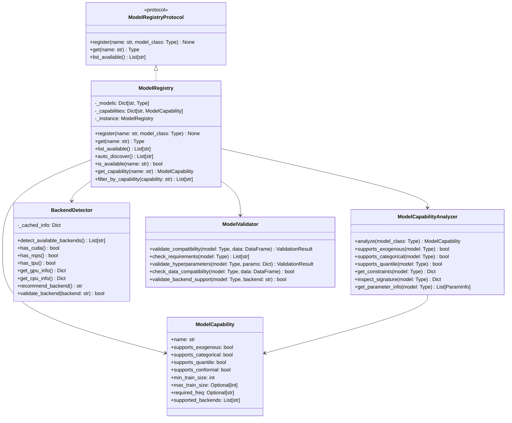

# C4アーキテクチャダイアグラム - 時系列予測システム
**C4 Model Architecture Diagrams for Time Series Forecasting System**

---

## 📋 ドキュメント情報

| 項目 | 内容 |
|-----|------|
| **ドキュメントタイトル** | 時系列予測システム C4アーキテクチャダイアグラム |
| **バージョン** | v1.0.0 |
| **作成日** | 2025-11-04 |
| **対象システム** | NeuralForecast Auto Runner + Time Series Forecasting System |
| **アーキテクチャモデル** | C4 Model (Context, Container, Component, Code) |

---

## 目次

1. [C4モデルとは](#1-c4モデルとは)
2. [Level 1: Context Diagram](#2-level-1-context-diagram)
3. [Level 2: Container Diagram](#3-level-2-container-diagram)
4. [Level 3: Component Diagram](#4-level-3-component-diagram)
5. [Level 4: Code Diagram](#5-level-4-code-diagram)
6. [処理シーケンス図](#6-処理シーケンス図)
7. [データフロー図](#7-データフロー図)
8. [デプロイメント図](#8-デプロイメント図)

---

## 1. C4モデルとは

C4モデルは、ソフトウェアアーキテクチャを4つの抽象化レベルで表現する手法です：

| レベル | 名称 | 対象 | 読者 |
|--------|------|------|------|
| **Level 1** | Context | システム全体と外部エンティティ | すべての人 |
| **Level 2** | Container | システムを構成する主要コンテナ | 技術的な意思決定者 |
| **Level 3** | Component | 各コンテナ内のコンポーネント | アーキテクト、開発者 |
| **Level 4** | Code | クラス、インターフェース | 開発者 |

---

## 2. Level 1: Context Diagram

### 2.1 システムコンテキスト図

システム全体と外部エンティティとの関係を示します。

```mermaid
C4Context
    title システムコンテキスト図 - 時系列予測システム

    Person(ds, "データサイエンティスト", "モデルの学習と評価を実行")
    Person(mle, "機械学習エンジニア", "システムの運用と監視")
    Person(analyst, "データアナリスト", "予測結果の分析と活用")
    Person(developer, "開発者", "システムの開発と保守")

    System(tfs, "時系列予測システム", "NeuralForecastを使用した<br/>自動時系列予測システム")

    System_Ext(data_source, "データソース", "CSV/Parquet形式の<br/>時系列データ")
    System_Ext(mlflow, "MLflow", "実験管理と<br/>モデルトラッキング")
    System_Ext(wandb, "Weights & Biases", "実験可視化と<br/>メトリクス監視")
    System_Ext(postgres, "PostgreSQL", "メタデータと<br/>実験結果の永続化")
    System_Ext(ray, "Ray Cluster", "分散並列実行<br/>環境")

    Rel(ds, tfs, "学習実行、ハイパーパラメータ探索", "CLI/API")
    Rel(mle, tfs, "システム運用、監視", "CLI/Web UI")
    Rel(analyst, tfs, "予測結果取得、分析", "API/Web UI")
    Rel(developer, tfs, "開発、テスト、デプロイ", "CLI/IDE")

    Rel(tfs, data_source, "データ読み込み", "pandas")
    Rel(tfs, mlflow, "実験ログ送信", "HTTP/REST")
    Rel(tfs, wandb, "メトリクス送信", "HTTP/REST")
    Rel(tfs, postgres, "メタデータ保存/読み込み", "SQL")
    Rel(tfs, ray, "分散タスク送信", "gRPC")

    UpdateRelStyle(ds, tfs, $offsetY="-40", $offsetX="-50")
    UpdateRelStyle(mle, tfs, $offsetY="-40", $offsetX="50")
    UpdateRelStyle(tfs, mlflow, $offsetY="20", $offsetX="-80")
    UpdateRelStyle(tfs, wandb, $offsetY="20", $offsetX="80")
```



### 2.2 コンテキスト図（標準グラフ）

```mermaid
graph TB
    subgraph "External Users"
        U1[データサイエンティスト]
        U2[機械学習エンジニア]
        U3[データアナリスト]
        U4[開発者]
    end

    subgraph "Time Series Forecasting System"
        TFS[時系列予測システム<br/>NeuralForecast Auto Runner]
    end

    subgraph "External Systems"
        DS[データソース<br/>CSV/Parquet]
        ML[MLflow<br/>実験管理]
        WB[Weights & Biases<br/>可視化]
        PG[(PostgreSQL<br/>メタデータDB)]
        RAY[Ray Cluster<br/>分散実行]
    end

    U1 -->|学習実行| TFS
    U2 -->|運用監視| TFS
    U3 -->|予測取得| TFS
    U4 -->|開発保守| TFS

    TFS -->|データ読込| DS
    TFS -->|実験ログ| ML
    TFS -->|メトリクス| WB
    TFS <-->|メタデータ| PG
    TFS -->|分散タスク| RAY

    style TFS fill:#4a90e2,color:#fff
    style DS fill:#e8f5e9
    style ML fill:#fff3e0
    style WB fill:#fff3e0
    style PG fill:#e1f5fe
    style RAY fill:#f3e5f5
```



---

## 3. Level 2: Container Diagram

### 3.1 コンテナ図 - システム全体

システムを構成する主要な実行単位（コンテナ）を示します。


### 3.2 コンテナ図（標準グラフ）


### 3.3 デプロイメントコンテナ図


---

## 4. Level 3: Component Diagram

### 4.1 Core Engine コンポーネント図

Core Engineを構成する9層のコンポーネントを示します。

```mermaid
C4Component
    title コンポーネント図 - Core Engine (9層アーキテクチャ)

    Container_Boundary(core, "Core Engine") {
        Component(l9, "Layer 9: Application", "Python", "オーケストレーション<br/>CLI/Web/API")
        Component(l8, "Layer 8: Logging", "Python", "ログ管理<br/>Progress Tracking")
        Component(l7, "Layer 7: Artifact Mgmt", "Python", "アーティファクト<br/>管理")
        Component(l6, "Layer 6: Execution", "Python", "実行エンジン<br/>Serial/Parallel/Ray")
        Component(l5, "Layer 5: Execution Plan", "Python", "実行計画<br/>生成")
        Component(l4, "Layer 4: Hyperparameter", "Python", "ハイパーパラメータ<br/>管理")
        Component(l3, "Layer 3: Model Discovery", "Python", "モデル検出<br/>レジストリ")
        Component(l2, "Layer 2: Data", "Python", "データ処理<br/>前処理")
        Component(l1, "Layer 1: Configuration", "Python", "設定管理<br/>環境変数")
    }

    ContainerDb(db, "PostgreSQL", "Database", "メタデータ")
    ContainerDb(fs, "File Storage", "File System", "アーティファクト")
    System_Ext(mlflow, "MLflow", "実験管理")
    System_Ext(ray, "Ray", "分散実行")

    Rel(l9, l8, "Uses", "Logging")
    Rel(l8, l7, "Uses", "Save Artifacts")
    Rel(l7, l6, "Uses", "Execute")
    Rel(l6, l5, "Uses", "Get Plan")
    Rel(l5, l4, "Uses", "Get Hyperparams")
    Rel(l4, l3, "Uses", "Get Models")
    Rel(l3, l2, "Uses", "Get Data")
    Rel(l2, l1, "Uses", "Get Config")

    Rel(l8, mlflow, "Log", "HTTP")
    Rel(l7, db, "Save", "SQL")
    Rel(l7, fs, "Write", "I/O")
    Rel(l6, ray, "Distribute", "gRPC")
    Rel(l2, fs, "Read", "I/O")

    UpdateRelStyle(l9, l8, $offsetY="-10")
    UpdateRelStyle(l8, l7, $offsetY="-10")
```



### 4.2 Layer 1: Configuration コンポーネント

```mermaid
graph TB
    subgraph "Layer 1: Configuration"
        CL[ConfigLoader]
        
        subgraph "Config Classes"
            BC[Config<br/><<abstract>>]
            PC[PathConfig]
            EC[ExecutionConfig]
            MC[ModelSelectionConfig]
            LC[LoggingConfig]
        end

        subgraph "Validators"
            CV[ConfigValidator]
            PV[PathValidator]
        end
    end

    ENV[Environment<br/>Variables]
    
    CL --> BC
    BC <|-- PC
    BC <|-- EC
    BC <|-- MC
    BC <|-- LC
    CL --> CV
    CV --> PV
    PC --> ENV
    EC --> ENV
    MC --> ENV
    LC --> ENV

    style BC fill:#ffeb3b,color:#000
    style CL fill:#4caf50,color:#fff
```

### 4.3 Layer 2: Data コンポーネント


### 4.4 Layer 3: Model Discovery コンポーネント


### 4.5 Layer 4: Hyperparameter コンポーネント


### 4.6 Layer 5: Execution Plan コンポーネント


### 4.7 Layer 6: Execution コンポーネント

```mermaid
graph TB
    subgraph "Layer 6: Execution"
        subgraph "Executor Interface"
            EX[Executor<br/><<abstract>>]
            EI[ExecutorInterface<br/><<protocol>>]
        end

        subgraph "Implementations"
            SE[SerialExecutor]
            PE[ParallelExecutor]
            RE[RayExecutor]
        end

        subgraph "Training"
            TM[TrainingManager]
            TE[TrainingExecutor]
            ME[ModelEvaluator]
        end

        subgraph "Monitoring"
            RM[Resource<br/>Monitor]
            MM[MemoryMonitor]
            GM[GPUMonitor]
            PM[ProgressMonitor]
        end
    end

    RAY[Ray Cluster]

    EX <|-- SE
    EX <|-- PE
    EX <|-- RE
    EI <.. EX
    SE --> TM
    PE --> TM
    RE --> TM
    RE --> RAY
    TM --> TE
    TM --> ME
    RM --> MM
    RM --> GM
    RM --> PM
    TM --> RM

    style EX fill:#ff5722,color:#fff
    style SE fill:#ff9800,color:#fff
    style PE fill:#ffc107,color:#000
    style RE fill:#ffeb3b,color:#000
    style RM fill:#4caf50,color:#fff
```

### 4.8 Layer 7: Artifact Management コンポーネント


### 4.9 Layer 8: Logging コンポーネント


### 4.10 Layer 9: Application コンポーネント

```mermaid
graph TB
    subgraph "Layer 9: Application"
        subgraph "Orchestration"
            MO[MainOrchestrator]
            WM[WorkflowManager]
            SM[StateManager]
        end

        subgraph "CLI"
            CLI[CLIEntryPoint]
            CC[CommandController]
            CA[CLIArgParser]
        end

        subgraph "Web UI"
            WU[WebUIApplication<br/>Streamlit]
            DC[DashboardController]
            VC[VisualizationController]
        end

        subgraph "API"
            API[FastAPI<br/>Application]
            RT[Router]
            EP[Endpoints]
        end
    end

    U[User]

    MO --> WM
    MO --> SM
    CLI --> CC
    CLI --> CA
    CLI --> MO
    WU --> DC
    WU --> VC
    WU --> MO
    API --> RT
    API --> EP
    API --> MO
    U --> CLI
    U --> WU
    U --> API

    style MO fill:#e91e63,color:#fff
    style CLI fill:#9c27b0,color:#fff
    style WU fill:#673ab7,color:#fff
    style API fill:#3f51b5,color:#fff
```

---

## 5. Level 4: Code Diagram

### 5.1 Layer 1: Configuration 詳細クラス図


### 5.2 Layer 2: Data 詳細クラス図


### 5.3 Layer 3: Model Discovery 詳細クラス図



### 5.4 Layer 4: Hyperparameter 詳細クラス図


### 5.5 Layer 5: Execution Plan 詳細クラス図


### 5.6 Layer 6: Execution 詳細クラス図

```mermaid
classDiagram
    class ExecutorProtocol {
        <<protocol>>
        +execute(plan: ExecutionPlan) List[Result]
        +execute_one(combination: Combination) Result
    }

    class Executor {
        <<abstract>>
        #_config: ExecutionConfig
        #_logger: Logger
        #_monitor: ResourceMonitor
        +execute(plan: ExecutionPlan) List[Result]
        +execute_one(combination: Combination) Result
        #_prepare_data(data_config: Dict) DataFrame
        #_train_model(model: str, params: Dict, data: DataFrame) Model
        #_evaluate_model(model: Model, data: DataFrame) Metrics
        #_save_artifacts(result: Result) None
    }

    class SerialExecutor {
        +execute(plan: ExecutionPlan) List[Result]
        +execute_one(combination: Combination) Result
        -_sequential_execution(combinations: List) List[Result]
    }

    class ParallelExecutor {
        -_max_workers: int
        -_executor: ThreadPoolExecutor
        +execute(plan: ExecutionPlan) List[Result]
        +execute_one(combination: Combination) Result
        -_parallel_execution(combinations: List) List[Result]
        -_worker_function(combination: Combination) Result
    }

    class RayExecutor {
        -_ray_config: Dict
        -_cluster: RayCluster
        +execute(plan: ExecutionPlan) List[Result]
        +execute_one(combination: Combination) Result
        -_distributed_execution(combinations: List) List[Result]
        -_submit_remote_task(combination: Combination) ObjectRef
        +shutdown() None
    }

    class TrainingManager {
        -_data_loader: DataLoader
        -_model_registry: ModelRegistry
        +train(model_name: str, params: Dict, data: DataFrame) TrainedModel
        +evaluate(model: TrainedModel, data: DataFrame) Metrics
        +cross_validate(model: Type, data: DataFrame, cv: int) CVResults
        -_prepare_training_data(data: DataFrame) Tuple
        -_fit_model(model: Type, X: ndarray, y: ndarray) Model
    }

    class ModelEvaluator {
        -_metrics: List[Metric]
        +evaluate(predictions: ndarray, actuals: ndarray) Metrics
        +compute_metric(name: str, pred: ndarray, actual: ndarray) float
        +compute_all_metrics(pred: ndarray, actual: ndarray) Dict
        +generate_report(metrics: Metrics) Report
    }

    class ResourceMonitor {
        -_memory_threshold: float
        -_gpu_threshold: float
        +start_monitoring() None
        +stop_monitoring() None
        +get_current_usage() ResourceUsage
        +check_available_resources() bool
        +wait_for_resources(required: Dict, timeout: int) bool
        -_monitor_loop() None
    }

    class MemoryMonitor {
        +get_process_memory() int
        +get_system_memory() Dict
        +check_memory_leak() bool
    }

    class GPUMonitor {
        +get_gpu_memory() List[int]
        +get_gpu_utilization() List[float]
        +select_best_gpu() int
    }

    ExecutorProtocol <|.. Executor
    Executor <|-- SerialExecutor
    Executor <|-- ParallelExecutor
    Executor <|-- RayExecutor
    Executor --> TrainingManager
    Executor --> ModelEvaluator
    Executor --> ResourceMonitor
    ResourceMonitor --> MemoryMonitor
    ResourceMonitor --> GPUMonitor
```

### 5.7 Layer 7: Artifact Management 詳細クラス図

```mermaid
classDiagram
    class ArtifactManager {
        -_storage: Storage
        -_registry: ArtifactRegistry
        -_version_manager: VersionManager
        +save_model(model: Model, metadata: Dict) str
        +load_model(id: str) Model
        +save_predictions(predictions: ndarray, metadata: Dict) str
        +load_predictions(id: str) ndarray
        +save_results(results: Results, metadata: Dict) str
        +load_results(id: str) Results
        +list_artifacts(filter: Dict) List[Artifact]
        +delete_artifact(id: str) bool
    }

    class ArtifactRegistry {
        -_db: Database
        +register(artifact: Artifact) str
        +get(id: str) Artifact
        +search(query: Dict) List[Artifact]
        +update(id: str, metadata: Dict) bool
        +delete(id: str) bool
    }

    class Artifact {
        +id: str
        +type: str
        +path: Path
        +metadata: Dict
        +version: str
        +created_at: datetime
        +size_bytes: int
        +checksum: str
        +to_dict() Dict
        +from_dict(data: Dict) Artifact
    }

    class ModelSaver {
        -_storage: Storage
        +save(model: Model, path: Path) None
        +save_with_metadata(model: Model, metadata: Dict) str
        +serialize(model: Model) bytes
        +compress(data: bytes) bytes
    }

    class ModelLoader {
        -_storage: Storage
        +load(path: Path) Model
        +load_by_id(id: str) Model
        +deserialize(data: bytes) Model
        +decompress(data: bytes) bytes
    }

    class PredictionSaver {
        -_storage: Storage
        +save(predictions: ndarray, path: Path) None
        +save_with_metadata(predictions: ndarray, metadata: Dict) str
        +to_dataframe(predictions: ndarray) DataFrame
    }

    class ResultSaver {
        -_storage: Storage
        +save(results: Results, path: Path) None
        +save_metrics(metrics: Dict, metadata: Dict) str
        +save_plots(plots: List[Figure], metadata: Dict) List[str]
    }

    class VersionManager {
        -_version_strategy: VersionStrategy
        +generate_version(artifact_type: str) str
        +validate_version(version: str) bool
        +compare_versions(v1: str, v2: str) int
        +get_latest_version(artifact_id: str) str
        +list_versions(artifact_id: str) List[str]
    }

    class Storage {
        <<interface>>
        +save(path: Path, data: bytes) None
        +load(path: Path) bytes
        +exists(path: Path) bool
        +delete(path: Path) None
        +list(directory: Path) List[Path]
    }

    class FileStorage {
        -_base_path: Path
        +save(path: Path, data: bytes) None
        +load(path: Path) bytes
        +exists(path: Path) bool
        +delete(path: Path) None
    }

    class DatabaseStorage {
        -_db: Database
        +save(path: Path, data: bytes) None
        +load(path: Path) bytes
        +exists(path: Path) bool
        +delete(path: Path) None
    }

    ArtifactManager --> ArtifactRegistry
    ArtifactManager --> VersionManager
    ArtifactManager --> ModelSaver
    ArtifactManager --> ModelLoader
    ArtifactManager --> PredictionSaver
    ArtifactManager --> ResultSaver
    ArtifactRegistry --> Artifact
    ModelSaver --> Storage
    ModelLoader --> Storage
    Storage <|.. FileStorage
    Storage <|.. DatabaseStorage
```

### 5.8 Layer 8: Logging 詳細クラス図

```mermaid
classDiagram
    class LoggerProtocol {
        <<protocol>>
        +log(level: str, message: str, **kwargs) None
        +info(message: str, **kwargs) None
        +warning(message: str, **kwargs) None
        +error(message: str, **kwargs) None
    }

    class StructuredLogger {
        -_instance: StructuredLogger
        -_handlers: List[Handler]
        -_formatters: List[Formatter]
        +log(level: str, message: str, **context) None
        +info(message: str, **context) None
        +warning(message: str, **context) None
        +error(message: str, **context) None
        +add_context(**context) None
        +clear_context() None
        +add_handler(handler: Handler) None
    }

    class LogFormatter {
        +format(record: LogRecord) str
        +format_json(record: LogRecord) str
        +format_colored(record: LogRecord) str
        +add_timestamp(record: LogRecord) LogRecord
        +add_context(record: LogRecord, context: Dict) LogRecord
    }

    class LogHandler {
        <<abstract>>
        +emit(record: LogRecord) None
        +flush() None
        +close() None
    }

    class FileHandler {
        -_file: File
        -_rotation: RotationStrategy
        +emit(record: LogRecord) None
        +rotate() None
    }

    class ConsoleHandler {
        +emit(record: LogRecord) None
    }

    class DatabaseHandler {
        -_db: Database
        +emit(record: LogRecord) None
        +batch_emit(records: List[LogRecord]) None
    }

    class ProgressTracker {
        -_observers: List[Observer]
        -_current: int
        -_total: int
        +start(total: int) None
        +update(n: int) None
        +complete() None
        +attach(observer: Observer) None
        +detach(observer: Observer) None
        +notify() None
        +get_progress() float
        +get_eta() float
    }

    class MetricsTracker {
        -_metrics: Dict[str, List]
        +track(name: str, value: float, step: int) None
        +get(name: str) List
        +get_all() Dict
        +summary(name: str) Dict
        +plot(name: str) Figure
    }

    class TimeTracker {
        -_start_times: Dict[str, datetime]
        -_durations: Dict[str, List[timedelta]]
        +start(name: str) None
        +stop(name: str) timedelta
        +elapsed(name: str) timedelta
        +average(name: str) timedelta
        +total(name: str) timedelta
    }

    class ExternalBridge {
        <<abstract>>
        +connect() bool
        +disconnect() None
        +log_metric(name: str, value: float, step: int) None
        +log_params(params: Dict) None
        +log_artifact(path: Path) None
    }

    class MLflowBridge {
        -_client: MlflowClient
        -_run_id: str
        +connect() bool
        +start_run(experiment_name: str) str
        +end_run() None
        +log_metric(name: str, value: float, step: int) None
        +log_params(params: Dict) None
        +log_model(model: Model, artifact_path: str) None
    }

    class WandBBridge {
        -_run: wandb.Run
        +connect() bool
        +init(project: str, name: str) None
        +log(data: Dict, step: int) None
        +finish() None
    }

    class TensorBoardBridge {
        -_writer: SummaryWriter
        +connect() bool
        +add_scalar(tag: str, value: float, step: int) None
        +add_histogram(tag: str, values: ndarray, step: int) None
        +close() None
    }

    LoggerProtocol <|.. StructuredLogger
    StructuredLogger --> LogFormatter
    StructuredLogger --> LogHandler
    LogHandler <|-- FileHandler
    LogHandler <|-- ConsoleHandler
    LogHandler <|-- DatabaseHandler
    StructuredLogger --> ProgressTracker
    ProgressTracker --> MetricsTracker
    ProgressTracker --> TimeTracker
    ExternalBridge <|-- MLflowBridge
    ExternalBridge <|-- WandBBridge
    ExternalBridge <|-- TensorBoardBridge
    StructuredLogger --> ExternalBridge
```

### 5.9 Layer 9: Application 詳細クラス図

```mermaid
classDiagram
    class MainOrchestrator {
        -_config_loader: ConfigLoader
        -_data_layer: DataLayer
        -_model_layer: ModelLayer
        -_execution_layer: ExecutionLayer
        -_artifact_layer: ArtifactLayer
        -_logging_layer: LoggingLayer
        +initialize() None
        +run_training(config: Dict) Results
        +run_prediction(model_id: str, data: DataFrame) Predictions
        +run_hyperparameter_search(config: Dict) Results
        +run_full_pipeline(config: Dict) Results
        +shutdown() None
    }

    class WorkflowManager {
        -_steps: List[WorkflowStep]
        -_state: WorkflowState
        +add_step(step: WorkflowStep) None
        +execute() WorkflowResult
        +pause() None
        +resume() None
        +cancel() None
        +get_state() WorkflowState
    }

    class WorkflowStep {
        +name: str
        +function: Callable
        +dependencies: List[str]
        +timeout: int
        +retry_count: int
        +execute() StepResult
        +validate() bool
    }

    class StateManager {
        -_state: Dict
        -_history: List[State]
        +save_state(name: str, state: Dict) None
        +load_state(name: str) Dict
        +get_current_state() Dict
        +rollback(n: int) None
        +clear_history() None
    }

    class CLIEntryPoint {
        -_app: click.Group
        +main() None
        +train_command() None
        +predict_command() None
        +evaluate_command() None
        +search_command() None
    }

    class CommandController {
        -_orchestrator: MainOrchestrator
        +execute_train(args: Dict) None
        +execute_predict(args: Dict) None
        +execute_evaluate(args: Dict) None
        +execute_search(args: Dict) None
        -_parse_args(args: List) Dict
        -_validate_args(args: Dict) bool
    }

    class CLIArgParser {
        +parse_train_args(args: List) Dict
        +parse_predict_args(args: List) Dict
        +parse_evaluate_args(args: List) Dict
        +parse_search_args(args: List) Dict
        +validate_args(args: Dict) ValidationResult
    }

    class WebUIApplication {
        -_app: streamlit.App
        -_orchestrator: MainOrchestrator
        +run() None
        +render_main_page() None
        +render_training_page() None
        +render_prediction_page() None
        +render_evaluation_page() None
    }

    class DashboardController {
        -_orchestrator: MainOrchestrator
        +get_experiments() List[Experiment]
        +get_models() List[Model]
        +get_results(experiment_id: str) Results
        +get_metrics(experiment_id: str) Dict
    }

    class VisualizationController {
        +plot_metrics(data: Dict) Figure
        +plot_predictions(pred: ndarray, actual: ndarray) Figure
        +plot_residuals(residuals: ndarray) Figure
        +plot_feature_importance(importance: Dict) Figure
        +create_dashboard(data: Dict) Dashboard
    }

    class FastAPIApplication {
        -_app: fastapi.FastAPI
        -_orchestrator: MainOrchestrator
        +create_app() FastAPI
        +add_routes() None
        +add_middleware() None
    }

    class APIRouter {
        -_router: fastapi.APIRouter
        +add_route(path: str, endpoint: Callable, methods: List) None
        +get_routes() List[Route]
    }

    class APIEndpoint {
        <<abstract>>
        +handle_request(request: Request) Response
        +validate_request(request: Request) bool
        +serialize_response(data: Any) Response
    }

    class TrainingEndpoint {
        +post(request: TrainRequest) TrainResponse
        +get(training_id: str) TrainingStatus
    }

    class PredictionEndpoint {
        +post(request: PredictRequest) PredictResponse
        +get(prediction_id: str) PredictionResult
    }

    MainOrchestrator --> WorkflowManager
    MainOrchestrator --> StateManager
    WorkflowManager --> WorkflowStep
    CLIEntryPoint --> CommandController
    CommandController --> CLIArgParser
    CommandController --> MainOrchestrator
    WebUIApplication --> DashboardController
    WebUIApplication --> VisualizationController
    DashboardController --> MainOrchestrator
    FastAPIApplication --> APIRouter
    APIRouter --> APIEndpoint
    APIEndpoint <|-- TrainingEndpoint
    APIEndpoint <|-- PredictionEndpoint
    TrainingEndpoint --> MainOrchestrator
    PredictionEndpoint --> MainOrchestrator
```

---

## 6. 処理シーケンス図

### 6.1 完全な学習パイプライン

```mermaid
sequenceDiagram
    actor User
    participant CLI as CLI Entry Point
    participant MO as Main Orchestrator
    participant CL as Config Loader
    participant DL as Data Loader
    participant DP as Data Preprocessor
    participant MR as Model Registry
    participant CG as Combination Generator
    participant EP as Execution Plan
    participant EX as Executor
    participant TM as Training Manager
    participant ME as Model Evaluator
    participant AM as Artifact Manager
    participant LOG as Logger
    participant MLB as MLflow Bridge
    participant DB as Database

    User->>CLI: execute train command
    CLI->>MO: run_training(config)
    
    rect rgb(200, 220, 255)
        Note over MO,CL: Phase 1: Configuration
        MO->>CL: load_all()
        CL->>CL: read environment variables
        CL->>CL: validate configs
        CL-->>MO: configs
    end

    rect rgb(220, 255, 220)
        Note over MO,DP: Phase 2: Data Loading
        MO->>DL: load_csv(path)
        DL->>DL: read CSV file
        DL->>DL: infer schema
        DL-->>MO: raw_dataframe
        
        MO->>DP: preprocess(df)
        DP->>DP: handle missing values
        DP->>DP: remove outliers
        DP->>DP: normalize datetime
        DP-->>MO: processed_dataframe
    end

    rect rgb(255, 240, 220)
        Note over MO,EP: Phase 3: Planning
        MO->>MR: list_available()
        MR->>MR: auto_discover models
        MR-->>MO: available_models
        
        MO->>CG: generate_all(models, hyperparams)
        CG->>CG: create combinations
        CG-->>MO: combinations
        
        MO->>EP: create_plan(combinations)
        EP->>EP: optimize plan
        EP->>EP: prioritize combinations
        EP-->>MO: execution_plan
    end

    rect rgb(255, 220, 220)
        Note over MO,ME: Phase 4: Execution
        MO->>EX: execute(execution_plan)
        
        loop For each combination
            EX->>LOG: log_progress(combination)
            LOG->>MLB: log_params(params)
            
            EX->>TM: train(model, params, data)
            TM->>TM: prepare training data
            TM->>TM: fit model
            TM-->>EX: trained_model
            
            EX->>ME: evaluate(model, test_data)
            ME->>ME: compute metrics
            ME-->>EX: metrics
            
            EX->>LOG: log_metrics(metrics)
            LOG->>MLB: log_metrics(metrics)
            LOG->>DB: save_metrics(metrics)
        end
        
        EX-->>MO: results
    end

    rect rgb(240, 220, 255)
        Note over MO,DB: Phase 5: Artifact Management
        MO->>AM: save_model(best_model)
        AM->>AM: serialize model
        AM->>DB: save_metadata(metadata)
        AM-->>MO: model_id
        
        MO->>AM: save_results(results)
        AM->>DB: save_results(results)
        AM-->>MO: result_id
    end

    MO-->>CLI: training_results
    CLI-->>User: display results
```

### 6.2 予測パイプライン

```mermaid
sequenceDiagram
    actor User
    participant API as REST API
    participant MO as Main Orchestrator
    participant AM as Artifact Manager
    participant ML as Model Loader
    participant DL as Data Loader
    participant DP as Data Preprocessor
    participant PM as Prediction Manager
    participant PS as Prediction Saver
    participant DB as Database

    User->>API: POST /predict
    API->>API: validate request
    API->>MO: run_prediction(model_id, data_path)

    rect rgb(220, 255, 220)
        Note over MO,ML: Load Model
        MO->>AM: load_model(model_id)
        AM->>DB: get_model_metadata(model_id)
        DB-->>AM: metadata
        AM->>ML: load(model_path)
        ML->>ML: deserialize model
        ML-->>AM: model
        AM-->>MO: loaded_model
    end

    rect rgb(200, 220, 255)
        Note over MO,DP: Prepare Data
        MO->>DL: load_csv(data_path)
        DL-->>MO: raw_data
        
        MO->>DP: preprocess(raw_data)
        DP->>DP: apply same transformations
        DP-->>MO: processed_data
    end

    rect rgb(255, 240, 220)
        Note over MO,PM: Make Predictions
        MO->>PM: predict(model, data)
        PM->>PM: validate input
        PM->>PM: generate predictions
        PM->>PM: compute confidence intervals
        PM-->>MO: predictions
    end

    rect rgb(240, 220, 255)
        Note over MO,DB: Save Results
        MO->>PS: save_predictions(predictions)
        PS->>DB: insert predictions
        DB-->>PS: prediction_id
        PS-->>MO: prediction_id
    end

    MO-->>API: prediction_results
    API->>API: format response
    API-->>User: JSON response
```

### 6.3 ハイパーパラメータ探索パイプライン

```mermaid
sequenceDiagram
    actor User
    participant CLI as CLI
    participant MO as Main Orchestrator
    participant HR as Hyperparam Registry
    participant SAM as Search Algorithm Manager
    participant OP as Optuna
    participant CG as Combination Generator
    participant EX as Executor
    participant TM as Training Manager
    participant DB as Database

    User->>CLI: search command
    CLI->>MO: run_hyperparameter_search(config)

    rect rgb(220, 255, 220)
        Note over MO,SAM: Setup Search
        MO->>HR: get_hyperparam_space(model)
        HR-->>MO: hyperparam_space
        
        MO->>SAM: get("bayesian")
        SAM-->>MO: bayesian_search
        
        MO->>OP: create_study(direction="minimize")
        OP-->>MO: study
    end

    rect rgb(255, 240, 220)
        Note over MO,TM: Optimization Loop
        loop n_trials
            OP->>OP: suggest_hyperparameters()
            OP-->>MO: suggested_params
            
            MO->>CG: generate_combination(model, suggested_params)
            CG-->>MO: combination
            
            MO->>EX: execute_one(combination)
            EX->>TM: train(model, params, data)
            TM->>TM: fit and evaluate
            TM-->>EX: metrics
            EX-->>MO: result
            
            MO->>OP: report(trial_number, metric_value)
            OP->>OP: update study
            
            alt Early Stopping
                OP->>OP: check_early_stop()
                OP-->>MO: should_stop
            end
        end
    end

    rect rgb(240, 220, 255)
        Note over MO,DB: Save Best Results
        MO->>OP: get_best_params()
        OP-->>MO: best_params
        
        MO->>DB: save_best_trial(best_params, best_metrics)
        DB-->>MO: trial_id
    end

    MO-->>CLI: search_results
    CLI-->>User: display best parameters
```

### 6.4 モデル再学習トリガーフロー

```mermaid
sequenceDiagram
    participant Scheduler as Scheduler
    participant DD as Drift Detector
    participant DM as Data Monitor
    participant RT as Retrain Trigger
    participant MO as Main Orchestrator
    participant NS as Notification Service
    participant DB as Database

    loop Every Hour
        Scheduler->>DM: check_new_data()
        DM->>DB: query latest data
        DB-->>DM: new_data
        
        alt Has New Data
            DM->>DD: detect_drift(new_data)
            DD->>DD: compute statistics
            DD->>DD: compare distributions
            DD-->>DM: drift_detected
            
            alt Drift Detected
                DM->>RT: trigger_retrain(reason="drift")
                RT->>DB: save_retrain_event(reason)
                RT->>MO: run_training(retrain_config)
                
                MO->>MO: execute training pipeline
                MO-->>RT: training_results
                
                RT->>NS: send_notification(results)
                NS->>NS: send email/slack
                
                RT->>DB: update_model_registry(new_model)
            else No Drift
                DM->>DB: log_monitoring_result("no_drift")
            end
        end
    end
```

### 6.5 分散実行フロー（Ray）

```mermaid
sequenceDiagram
    participant EX as Ray Executor
    participant RC as Ray Cluster
    participant Head as Ray Head Node
    participant W1 as Worker 1
    participant W2 as Worker 2
    participant WN as Worker N
    participant DB as Database

    EX->>RC: connect()
    RC->>Head: initialize cluster
    Head->>W1: start worker
    Head->>W2: start worker
    Head->>WN: start worker

    EX->>EX: split execution plan
    
    par Parallel Execution
        EX->>Head: submit_task(task1)
        Head->>W1: assign task1
        W1->>W1: execute training
        W1->>DB: save partial results
        W1-->>Head: result1
        Head-->>EX: result1
    and
        EX->>Head: submit_task(task2)
        Head->>W2: assign task2
        W2->>W2: execute training
        W2->>DB: save partial results
        W2-->>Head: result2
        Head-->>EX: result2
    and
        EX->>Head: submit_task(taskN)
        Head->>WN: assign taskN
        WN->>WN: execute training
        WN->>DB: save partial results
        WN-->>Head: resultN
        Head-->>EX: resultN
    end

    EX->>EX: aggregate results
    EX->>RC: shutdown()
```

---

## 7. データフロー図

### 7.1 Level 0: コンテキストデータフロー

```mermaid
graph TB
    subgraph "External Entities"
        U[User]
        DS[Data Source<br/>CSV/Parquet]
        ES[External Services<br/>MLflow/W&B]
    end

    subgraph "Time Series Forecasting System"
        SYS[Forecasting<br/>System]
    end

    U -->|Training Config| SYS
    DS -->|Time Series Data| SYS
    SYS -->|Experiment Logs| ES
    SYS -->|Predictions| U
    SYS -->|Model Artifacts| U
    SYS -->|Performance Metrics| ES

    style SYS fill:#4a90e2,color:#fff
    style U fill:#90caf9
    style DS fill:#a5d6a7
    style ES fill:#ffcc80
```

### 7.2 Level 1: システムデータフロー

```mermaid
graph TB
    subgraph "Input Processing"
        IN[Input Data<br/>CSV/Parquet]
        V1[Validation]
        PP[Preprocessing]
        FE[Feature Engineering]
    end

    subgraph "Model Processing"
        MD[Model<br/>Discovery]
        HP[Hyperparameter<br/>Generation]
        CP[Combination<br/>Planning]
    end

    subgraph "Execution"
        EX[Training<br/>Execution]
        EV[Evaluation]
    end

    subgraph "Output Management"
        AS[Artifact<br/>Storage]
        RS[Result<br/>Storage]
        LOG[Logging]
    end

    IN --> V1
    V1 --> PP
    PP --> FE
    FE --> EX

    MD --> CP
    HP --> CP
    CP --> EX

    EX --> EV
    EV --> AS
    EV --> RS
    EX --> LOG
    EV --> LOG

    style IN fill:#e8f5e9
    style EX fill:#fff3e0
    style AS fill:#e1f5fe
    style LOG fill:#f3e5f5
```

### 7.3 Level 2: 詳細データフロー（学習）

```mermaid
graph TB
    Start[Start Training]
    
    subgraph "Data Pipeline"
        D1[Load CSV]
        D2[Validate Schema]
        D3{Valid?}
        D4[Handle Missing]
        D5[Remove Outliers]
        D6[Normalize Dates]
        D7[Encode Exogenous]
        D8[Infer Frequency]
    end

    subgraph "Planning Pipeline"
        P1[Load Config]
        P2[Discover Models]
        P3[Generate Hyperparams]
        P4[Create Combinations]
        P5[Detect Duplicates]
        P6{Has Duplicates?}
        P7[Remove Duplicates]
        P8[Optimize Plan]
        P9[Create Schedule]
    end

    subgraph "Execution Pipeline"
        E1[Start Executor]
        E2[Get Next Combination]
        E3{More Combos?}
        E4[Prepare Data]
        E5[Initialize Model]
        E6[Train Model]
        E7[Evaluate Model]
        E8[Save Artifacts]
        E9[Log Results]
    end

    subgraph "Output Pipeline"
        O1[Collect Results]
        O2[Rank Models]
        O3[Select Best]
        O4[Save Best Model]
        O5[Generate Report]
        O6[Send Notifications]
    end

    Start --> D1
    D1 --> D2
    D2 --> D3
    D3 -->|No| End[Error]
    D3 -->|Yes| D4
    D4 --> D5
    D5 --> D6
    D6 --> D7
    D7 --> D8

    Start --> P1
    P1 --> P2
    P2 --> P3
    P3 --> P4
    P4 --> P5
    P5 --> P6
    P6 -->|Yes| P7
    P7 --> P8
    P6 -->|No| P8
    P8 --> P9

    D8 --> E1
    P9 --> E1
    E1 --> E2
    E2 --> E3
    E3 -->|Yes| E4
    E3 -->|No| O1
    E4 --> E5
    E5 --> E6
    E6 --> E7
    E7 --> E8
    E8 --> E9
    E9 --> E2

    O1 --> O2
    O2 --> O3
    O3 --> O4
    O4 --> O5
    O5 --> O6
    O6 --> End

    style Start fill:#4caf50,color:#fff
    style End fill:#f44336,color:#fff
    style D3 fill:#ffeb3b,color:#000
    style P6 fill:#ffeb3b,color:#000
    style E3 fill:#ffeb3b,color:#000
```

### 7.4 データ変換パイプライン

```mermaid
graph LR
    subgraph "Raw Data"
        R[CSV File<br/>Time, Value, Exog]
    end

    subgraph "Validated Data"
        V[Validated DF<br/>Schema OK<br/>Types OK]
    end

    subgraph "Cleaned Data"
        C[Cleaned DF<br/>No Missing<br/>No Outliers]
    end

    subgraph "Engineered Data"
        E[Engineered DF<br/>Encoded Exog<br/>Known Frequency]
    end

    subgraph "Training Data"
        T[Training Set<br/>X_train<br/>y_train]
    end

    subgraph "Test Data"
        TE[Test Set<br/>X_test<br/>y_test]
    end

    R -->|validate| V
    V -->|clean| C
    C -->|engineer| E
    E -->|split| T
    E -->|split| TE

    style R fill:#ffcdd2
    style V fill:#f8bbd0
    style C fill:#e1bee7
    style E fill:#d1c4e9
    style T fill:#c5cae9
    style TE fill:#bbdefb
```

### 7.5 メトリクス集約データフロー

```mermaid
graph TB
    subgraph "Training Execution"
        M1[Model 1<br/>Metrics]
        M2[Model 2<br/>Metrics]
        MN[Model N<br/>Metrics]
    end

    subgraph "Metric Aggregation"
        MA[Metrics<br/>Aggregator]
    end

    subgraph "Storage"
        DB[(Database<br/>Metrics Table)]
        FS[(File System<br/>Metrics JSON)]
    end

    subgraph "External Services"
        MLF[MLflow]
        WB[W&B]
    end

    subgraph "Reporting"
        REP[Report<br/>Generator]
        VIZ[Visualization<br/>Generator]
    end

    M1 --> MA
    M2 --> MA
    MN --> MA

    MA --> DB
    MA --> FS
    MA --> MLF
    MA --> WB

    DB --> REP
    FS --> REP
    REP --> VIZ

    style MA fill:#4caf50,color:#fff
    style DB fill:#2196f3,color:#fff
    style REP fill:#ff9800,color:#fff
```

---

## 8. デプロイメント図

### 8.1 ローカル開発環境

```mermaid
graph TB
    subgraph "Developer Machine"
        subgraph "Python Environment"
            APP[Application<br/>Python 3.11+]
            CLI[CLI Tool]
        end

        subgraph "Database"
            PG[(PostgreSQL<br/>15+)]
        end

        subgraph "File System"
            DATA[/data/<br/>CSV Files/]
            OUTPUT[/output/<br/>Models & Results/]
            LOGS[/logs/<br/>Log Files/]
        end

        subgraph "GPU (Optional)"
            CUDA[CUDA<br/>Toolkit]
            GPU[NVIDIA GPU]
        end

        subgraph "External Services (Optional)"
            MLF[MLflow<br/>Local Server]
            WB[W&B<br/>Cloud Service]
        end
    end

    CLI --> APP
    APP --> PG
    APP --> DATA
    APP --> OUTPUT
    APP --> LOGS
    APP --> CUDA
    CUDA --> GPU
    APP -.-> MLF
    APP -.-> WB

    style APP fill:#4a90e2,color:#fff
    style PG fill:#336791,color:#fff
    style GPU fill:#76b900,color:#fff
```

### 8.2 Docker Compose デプロイメント

```mermaid
graph TB
    subgraph "Docker Host"
        subgraph "Application Container"
            APP[App Service<br/>Python Image]
            CLI[CLI]
            API[FastAPI]
            WEB[Streamlit]
        end

        subgraph "Database Container"
            PG[(PostgreSQL<br/>Container)]
        end

        subgraph "MLflow Container (Optional)"
            MLF[MLflow<br/>Server]
        end

        subgraph "Ray Cluster (Optional)"
            HEAD[Ray Head<br/>Container]
            W1[Ray Worker 1<br/>Container]
            W2[Ray Worker 2<br/>Container]
        end

        subgraph "Volumes"
            V_DATA[/data<br/>Volume/]
            V_OUTPUT[/output<br/>Volume/]
            V_DB[/postgres<br/>Volume/]
            V_MLF[/mlflow<br/>Volume/]
        end

        subgraph "Networks"
            NET[forecasting-net<br/>Docker Network]
        end
    end

    CLI --> APP
    API --> APP
    WEB --> API

    APP --> PG
    APP --> MLF
    APP --> HEAD
    HEAD --> W1
    HEAD --> W2

    APP --> V_DATA
    APP --> V_OUTPUT
    PG --> V_DB
    MLF --> V_MLF

    APP -.-> NET
    PG -.-> NET
    MLF -.-> NET
    HEAD -.-> NET

    style APP fill:#4a90e2,color:#fff
    style PG fill:#336791,color:#fff
    style HEAD fill:#00add8,color:#fff
    style NET fill:#ffd54f,color:#000
```

### 8.3 本番環境（スケーラブル構成）

```mermaid
graph TB
    subgraph "Load Balancer Tier"
        LB[Load Balancer<br/>Nginx/HAProxy]
    end

    subgraph "Application Tier"
        APP1[App Instance 1<br/>Container]
        APP2[App Instance 2<br/>Container]
        APP3[App Instance 3<br/>Container]
    end

    subgraph "API Tier"
        API1[API Server 1<br/>FastAPI]
        API2[API Server 2<br/>FastAPI]
    end

    subgraph "Database Tier"
        PG_M[(PostgreSQL<br/>Master)]
        PG_R1[(PostgreSQL<br/>Replica 1)]
        PG_R2[(PostgreSQL<br/>Replica 2)]
    end

    subgraph "Compute Tier"
        RAY_H[Ray Head<br/>Orchestrator]
        RAY_W1[Ray Worker<br/>GPU Node 1]
        RAY_W2[Ray Worker<br/>GPU Node 2]
        RAY_WN[Ray Worker<br/>GPU Node N]
    end

    subgraph "Storage Tier"
        S3[S3/MinIO<br/>Object Storage]
        REDIS[(Redis<br/>Cache)]
    end

    subgraph "Monitoring Tier"
        PROM[Prometheus]
        GRAF[Grafana]
        ELK[ELK Stack]
    end

    subgraph "External Services"
        MLF[MLflow<br/>Tracking]
        WB[Weights & Biases]
    end

    LB --> APP1
    LB --> APP2
    LB --> APP3

    APP1 --> API1
    APP2 --> API2
    APP3 --> API1

    API1 --> PG_M
    API2 --> PG_M
    APP1 --> PG_R1
    APP2 --> PG_R2
    APP3 --> PG_R1

    PG_M -.->|Replication| PG_R1
    PG_M -.->|Replication| PG_R2

    APP1 --> RAY_H
    APP2 --> RAY_H
    RAY_H --> RAY_W1
    RAY_H --> RAY_W2
    RAY_H --> RAY_WN

    APP1 --> S3
    APP2 --> S3
    APP3 --> S3
    APP1 --> REDIS
    APP2 --> REDIS

    APP1 --> MLF
    APP2 --> MLF
    APP1 --> WB
    APP2 --> WB

    PROM --> APP1
    PROM --> APP2
    PROM --> APP3
    PROM --> PG_M
    GRAF --> PROM
    ELK --> APP1
    ELK --> APP2

    style LB fill:#ff6f00,color:#fff
    style PG_M fill:#1976d2,color:#fff
    style RAY_H fill:#00bcd4,color:#fff
    style S3 fill:#ff9100,color:#fff
    style PROM fill:#e37222,color:#fff
```

### 8.4 クラウドネイティブデプロイメント（Kubernetes）

```mermaid
graph TB
    subgraph "Kubernetes Cluster"
        subgraph "Ingress"
            ING[Ingress<br/>Controller]
        end

        subgraph "Application Namespace"
            subgraph "App Deployment"
                POD1[App Pod 1]
                POD2[App Pod 2]
                POD3[App Pod 3]
            end

            subgraph "API Deployment"
                API_POD1[API Pod 1]
                API_POD2[API Pod 2]
            end

            SVC_APP[App Service<br/>ClusterIP]
            SVC_API[API Service<br/>ClusterIP]
        end

        subgraph "Data Namespace"
            subgraph "StatefulSet"
                PG_POD1[PostgreSQL<br/>Primary]
                PG_POD2[PostgreSQL<br/>Standby]
            end

            PVC1[PVC<br/>Data]
            PVC2[PVC<br/>Logs]
        end

        subgraph "Compute Namespace"
            subgraph "Ray Cluster"
                RAY_HEAD[Ray Head<br/>Pod]
                RAY_WORKER1[Ray Worker<br/>Pod 1]
                RAY_WORKER2[Ray Worker<br/>Pod 2]
            end
        end

        subgraph "Storage"
            PV1[Persistent<br/>Volume 1]
            PV2[Persistent<br/>Volume 2]
            SC[Storage<br/>Class]
        end

        subgraph "Monitoring"
            PROM[Prometheus<br/>Pod]
            GRAF[Grafana<br/>Pod]
        end
    end

    ING --> SVC_APP
    ING --> SVC_API

    SVC_APP --> POD1
    SVC_APP --> POD2
    SVC_APP --> POD3

    SVC_API --> API_POD1
    SVC_API --> API_POD2

    POD1 --> PG_POD1
    POD2 --> PG_POD1
    API_POD1 --> PG_POD1

    PG_POD1 --> PVC1
    PG_POD2 --> PVC1
    PVC1 --> PV1
    PVC2 --> PV2
    SC --> PV1
    SC --> PV2

    POD1 --> RAY_HEAD
    RAY_HEAD --> RAY_WORKER1
    RAY_HEAD --> RAY_WORKER2

    PROM --> POD1
    PROM --> POD2
    GRAF --> PROM

    style ING fill:#ff6f00,color:#fff
    style PG_POD1 fill:#1976d2,color:#fff
    style RAY_HEAD fill:#00bcd4,color:#fff
    style PROM fill:#e37222,color:#fff
```

---

## 付録

### A. C4モデル記法リファレンス

| 要素 | 記法 | 説明 |
|------|------|------|
| Person | `Person(alias, label, description)` | システムのユーザー |
| System | `System(alias, label, description)` | ソフトウェアシステム |
| Container | `Container(alias, label, tech, description)` | 実行可能な単位 |
| Component | `Component(alias, label, tech, description)` | コードのグループ |
| Database | `ContainerDb(alias, label, tech, description)` | データストア |
| Relationship | `Rel(from, to, label, tech)` | 関係性 |

### B. マーメイド記法リファレンス

| 図の種類 | 構文開始 | 用途 |
|----------|----------|------|
| フローチャート | `graph TB` | プロセスフロー |
| シーケンス図 | `sequenceDiagram` | 時系列の相互作用 |
| クラス図 | `classDiagram` | クラス構造 |
| C4図 | `C4Context`, `C4Container` | アーキテクチャ可視化 |

### C. 図の読み方ガイド

#### Level 1 (Context)
- システム全体と外部エンティティの関係を理解
- 誰がシステムを使うのか、何と連携するのかを把握

#### Level 2 (Container)
- システムがどのような実行単位で構成されているかを理解
- デプロイメント単位を把握

#### Level 3 (Component)
- 各コンテナ内の主要コンポーネントを理解
- コンポーネント間の依存関係を把握

#### Level 4 (Code)
- 詳細なクラス設計を理解
- 実装レベルの構造を把握

---

**Document End**
