# 時系列予測システム - ER図・クラス図詳細設計書

## 📋 目次

1. [ER図（データベース設計）](#1-er図データベース設計)
2. [クラス図（9層アーキテクチャ）](#2-クラス図9層アーキテクチャ)
3. [クラス関連図](#3-クラス関連図)
4. [パッケージ図](#4-パッケージ図)
5. [状態遷移図](#5-状態遷移図)

---

## 1. ER図（データベース設計）

### 1.1 データベース全体ER図

```mermaid
erDiagram
    %% 実験管理
    experiments ||--o{ runs : "has"
    runs ||--o{ metrics : "records"
    runs ||--o{ artifacts : "produces"
    runs ||--o{ feature_importances : "calculates"
    
    %% データセット
    datasets ||--o{ runs : "used_in"
    datasets ||--o{ data_slices : "contains"
    datasets ||--o{ quality_reports : "has"
    
    %% モデル管理
    runs ||--o{ models : "produces"
    models ||--o{ model_registry : "registered_in"
    models ||--o{ predictions : "generates"
    
    %% 分析
    runs ||--o{ correlations : "analyzes"
    runs ||--o{ granger_tests : "performs"
    runs ||--o{ feature_effects : "calculates"
    runs ||--o{ causal_studies : "conducts"
    
    %% リソース・ログ
    runs ||--o{ resource_stats : "monitors"
    runs ||--o{ run_logs : "generates"
    runs ||--o{ tool_logs : "tracks"
    
    %% バックテスト
    runs ||--o{ backtest_folds : "evaluates"
    runs ||--o{ residuals_sample : "samples"
    
    %% ユーザー（将来拡張用）
    users ||--o{ experiments : "owns"
    users ||--o{ runs : "executes"
    
    experiments {
        bigint experiment_id PK
        varchar experiment_name UK
        varchar experiment_description
        varchar experiment_type
        varchar status
        varchar lifecycle_stage
        varchar created_by
        timestamp created_at
        timestamp updated_at
        jsonb tags
        jsonb metadata
    }
    
    runs {
        bigint run_id PK
        uuid run_uuid UK
        bigint experiment_id FK
        varchar run_fingerprint UK
        bigint dataset_id FK
        varchar run_name
        varchar status
        timestamp start_time
        timestamp end_time
        integer duration_seconds
        varchar model_name
        varchar model_type
        jsonb model_config
        jsonb train_config
        jsonb hyperparameters
        varchar created_by
        jsonb tags
        jsonb metadata
    }
    
    datasets {
        bigint dataset_id PK
        uuid dataset_uuid UK
        varchar dataset_name
        varchar dataset_description
        varchar dataset_type
        text file_path
        varchar file_format
        bigint file_size_bytes
        varchar file_hash UK
        integer num_rows
        integer num_columns
        integer num_time_series
        varchar date_column
        varchar target_column
        varchar frequency
        timestamp start_date
        timestamp end_date
        jsonb schema_definition
        jsonb column_types
        integer missing_values_count
        integer duplicate_rows_count
        varchar version
        bigint parent_dataset_id FK
        jsonb tags
        jsonb metadata
        timestamp created_at
        timestamp updated_at
    }
    
    models {
        bigint model_id PK
        uuid model_uuid UK
        bigint run_id FK
        varchar model_name
        varchar model_type
        varchar model_version
        text model_file_path
        bigint model_size_bytes
        varchar model_hash UK
        jsonb model_config
        jsonb model_signature
        jsonb model_metadata
        varchar framework
        varchar framework_version
        jsonb dependencies
        varchar status
        timestamp trained_at
        timestamp created_at
        timestamp updated_at
    }
    
    model_registry {
        bigint registry_id PK
        bigint model_id FK UK
        varchar registered_model_name
        varchar current_stage
        integer model_version
        varchar version_description
        jsonb production_metrics
        timestamp registered_at
        timestamp deployed_at
        timestamp archived_at
        varchar registered_by
        jsonb tags
        jsonb metadata
    }
    
    predictions {
        bigint prediction_id PK
        uuid prediction_uuid UK
        bigint model_id FK
        bigint run_id FK
        varchar prediction_type
        text predictions_file_path
        bigint predictions_size_bytes
        varchar predictions_hash
        integer num_predictions
        timestamp prediction_date
        timestamp prediction_start
        timestamp prediction_end
        integer forecast_horizon
        jsonb prediction_metadata
        timestamp created_at
    }
    
    metrics {
        bigint metric_id PK
        bigint run_id FK
        varchar metric_name
        double_precision metric_value
        integer step
        timestamp timestamp_recorded
        varchar metric_type
        jsonb metric_metadata
    }
    
    artifacts {
        bigint artifact_id PK
        bigint run_id FK
        varchar artifact_name
        varchar artifact_type
        text artifact_path
        bigint artifact_size_bytes
        varchar artifact_hash
        varchar mime_type
        jsonb artifact_metadata
        timestamp created_at
    }
    
    feature_importances {
        bigint importance_id PK
        bigint run_id FK
        varchar feature_name
        double_precision importance_value
        varchar importance_type
        integer rank
        jsonb importance_metadata
        timestamp calculated_at
    }
    
    data_slices {
        bigint slice_id PK
        bigint dataset_id FK
        varchar slice_name
        varchar slice_type
        timestamp start_date
        timestamp end_date
        integer num_rows
        text slice_filter
        jsonb slice_metadata
        timestamp created_at
    }
    
    quality_reports {
        bigint report_id PK
        bigint dataset_id FK
        varchar report_type
        double_precision completeness_score
        double_precision validity_score
        double_precision consistency_score
        double_precision timeliness_score
        double_precision overall_score
        jsonb quality_issues
        jsonb recommendations
        timestamp generated_at
    }
    
    correlations {
        bigint correlation_id PK
        bigint run_id FK
        varchar feature_x
        varchar feature_y
        double_precision correlation_value
        varchar correlation_type
        double_precision p_value
        double_precision confidence_interval_low
        double_precision confidence_interval_high
        jsonb correlation_metadata
        timestamp calculated_at
    }
    
    granger_tests {
        bigint test_id PK
        bigint run_id FK
        varchar cause_series
        varchar effect_series
        integer max_lag
        double_precision f_statistic
        double_precision p_value
        boolean is_significant
        varchar test_result
        jsonb test_metadata
        timestamp tested_at
    }
    
    feature_effects {
        bigint effect_id PK
        bigint run_id FK
        varchar feature_name
        varchar effect_type
        double_precision effect_value
        double_precision std_error
        double_precision confidence_interval_low
        double_precision confidence_interval_high
        jsonb effect_metadata
        timestamp calculated_at
    }
    
    causal_studies {
        bigint study_id PK
        bigint run_id FK
        varchar study_name
        varchar study_method
        varchar treatment_variable
        varchar outcome_variable
        double_precision estimated_effect
        double_precision std_error
        double_precision p_value
        jsonb control_variables
        jsonb study_results
        jsonb study_metadata
        timestamp conducted_at
    }
    
    resource_stats {
        bigint stat_id PK
        bigint run_id FK
        timestamp recorded_at
        double_precision cpu_percent
        bigint memory_used_bytes
        bigint memory_total_bytes
        double_precision gpu_utilization
        bigint gpu_memory_used_bytes
        bigint gpu_memory_total_bytes
        double_precision disk_io_read_mb
        double_precision disk_io_write_mb
        jsonb resource_metadata
    }
    
    run_logs {
        bigint log_id PK
        bigint run_id FK
        timestamp logged_at
        varchar log_level
        text log_message
        text log_source
        jsonb log_context
    }
    
    tool_logs {
        bigint tool_log_id PK
        bigint run_id FK
        varchar tool_name
        varchar tool_version
        varchar event_type
        timestamp event_time
        jsonb event_data
    }
    
    backtest_folds {
        bigint fold_id PK
        bigint run_id FK
        integer fold_number
        timestamp train_start
        timestamp train_end
        timestamp test_start
        timestamp test_end
        integer train_size
        integer test_size
        jsonb fold_metrics
        jsonb fold_metadata
    }
    
    residuals_sample {
        bigint residual_id PK
        bigint run_id FK
        varchar unique_id
        timestamp timestamp
        double_precision actual_value
        double_precision predicted_value
        double_precision residual
        double_precision absolute_error
        double_precision squared_error
        jsonb residual_metadata
    }
    
    users {
        bigint user_id PK
        uuid user_uuid UK
        varchar username UK
        varchar email UK
        varchar full_name
        varchar auth_provider
        varchar external_id
        boolean is_active
        boolean is_superuser
        timestamp last_login_at
        integer login_count
        jsonb preferences
        jsonb metadata
        timestamp created_at
        timestamp updated_at
    }
```

---

### 1.2 コアテーブル詳細

#### 1.2.1 experiments（実験）テーブル

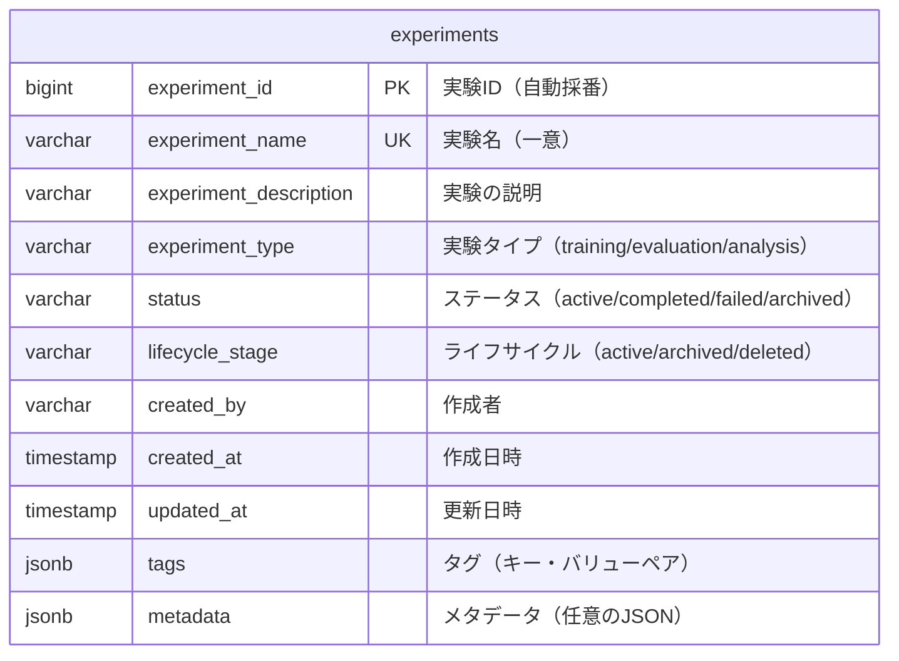
```mermaid
erDiagram
    experiments {
        bigint experiment_id PK "実験ID（自動採番）"
        varchar experiment_name UK "実験名（一意）"
        varchar experiment_description "実験の説明"
        varchar experiment_type "実験タイプ（training/evaluation/analysis）"
        varchar status "ステータス（active/completed/failed/archived）"
        varchar lifecycle_stage "ライフサイクル（active/archived/deleted）"
        varchar created_by "作成者"
        timestamp created_at "作成日時"
        timestamp updated_at "更新日時"
        jsonb tags "タグ（キー・バリューペア）"
        jsonb metadata "メタデータ（任意のJSON）"
    }
```

**インデックス**:
- `PK`: experiment_id
- `UNIQUE`: experiment_name
- `INDEX`: status, created_at
- `INDEX`: experiment_type, status

---

#### 1.2.2 runs（実行）テーブル

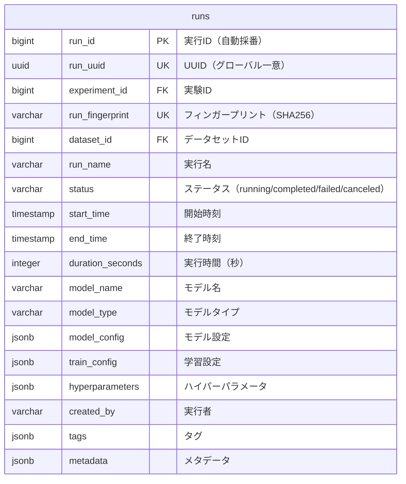
```mermaid
erDiagram
    runs {
        bigint run_id PK "実行ID（自動採番）"
        uuid run_uuid UK "UUID（グローバル一意）"
        bigint experiment_id FK "実験ID"
        varchar run_fingerprint UK "フィンガープリント（SHA256）"
        bigint dataset_id FK "データセットID"
        varchar run_name "実行名"
        varchar status "ステータス（running/completed/failed/canceled）"
        timestamp start_time "開始時刻"
        timestamp end_time "終了時刻"
        integer duration_seconds "実行時間（秒）"
        varchar model_name "モデル名"
        varchar model_type "モデルタイプ"
        jsonb model_config "モデル設定"
        jsonb train_config "学習設定"
        jsonb hyperparameters "ハイパーパラメータ"
        varchar created_by "実行者"
        jsonb tags "タグ"
        jsonb metadata "メタデータ"
    }
```

**インデックス**:
- `PK`: run_id
- `UNIQUE`: run_uuid, run_fingerprint
- `INDEX`: experiment_id, status
- `INDEX`: start_time DESC
- `INDEX`: model_name, model_type

---

### 1.3 関連テーブル詳細

#### 1.3.1 metrics（メトリクス）テーブル

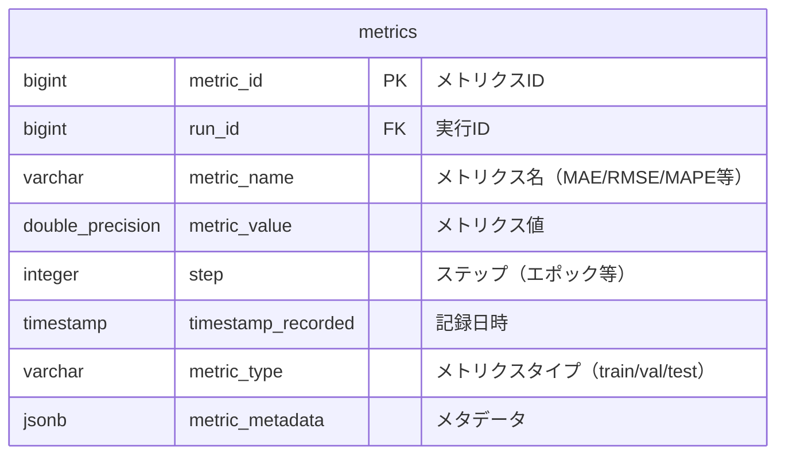
```mermaid
erDiagram
    metrics {
        bigint metric_id PK "メトリクスID"
        bigint run_id FK "実行ID"
        varchar metric_name "メトリクス名（MAE/RMSE/MAPE等）"
        double_precision metric_value "メトリクス値"
        integer step "ステップ（エポック等）"
        timestamp timestamp_recorded "記録日時"
        varchar metric_type "メトリクスタイプ（train/val/test）"
        jsonb metric_metadata "メタデータ"
    }
```

**インデックス**:
- `PK`: metric_id
- `INDEX`: run_id, metric_name
- `INDEX`: timestamp_recorded DESC
- `INDEX`: metric_type, step

---

#### 1.3.2 models（モデル）テーブル

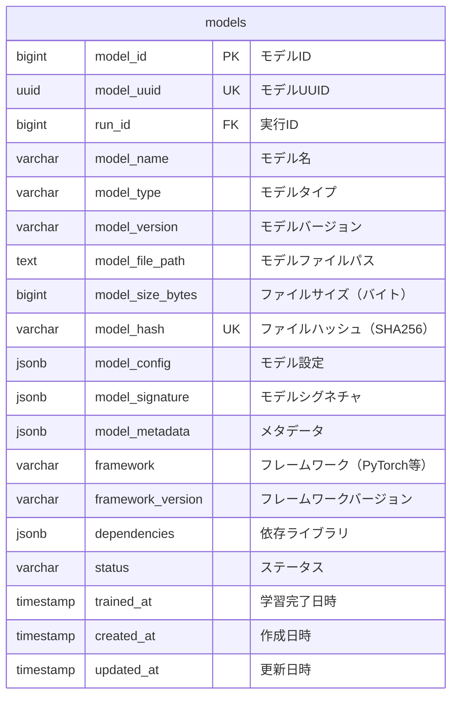
```mermaid
erDiagram
    models {
        bigint model_id PK "モデルID"
        uuid model_uuid UK "モデルUUID"
        bigint run_id FK "実行ID"
        varchar model_name "モデル名"
        varchar model_type "モデルタイプ"
        varchar model_version "モデルバージョン"
        text model_file_path "モデルファイルパス"
        bigint model_size_bytes "ファイルサイズ（バイト）"
        varchar model_hash UK "ファイルハッシュ（SHA256）"
        jsonb model_config "モデル設定"
        jsonb model_signature "モデルシグネチャ"
        jsonb model_metadata "メタデータ"
        varchar framework "フレームワーク（PyTorch等）"
        varchar framework_version "フレームワークバージョン"
        jsonb dependencies "依存ライブラリ"
        varchar status "ステータス"
        timestamp trained_at "学習完了日時"
        timestamp created_at "作成日時"
        timestamp updated_at "更新日時"
    }
```

---

## 2. クラス図（9層アーキテクチャ）

### 2.1 Layer 1: Configuration層

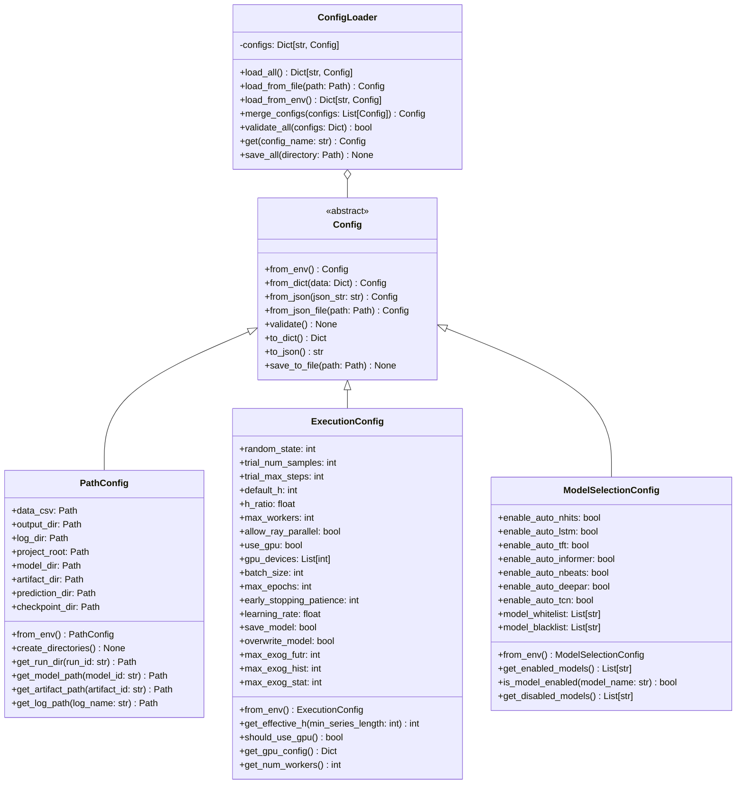
```mermaid
classDiagram
    class Config {
        <<abstract>>
        +from_env() Config
        +from_dict(data: Dict) Config
        +from_json(json_str: str) Config
        +from_json_file(path: Path) Config
        +validate() None
        +to_dict() Dict
        +to_json() str
        +save_to_file(path: Path) None
    }
    
    class PathConfig {
        +data_csv: Path
        +output_dir: Path
        +log_dir: Path
        +project_root: Path
        +model_dir: Path
        +artifact_dir: Path
        +prediction_dir: Path
        +checkpoint_dir: Path
        +from_env() PathConfig
        +create_directories() None
        +get_run_dir(run_id: str) Path
        +get_model_path(model_id: str) Path
        +get_artifact_path(artifact_id: str) Path
        +get_log_path(log_name: str) Path
    }
    
    class ExecutionConfig {
        +random_state: int
        +trial_num_samples: int
        +trial_max_steps: int
        +default_h: int
        +h_ratio: float
        +max_workers: int
        +allow_ray_parallel: bool
        +use_gpu: bool
        +gpu_devices: List[int]
        +batch_size: int
        +max_epochs: int
        +early_stopping_patience: int
        +learning_rate: float
        +save_model: bool
        +overwrite_model: bool
        +max_exog_futr: int
        +max_exog_hist: int
        +max_exog_stat: int
        +from_env() ExecutionConfig
        +get_effective_h(min_series_length: int) int
        +should_use_gpu() bool
        +get_gpu_config() Dict
        +get_num_workers() int
    }
    
    class ModelSelectionConfig {
        +enable_auto_nhits: bool
        +enable_auto_lstm: bool
        +enable_auto_tft: bool
        +enable_auto_informer: bool
        +enable_auto_nbeats: bool
        +enable_auto_deepar: bool
        +enable_auto_tcn: bool
        +model_whitelist: List[str]
        +model_blacklist: List[str]
        +from_env() ModelSelectionConfig
        +get_enabled_models() List[str]
        +is_model_enabled(model_name: str) bool
        +get_disabled_models() List[str]
    }
    
    class ConfigLoader {
        -configs: Dict[str, Config]
        +load_all() Dict[str, Config]
        +load_from_file(path: Path) Config
        +load_from_env() Dict[str, Config]
        +merge_configs(configs: List[Config]) Config
        +validate_all(configs: Dict) bool
        +get(config_name: str) Config
        +save_all(directory: Path) None
    }
    
    Config <|-- PathConfig
    Config <|-- ExecutionConfig
    Config <|-- ModelSelectionConfig
    ConfigLoader o-- Config
```

---

### 2.2 Layer 2: Data層

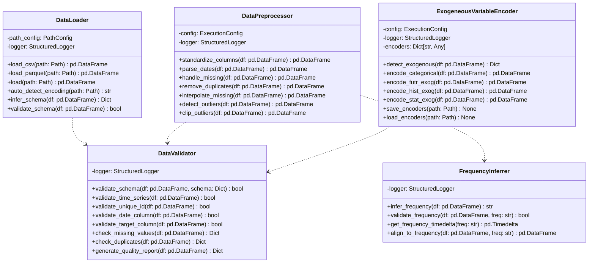
```mermaid
classDiagram
    class DataLoader {
        -path_config: PathConfig
        -logger: StructuredLogger
        +load_csv(path: Path) pd.DataFrame
        +load_parquet(path: Path) pd.DataFrame
        +load(path: Path) pd.DataFrame
        +auto_detect_encoding(path: Path) str
        +infer_schema(df: pd.DataFrame) Dict
        +validate_schema(df: pd.DataFrame) bool
    }
    
    class DataPreprocessor {
        -config: ExecutionConfig
        -logger: StructuredLogger
        +standardize_columns(df: pd.DataFrame) pd.DataFrame
        +parse_dates(df: pd.DataFrame) pd.DataFrame
        +handle_missing(df: pd.DataFrame) pd.DataFrame
        +remove_duplicates(df: pd.DataFrame) pd.DataFrame
        +interpolate_missing(df: pd.DataFrame) pd.DataFrame
        +detect_outliers(df: pd.DataFrame) pd.DataFrame
        +clip_outliers(df: pd.DataFrame) pd.DataFrame
    }
    
    class ExogeneousVariableEncoder {
        -config: ExecutionConfig
        -logger: StructuredLogger
        -encoders: Dict[str, Any]
        +detect_exogenous(df: pd.DataFrame) Dict
        +encode_categorical(df: pd.DataFrame) pd.DataFrame
        +encode_futr_exog(df: pd.DataFrame) pd.DataFrame
        +encode_hist_exog(df: pd.DataFrame) pd.DataFrame
        +encode_stat_exog(df: pd.DataFrame) pd.DataFrame
        +save_encoders(path: Path) None
        +load_encoders(path: Path) None
    }
    
    class FrequencyInferrer {
        -logger: StructuredLogger
        +infer_frequency(df: pd.DataFrame) str
        +validate_frequency(df: pd.DataFrame, freq: str) bool
        +get_frequency_timedelta(freq: str) pd.Timedelta
        +align_to_frequency(df: pd.DataFrame, freq: str) pd.DataFrame
    }
    
    class DataValidator {
        -logger: StructuredLogger
        +validate_schema(df: pd.DataFrame, schema: Dict) bool
        +validate_time_series(df: pd.DataFrame) bool
        +validate_unique_id(df: pd.DataFrame) bool
        +validate_date_column(df: pd.DataFrame) bool
        +validate_target_column(df: pd.DataFrame) bool
        +check_missing_values(df: pd.DataFrame) Dict
        +check_duplicates(df: pd.DataFrame) Dict
        +generate_quality_report(df: pd.DataFrame) Dict
    }
    
    DataLoader ..> DataValidator
    DataPreprocessor ..> DataValidator
    ExogeneousVariableEncoder ..> DataValidator
    DataPreprocessor ..> FrequencyInferrer
```

---

### 2.3 Layer 3: Model Discovery層

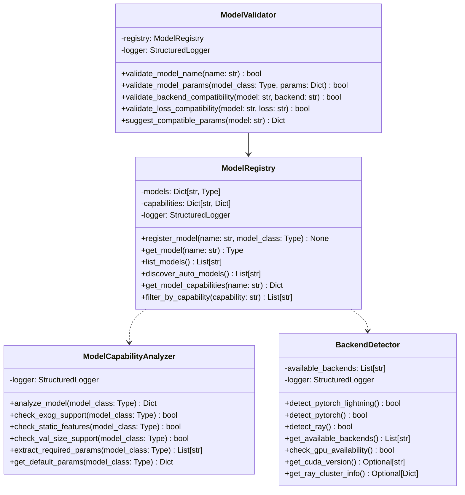
```mermaid
classDiagram
    class ModelRegistry {
        -models: Dict[str, Type]
        -capabilities: Dict[str, Dict]
        -logger: StructuredLogger
        +register_model(name: str, model_class: Type) None
        +get_model(name: str) Type
        +list_models() List[str]
        +discover_auto_models() List[str]
        +get_model_capabilities(name: str) Dict
        +filter_by_capability(capability: str) List[str]
    }
    
    class ModelCapabilityAnalyzer {
        -logger: StructuredLogger
        +analyze_model(model_class: Type) Dict
        +check_exog_support(model_class: Type) bool
        +check_static_features(model_class: Type) bool
        +check_val_size_support(model_class: Type) bool
        +extract_required_params(model_class: Type) List[str]
        +get_default_params(model_class: Type) Dict
    }
    
    class BackendDetector {
        -available_backends: List[str]
        -logger: StructuredLogger
        +detect_pytorch_lightning() bool
        +detect_pytorch() bool
        +detect_ray() bool
        +get_available_backends() List[str]
        +check_gpu_availability() bool
        +get_cuda_version() Optional[str]
        +get_ray_cluster_info() Optional[Dict]
    }
    
    class ModelValidator {
        -registry: ModelRegistry
        -logger: StructuredLogger
        +validate_model_name(name: str) bool
        +validate_model_params(model_class: Type, params: Dict) bool
        +validate_backend_compatibility(model: str, backend: str) bool
        +validate_loss_compatibility(model: str, loss: str) bool
        +suggest_compatible_params(model: str) Dict
    }
    
    ModelRegistry ..> ModelCapabilityAnalyzer
    ModelRegistry ..> BackendDetector
    ModelValidator --> ModelRegistry
```

---

### 2.4 Layer 4: Hyperparameter層

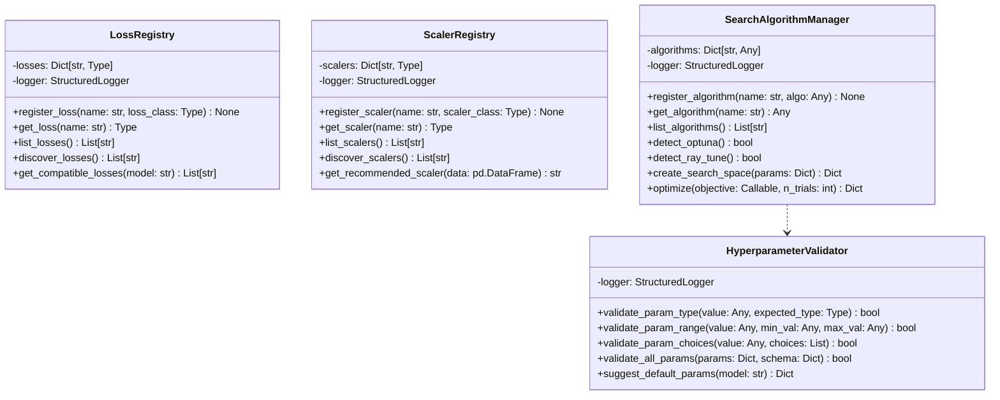
```mermaid
classDiagram
    class LossRegistry {
        -losses: Dict[str, Type]
        -logger: StructuredLogger
        +register_loss(name: str, loss_class: Type) None
        +get_loss(name: str) Type
        +list_losses() List[str]
        +discover_losses() List[str]
        +get_compatible_losses(model: str) List[str]
    }
    
    class ScalerRegistry {
        -scalers: Dict[str, Type]
        -logger: StructuredLogger
        +register_scaler(name: str, scaler_class: Type) None
        +get_scaler(name: str) Type
        +list_scalers() List[str]
        +discover_scalers() List[str]
        +get_recommended_scaler(data: pd.DataFrame) str
    }
    
    class SearchAlgorithmManager {
        -algorithms: Dict[str, Any]
        -logger: StructuredLogger
        +register_algorithm(name: str, algo: Any) None
        +get_algorithm(name: str) Any
        +list_algorithms() List[str]
        +detect_optuna() bool
        +detect_ray_tune() bool
        +create_search_space(params: Dict) Dict
        +optimize(objective: Callable, n_trials: int) Dict
    }
    
    class HyperparameterValidator {
        -logger: StructuredLogger
        +validate_param_type(value: Any, expected_type: Type) bool
        +validate_param_range(value: Any, min_val: Any, max_val: Any) bool
        +validate_param_choices(value: Any, choices: List) bool
        +validate_all_params(params: Dict, schema: Dict) bool
        +suggest_default_params(model: str) Dict
    }
    
    SearchAlgorithmManager ..> HyperparameterValidator
```

---

### 2.5 Layer 5: Execution Plan層

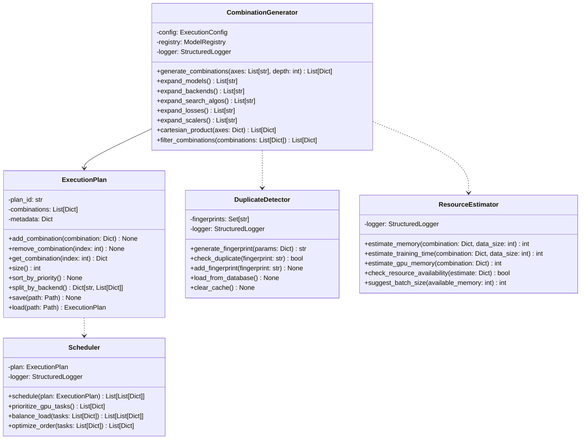
```mermaid
classDiagram
    class CombinationGenerator {
        -config: ExecutionConfig
        -registry: ModelRegistry
        -logger: StructuredLogger
        +generate_combinations(axes: List[str], depth: int) List[Dict]
        +expand_models() List[str]
        +expand_backends() List[str]
        +expand_search_algos() List[str]
        +expand_losses() List[str]
        +expand_scalers() List[str]
        +cartesian_product(axes: Dict) List[Dict]
        +filter_combinations(combinations: List[Dict]) List[Dict]
    }
    
    class ExecutionPlan {
        -plan_id: str
        -combinations: List[Dict]
        -metadata: Dict
        +add_combination(combination: Dict) None
        +remove_combination(index: int) None
        +get_combination(index: int) Dict
        +size() int
        +sort_by_priority() None
        +split_by_backend() Dict[str, List[Dict]]
        +save(path: Path) None
        +load(path: Path) ExecutionPlan
    }
    
    class DuplicateDetector {
        -fingerprints: Set[str]
        -logger: StructuredLogger
        +generate_fingerprint(params: Dict) str
        +check_duplicate(fingerprint: str) bool
        +add_fingerprint(fingerprint: str) None
        +load_from_database() None
        +clear_cache() None
    }
    
    class ResourceEstimator {
        -logger: StructuredLogger
        +estimate_memory(combination: Dict, data_size: int) int
        +estimate_training_time(combination: Dict, data_size: int) int
        +estimate_gpu_memory(combination: Dict) int
        +check_resource_availability(estimate: Dict) bool
        +suggest_batch_size(available_memory: int) int
    }
    
    class Scheduler {
        -plan: ExecutionPlan
        -logger: StructuredLogger
        +schedule(plan: ExecutionPlan) List[List[Dict]]
        +prioritize_gpu_tasks() List[Dict]
        +balance_load(tasks: List[Dict]) List[List[Dict]]
        +optimize_order(tasks: List[Dict]) List[Dict]
    }
    
    CombinationGenerator --> ExecutionPlan
    CombinationGenerator ..> DuplicateDetector
    CombinationGenerator ..> ResourceEstimator
    ExecutionPlan ..> Scheduler
```

---

### 2.6 Layer 6: Execution層

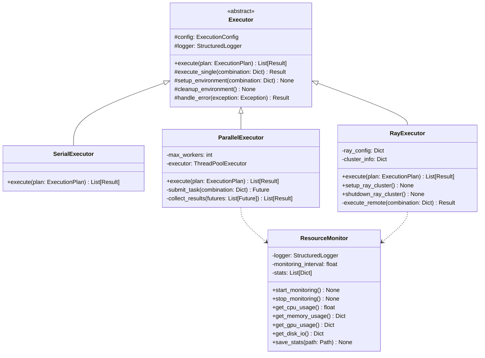
```mermaid
classDiagram
    class Executor {
        <<abstract>>
        #config: ExecutionConfig
        #logger: StructuredLogger
        +execute(plan: ExecutionPlan) List[Result]
        #execute_single(combination: Dict) Result
        #setup_environment(combination: Dict) None
        #cleanup_environment() None
        #handle_error(exception: Exception) Result
    }
    
    class SerialExecutor {
        +execute(plan: ExecutionPlan) List[Result]
    }
    
    class ParallelExecutor {
        -max_workers: int
        -executor: ThreadPoolExecutor
        +execute(plan: ExecutionPlan) List[Result]
        -submit_task(combination: Dict) Future
        -collect_results(futures: List[Future]) List[Result]
    }
    
    class RayExecutor {
        -ray_config: Dict
        -cluster_info: Dict
        +execute(plan: ExecutionPlan) List[Result]
        +setup_ray_cluster() None
        +shutdown_ray_cluster() None
        -execute_remote(combination: Dict) Result
    }
    
    class ResourceMonitor {
        -logger: StructuredLogger
        -monitoring_interval: float
        -stats: List[Dict]
        +start_monitoring() None
        +stop_monitoring() None
        +get_cpu_usage() float
        +get_memory_usage() Dict
        +get_gpu_usage() Dict
        +get_disk_io() Dict
        +save_stats(path: Path) None
    }
    
    Executor <|-- SerialExecutor
    Executor <|-- ParallelExecutor
    Executor <|-- RayExecutor
    ParallelExecutor ..> ResourceMonitor
    RayExecutor ..> ResourceMonitor
```

---

### 2.7 Layer 7: Artifact Management層

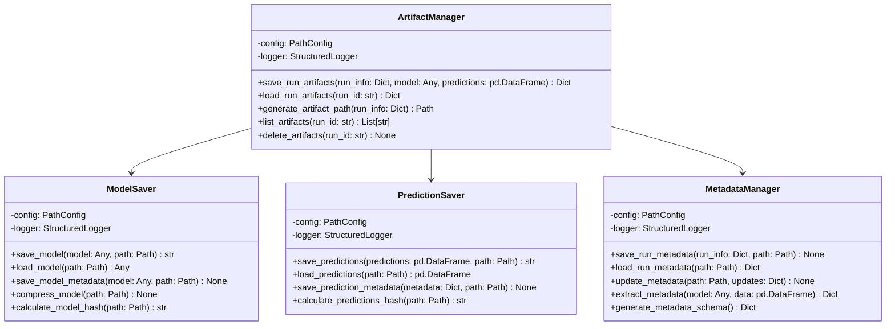
```mermaid
classDiagram
    class ArtifactManager {
        -config: PathConfig
        -logger: StructuredLogger
        +save_run_artifacts(run_info: Dict, model: Any, predictions: pd.DataFrame) Dict
        +load_run_artifacts(run_id: str) Dict
        +generate_artifact_path(run_info: Dict) Path
        +list_artifacts(run_id: str) List[str]
        +delete_artifacts(run_id: str) None
    }
    
    class ModelSaver {
        -config: PathConfig
        -logger: StructuredLogger
        +save_model(model: Any, path: Path) str
        +load_model(path: Path) Any
        +save_model_metadata(model: Any, path: Path) None
        +compress_model(path: Path) None
        +calculate_model_hash(path: Path) str
    }
    
    class PredictionSaver {
        -config: PathConfig
        -logger: StructuredLogger
        +save_predictions(predictions: pd.DataFrame, path: Path) str
        +load_predictions(path: Path) pd.DataFrame
        +save_prediction_metadata(metadata: Dict, path: Path) None
        +calculate_predictions_hash(path: Path) str
    }
    
    class MetadataManager {
        -config: PathConfig
        -logger: StructuredLogger
        +save_run_metadata(run_info: Dict, path: Path) None
        +load_run_metadata(path: Path) Dict
        +update_metadata(path: Path, updates: Dict) None
        +extract_metadata(model: Any, data: pd.DataFrame) Dict
        +generate_metadata_schema() Dict
    }
    
    ArtifactManager --> ModelSaver
    ArtifactManager --> PredictionSaver
    ArtifactManager --> MetadataManager
```

---

### 2.8 Layer 8: Logging層

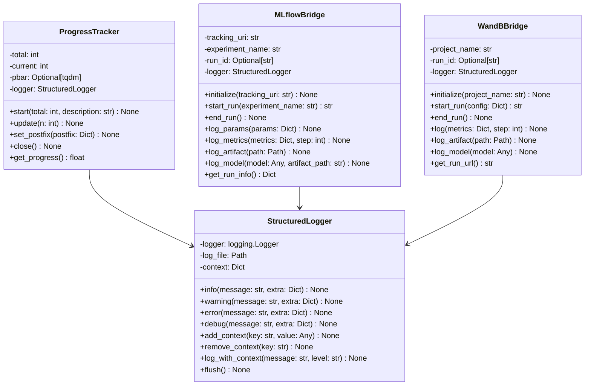
```mermaid
classDiagram
    class StructuredLogger {
        -logger: logging.Logger
        -log_file: Path
        -context: Dict
        +info(message: str, extra: Dict) None
        +warning(message: str, extra: Dict) None
        +error(message: str, extra: Dict) None
        +debug(message: str, extra: Dict) None
        +add_context(key: str, value: Any) None
        +remove_context(key: str) None
        +log_with_context(message: str, level: str) None
        +flush() None
    }
    
    class ProgressTracker {
        -total: int
        -current: int
        -pbar: Optional[tqdm]
        -logger: StructuredLogger
        +start(total: int, description: str) None
        +update(n: int) None
        +set_postfix(postfix: Dict) None
        +close() None
        +get_progress() float
    }
    
    class MLflowBridge {
        -tracking_uri: str
        -experiment_name: str
        -run_id: Optional[str]
        -logger: StructuredLogger
        +initialize(tracking_uri: str) None
        +start_run(experiment_name: str) str
        +end_run() None
        +log_params(params: Dict) None
        +log_metrics(metrics: Dict, step: int) None
        +log_artifact(path: Path) None
        +log_model(model: Any, artifact_path: str) None
        +get_run_info() Dict
    }
    
    class WandBBridge {
        -project_name: str
        -run_id: Optional[str]
        -logger: StructuredLogger
        +initialize(project_name: str) None
        +start_run(config: Dict) str
        +end_run() None
        +log(metrics: Dict, step: int) None
        +log_artifact(path: Path) None
        +log_model(model: Any) None
        +get_run_url() str
    }
    
    ProgressTracker --> StructuredLogger
    MLflowBridge --> StructuredLogger
    WandBBridge --> StructuredLogger
```

---

### 2.9 Layer 9: Application層

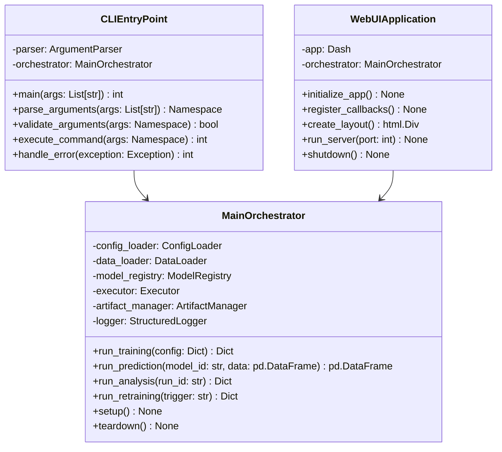
```mermaid
classDiagram
    class MainOrchestrator {
        -config_loader: ConfigLoader
        -data_loader: DataLoader
        -model_registry: ModelRegistry
        -executor: Executor
        -artifact_manager: ArtifactManager
        -logger: StructuredLogger
        +run_training(config: Dict) Dict
        +run_prediction(model_id: str, data: pd.DataFrame) pd.DataFrame
        +run_analysis(run_id: str) Dict
        +run_retraining(trigger: str) Dict
        +setup() None
        +teardown() None
    }
    
    class CLIEntryPoint {
        -parser: ArgumentParser
        -orchestrator: MainOrchestrator
        +main(args: List[str]) int
        +parse_arguments(args: List[str]) Namespace
        +validate_arguments(args: Namespace) bool
        +execute_command(args: Namespace) int
        +handle_error(exception: Exception) int
    }
    
    class WebUIApplication {
        -app: Dash
        -orchestrator: MainOrchestrator
        +initialize_app() None
        +register_callbacks() None
        +create_layout() html.Div
        +run_server(port: int) None
        +shutdown() None
    }
    
    CLIEntryPoint --> MainOrchestrator
    WebUIApplication --> MainOrchestrator
```

---

## 3. クラス関連図

### 3.1 依存関係図（全体）


```mermaid
graph TB
    subgraph Layer9["Layer 9: Application"]
        MainOrch[MainOrchestrator]
        CLI[CLIEntryPoint]
        WebUI[WebUIApplication]
    end
    
    subgraph Layer8["Layer 8: Logging"]
        Logger[StructuredLogger]
        Progress[ProgressTracker]
        MLflow[MLflowBridge]
        WandB[WandBBridge]
    end
    
    subgraph Layer7["Layer 7: Artifact Management"]
        ArtMgr[ArtifactManager]
        ModelSaver[ModelSaver]
        PredSaver[PredictionSaver]
        MetaMgr[MetadataManager]
    end
    
    subgraph Layer6["Layer 6: Execution"]
        Executor[Executor]
        SerialExec[SerialExecutor]
        ParallelExec[ParallelExecutor]
        RayExec[RayExecutor]
        ResMon[ResourceMonitor]
    end
    
    subgraph Layer5["Layer 5: Execution Plan"]
        CombGen[CombinationGenerator]
        ExecPlan[ExecutionPlan]
        DupDetect[DuplicateDetector]
        ResEst[ResourceEstimator]
    end
    
    subgraph Layer4["Layer 4: Hyperparameter"]
        LossReg[LossRegistry]
        ScalerReg[ScalerRegistry]
        SearchAlgo[SearchAlgorithmManager]
    end
    
    subgraph Layer3["Layer 3: Model Discovery"]
        ModelReg[ModelRegistry]
        CapAnalyzer[ModelCapabilityAnalyzer]
        BackendDet[BackendDetector]
    end
    
    subgraph Layer2["Layer 2: Data"]
        DataLoader[DataLoader]
        DataPreproc[DataPreprocessor]
        ExogEncoder[ExogeneousVariableEncoder]
        FreqInfer[FrequencyInferrer]
    end
    
    subgraph Layer1["Layer 1: Configuration"]
        ConfigLoader[ConfigLoader]
        PathConfig[PathConfig]
        ExecConfig[ExecutionConfig]
        ModelConfig[ModelSelectionConfig]
    end
    
    %% Layer 9 dependencies
    CLI --> MainOrch
    WebUI --> MainOrch
    MainOrch --> ConfigLoader
    MainOrch --> DataLoader
    MainOrch --> ModelReg
    MainOrch --> Executor
    MainOrch --> ArtMgr
    MainOrch --> Logger
    
    %% Layer 8 dependencies
    Progress --> Logger
    MLflow --> Logger
    WandB --> Logger
    
    %% Layer 7 dependencies
    ArtMgr --> ModelSaver
    ArtMgr --> PredSaver
    ArtMgr --> MetaMgr
    ArtMgr --> PathConfig
    
    %% Layer 6 dependencies
    SerialExec --> Executor
    ParallelExec --> Executor
    RayExec --> Executor
    ParallelExec --> ResMon
    Executor --> ExecConfig
    Executor --> Logger
    
    %% Layer 5 dependencies
    CombGen --> ExecPlan
    CombGen --> DupDetect
    CombGen --> ResEst
    CombGen --> ModelReg
    
    %% Layer 4 dependencies
    SearchAlgo --> LossReg
    SearchAlgo --> ScalerReg
    
    %% Layer 3 dependencies
    ModelReg --> CapAnalyzer
    ModelReg --> BackendDet
    
    %% Layer 2 dependencies
    DataLoader --> DataPreproc
    DataPreproc --> FreqInfer
    DataPreproc --> ExogEncoder
    
    %% Layer 1 dependencies
    ConfigLoader --> PathConfig
    ConfigLoader --> ExecConfig
    ConfigLoader --> ModelConfig
```

---

### 3.2 データフロー図

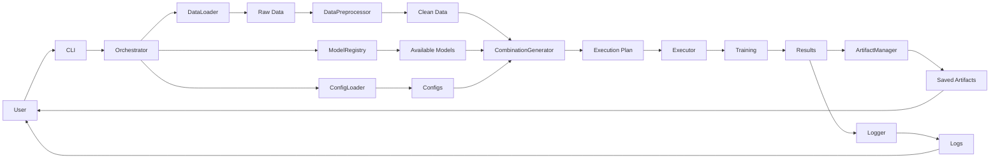
```mermaid
graph LR
    User[User] --> CLI[CLI]
    CLI --> Orch[Orchestrator]
    
    Orch --> Config[ConfigLoader]
    Config --> Configs[Configs]
    
    Orch --> DL[DataLoader]
    DL --> RawData[Raw Data]
    RawData --> DP[DataPreprocessor]
    DP --> CleanData[Clean Data]
    
    Orch --> MR[ModelRegistry]
    MR --> Models[Available Models]
    
    CleanData --> CG[CombinationGenerator]
    Models --> CG
    Configs --> CG
    CG --> Plan[Execution Plan]
    
    Plan --> Exec[Executor]
    Exec --> Train[Training]
    Train --> Results[Results]
    
    Results --> AM[ArtifactManager]
    AM --> Artifacts[Saved Artifacts]
    
    Results --> Logger[Logger]
    Logger --> Logs[Logs]
    
    Artifacts --> User
    Logs --> User
```

---

## 4. パッケージ図

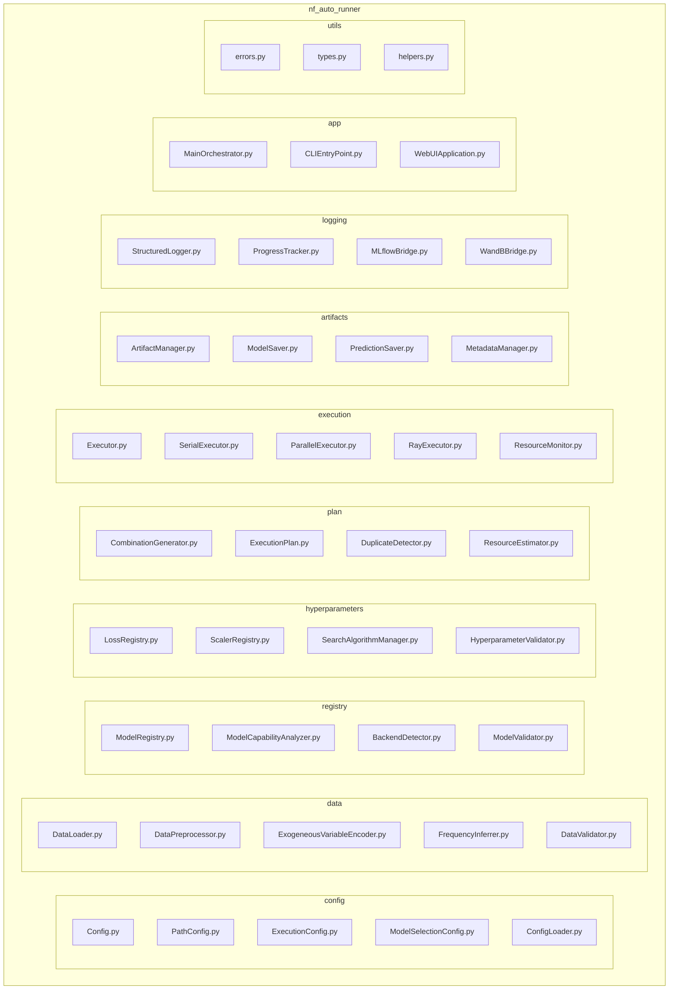
```mermaid
graph TB
    subgraph nf_auto_runner["nf_auto_runner"]
        subgraph config["config"]
            Config[Config.py]
            PathConfig[PathConfig.py]
            ExecConfig[ExecutionConfig.py]
            ModelConfig[ModelSelectionConfig.py]
            ConfigLoader[ConfigLoader.py]
        end
        
        subgraph data["data"]
            DataLoader[DataLoader.py]
            DataPreproc[DataPreprocessor.py]
            ExogEncoder[ExogeneousVariableEncoder.py]
            FreqInfer[FrequencyInferrer.py]
            DataValid[DataValidator.py]
        end
        
        subgraph registry["registry"]
            ModelReg[ModelRegistry.py]
            CapAnalyzer[ModelCapabilityAnalyzer.py]
            BackDet[BackendDetector.py]
            ModelValid[ModelValidator.py]
        end
        
        subgraph hyperparams["hyperparameters"]
            LossReg[LossRegistry.py]
            ScalerReg[ScalerRegistry.py]
            SearchMgr[SearchAlgorithmManager.py]
            ParamValid[HyperparameterValidator.py]
        end
        
        subgraph plan["plan"]
            CombGen[CombinationGenerator.py]
            ExecPlan[ExecutionPlan.py]
            DupDet[DuplicateDetector.py]
            ResEst[ResourceEstimator.py]
        end
        
        subgraph execution["execution"]
            Executor[Executor.py]
            SerialExec[SerialExecutor.py]
            ParallelExec[ParallelExecutor.py]
            RayExec[RayExecutor.py]
            ResMon[ResourceMonitor.py]
        end
        
        subgraph artifacts["artifacts"]
            ArtMgr[ArtifactManager.py]
            ModelSaver[ModelSaver.py]
            PredSaver[PredictionSaver.py]
            MetaMgr[MetadataManager.py]
        end
        
        subgraph logging["logging"]
            Logger[StructuredLogger.py]
            Progress[ProgressTracker.py]
            MLflow[MLflowBridge.py]
            WandB[WandBBridge.py]
        end
        
        subgraph app["app"]
            Orch[MainOrchestrator.py]
            CLI[CLIEntryPoint.py]
            WebUI[WebUIApplication.py]
        end
        
        subgraph utils["utils"]
            Errors[errors.py]
            Types[types.py]
            Helpers[helpers.py]
        end
    end
```

---

## 5. 状態遷移図

### 5.1 Run状態遷移図

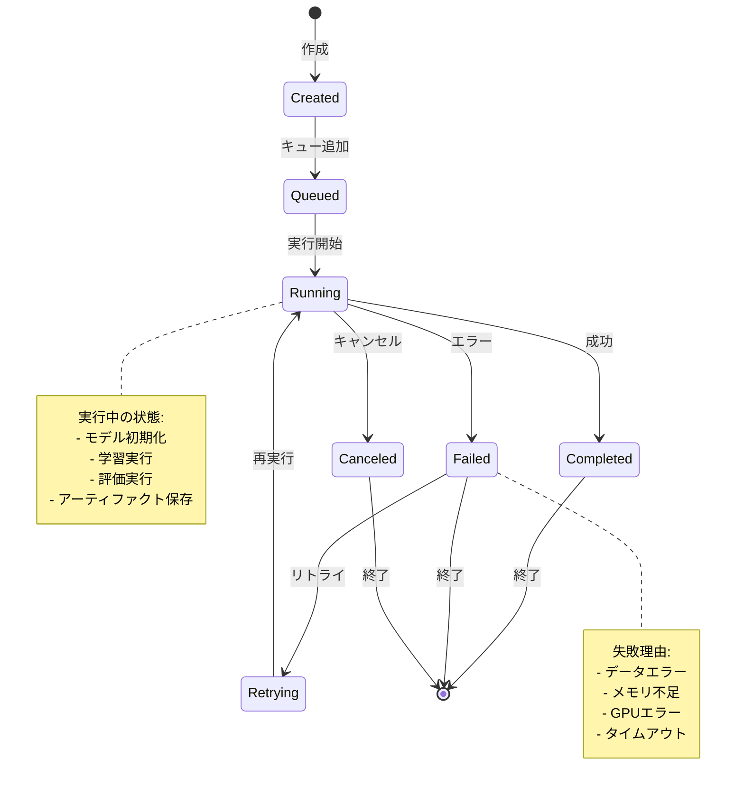
```mermaid
stateDiagram-v2
    [*] --> Created: 作成
    
    Created --> Queued: キュー追加
    Queued --> Running: 実行開始
    
    Running --> Completed: 成功
    Running --> Failed: エラー
    Running --> Canceled: キャンセル
    
    Failed --> Retrying: リトライ
    Retrying --> Running: 再実行
    
    Completed --> [*]: 終了
    Failed --> [*]: 終了
    Canceled --> [*]: 終了
    
    note right of Running
        実行中の状態:
        - モデル初期化
        - 学習実行
        - 評価実行
        - アーティファクト保存
    end note
    
    note right of Failed
        失敗理由:
        - データエラー
        - メモリ不足
        - GPUエラー
        - タイムアウト
    end note
```

---

### 5.2 Model状態遷移図

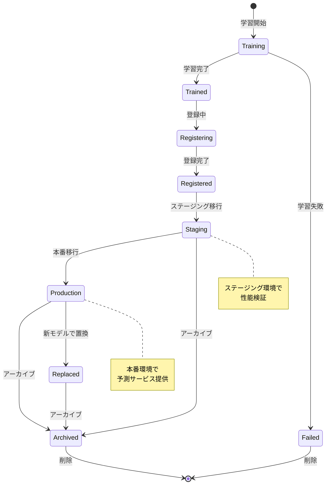
```mermaid
stateDiagram-v2
    [*] --> Training: 学習開始
    
    Training --> Trained: 学習完了
    Training --> Failed: 学習失敗
    
    Trained --> Registering: 登録中
    Registering --> Registered: 登録完了
    
    Registered --> Staging: ステージング移行
    Staging --> Production: 本番移行
    Staging --> Archived: アーカイブ
    
    Production --> Archived: アーカイブ
    Production --> Replaced: 新モデルで置換
    
    Replaced --> Archived: アーカイブ
    
    Archived --> [*]: 削除
    Failed --> [*]: 削除
    
    note right of Staging
        ステージング環境で
        性能検証
    end note
    
    note right of Production
        本番環境で
        予測サービス提供
    end note
```

---

### 5.3 Experiment状態遷移図

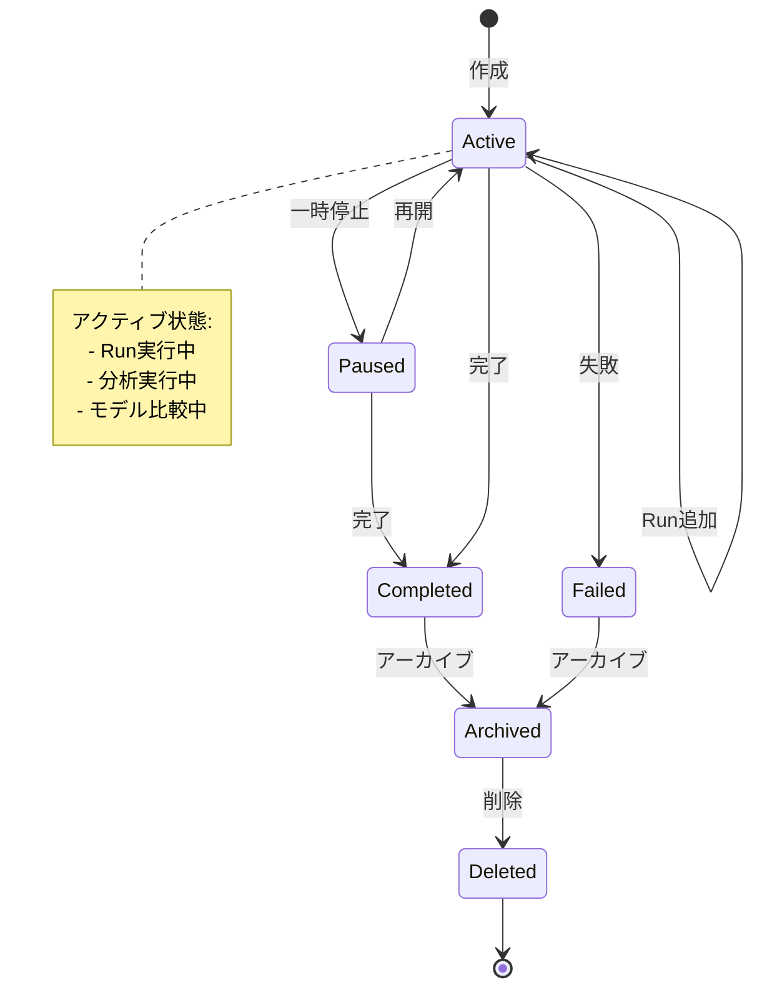
```mermaid
stateDiagram-v2
    [*] --> Active: 作成
    
    Active --> Active: Run追加
    Active --> Paused: 一時停止
    
    Paused --> Active: 再開
    Paused --> Completed: 完了
    
    Active --> Completed: 完了
    Active --> Failed: 失敗
    
    Completed --> Archived: アーカイブ
    Failed --> Archived: アーカイブ
    
    Archived --> Deleted: 削除
    Deleted --> [*]
    
    note right of Active
        アクティブ状態:
        - Run実行中
        - 分析実行中
        - モデル比較中
    end note
```

---

## 6. 使用方法

### 6.1 Mermaidレンダリング

これらの図は、Mermaid対応のマークダウンビューアで表示できます：

1. **GitHub/GitLab**: 自動レンダリング
2. **VS Code**: Mermaid Preview拡張機能
3. **Mermaid Live Editor**: https://mermaid.live
4. **Confluence/Notion**: Mermaidプラグイン

### 6.2 図の更新

設計変更時は、対応するMermaidコードを更新してください。

```bash
# Mermaid CLIを使ってPNG/SVG生成
mmdc -i ER_AND_CLASS_DIAGRAMS.md -o output/
```

---

## 7. 補足情報

### 7.1 命名規則

- **テーブル名**: snake_case、複数形
- **カラム名**: snake_case
- **クラス名**: PascalCase
- **メソッド名**: snake_case
- **変数名**: snake_case
- **定数名**: UPPER_SNAKE_CASE

### 7.2 型ヒント

```python
from typing import Dict, List, Optional, Any, Type
from pathlib import Path
import pandas as pd
```

### 7.3 インデックス戦略

- **主キー**: すべてのテーブルに必須
- **外部キー**: リレーションシップのあるカラムに作成
- **検索頻度**: 頻繁に検索されるカラムにインデックス
- **複合インデックス**: WHERE句で複数カラムを使用する場合

---

**ドキュメントバージョン**: 1.0  
**最終更新日**: 2025-11-04  
**作成者**: System Architect  
**ステータス**: Complete
