# 時系列予測システム - ER図・クラス図詳細設計書

## 📋 目次

1. [ER図（データベース設計）](#1-er図データベース設計)
2. [クラス図（9層アーキテクチャ）](#2-クラス図9層アーキテクチャ)
3. [クラス関連図](#3-クラス関連図)
4. [パッケージ図](#4-パッケージ図)
5. [状態遷移図](#5-状態遷移図)

---

## 1. ER図（データベース設計）

### 1.1 データベース全体ER図

```mermaid
erDiagram
    %% 実験管理
    experiments ||--o{ runs : "has"
    runs ||--o{ metrics : "records"
    runs ||--o{ artifacts : "produces"
    runs ||--o{ feature_importances : "calculates"
    
    %% データセット
    datasets ||--o{ runs : "used_in"
    datasets ||--o{ data_slices : "contains"
    datasets ||--o{ quality_reports : "has"
    
    %% モデル管理
    runs ||--o{ models : "produces"
    models ||--o{ model_registry : "registered_in"
    models ||--o{ predictions : "generates"
    
    %% 分析
    runs ||--o{ correlations : "analyzes"
    runs ||--o{ granger_tests : "performs"
    runs ||--o{ feature_effects : "calculates"
    runs ||--o{ causal_studies : "conducts"
    
    %% リソース・ログ
    runs ||--o{ resource_stats : "monitors"
    runs ||--o{ run_logs : "generates"
    runs ||--o{ tool_logs : "tracks"
    
    %% バックテスト
    runs ||--o{ backtest_folds : "evaluates"
    runs ||--o{ residuals_sample : "samples"
    
    %% ユーザー（将来拡張用）
    users ||--o{ experiments : "owns"
    users ||--o{ runs : "executes"
    
    experiments {
        bigint experiment_id PK
        varchar experiment_name UK
        varchar experiment_description
        varchar experiment_type
        varchar status
        varchar lifecycle_stage
        varchar created_by
        timestamp created_at
        timestamp updated_at
        jsonb tags
        jsonb metadata
    }
    
    runs {
        bigint run_id PK
        uuid run_uuid UK
        bigint experiment_id FK
        varchar run_fingerprint UK
        bigint dataset_id FK
        varchar run_name
        varchar status
        timestamp start_time
        timestamp end_time
        integer duration_seconds
        varchar model_name
        varchar model_type
        jsonb model_config
        jsonb train_config
        jsonb hyperparameters
        varchar created_by
        jsonb tags
        jsonb metadata
    }
    
    datasets {
        bigint dataset_id PK
        uuid dataset_uuid UK
        varchar dataset_name
        varchar dataset_description
        varchar dataset_type
        text file_path
        varchar file_format
        bigint file_size_bytes
        varchar file_hash UK
        integer num_rows
        integer num_columns
        integer num_time_series
        varchar date_column
        varchar target_column
        varchar frequency
        timestamp start_date
        timestamp end_date
        jsonb schema_definition
        jsonb column_types
        integer missing_values_count
        integer duplicate_rows_count
        varchar version
        bigint parent_dataset_id FK
        jsonb tags
        jsonb metadata
        timestamp created_at
        timestamp updated_at
    }
    
    models {
        bigint model_id PK
        uuid model_uuid UK
        bigint run_id FK
        varchar model_name
        varchar model_type
        varchar model_version
        text model_file_path
        bigint model_size_bytes
        varchar model_hash UK
        jsonb model_config
        jsonb model_signature
        jsonb model_metadata
        varchar framework
        varchar framework_version
        jsonb dependencies
        varchar status
        timestamp trained_at
        timestamp created_at
        timestamp updated_at
    }
    
    model_registry {
        bigint registry_id PK
        bigint model_id FK UK
        varchar registered_model_name
        varchar current_stage
        integer model_version
        varchar version_description
        jsonb production_metrics
        timestamp registered_at
        timestamp deployed_at
        timestamp archived_at
        varchar registered_by
        jsonb tags
        jsonb metadata
    }
    
    predictions {
        bigint prediction_id PK
        uuid prediction_uuid UK
        bigint model_id FK
        bigint run_id FK
        varchar prediction_type
        text predictions_file_path
        bigint predictions_size_bytes
        varchar predictions_hash
        integer num_predictions
        timestamp prediction_date
        timestamp prediction_start
        timestamp prediction_end
        integer forecast_horizon
        jsonb prediction_metadata
        timestamp created_at
    }
    
    metrics {
        bigint metric_id PK
        bigint run_id FK
        varchar metric_name
        double_precision metric_value
        integer step
        timestamp timestamp_recorded
        varchar metric_type
        jsonb metric_metadata
    }
    
    artifacts {
        bigint artifact_id PK
        bigint run_id FK
        varchar artifact_name
        varchar artifact_type
        text artifact_path
        bigint artifact_size_bytes
        varchar artifact_hash
        varchar mime_type
        jsonb artifact_metadata
        timestamp created_at
    }
    
    feature_importances {
        bigint importance_id PK
        bigint run_id FK
        varchar feature_name
        double_precision importance_value
        varchar importance_type
        integer rank
        jsonb importance_metadata
        timestamp calculated_at
    }
    
    data_slices {
        bigint slice_id PK
        bigint dataset_id FK
        varchar slice_name
        varchar slice_type
        timestamp start_date
        timestamp end_date
        integer num_rows
        text slice_filter
        jsonb slice_metadata
        timestamp created_at
    }
    
    quality_reports {
        bigint report_id PK
        bigint dataset_id FK
        varchar report_type
        double_precision completeness_score
        double_precision validity_score
        double_precision consistency_score
        double_precision timeliness_score
        double_precision overall_score
        jsonb quality_issues
        jsonb recommendations
        timestamp generated_at
    }
    
    correlations {
        bigint correlation_id PK
        bigint run_id FK
        varchar feature_x
        varchar feature_y
        double_precision correlation_value
        varchar correlation_type
        double_precision p_value
        double_precision confidence_interval_low
        double_precision confidence_interval_high
        jsonb correlation_metadata
        timestamp calculated_at
    }
    
    granger_tests {
        bigint test_id PK
        bigint run_id FK
        varchar cause_series
        varchar effect_series
        integer max_lag
        double_precision f_statistic
        double_precision p_value
        boolean is_significant
        varchar test_result
        jsonb test_metadata
        timestamp tested_at
    }
    
    feature_effects {
        bigint effect_id PK
        bigint run_id FK
        varchar feature_name
        varchar effect_type
        double_precision effect_value
        double_precision std_error
        double_precision confidence_interval_low
        double_precision confidence_interval_high
        jsonb effect_metadata
        timestamp calculated_at
    }
    
    causal_studies {
        bigint study_id PK
        bigint run_id FK
        varchar study_name
        varchar study_method
        varchar treatment_variable
        varchar outcome_variable
        double_precision estimated_effect
        double_precision std_error
        double_precision p_value
        jsonb control_variables
        jsonb study_results
        jsonb study_metadata
        timestamp conducted_at
    }
    
    resource_stats {
        bigint stat_id PK
        bigint run_id FK
        timestamp recorded_at
        double_precision cpu_percent
        bigint memory_used_bytes
        bigint memory_total_bytes
        double_precision gpu_utilization
        bigint gpu_memory_used_bytes
        bigint gpu_memory_total_bytes
        double_precision disk_io_read_mb
        double_precision disk_io_write_mb
        jsonb resource_metadata
    }
    
    run_logs {
        bigint log_id PK
        bigint run_id FK
        timestamp logged_at
        varchar log_level
        text log_message
        text log_source
        jsonb log_context
    }
    
    tool_logs {
        bigint tool_log_id PK
        bigint run_id FK
        varchar tool_name
        varchar tool_version
        varchar event_type
        timestamp event_time
        jsonb event_data
    }
    
    backtest_folds {
        bigint fold_id PK
        bigint run_id FK
        integer fold_number
        timestamp train_start
        timestamp train_end
        timestamp test_start
        timestamp test_end
        integer train_size
        integer test_size
        jsonb fold_metrics
        jsonb fold_metadata
    }
    
    residuals_sample {
        bigint residual_id PK
        bigint run_id FK
        varchar unique_id
        timestamp timestamp
        double_precision actual_value
        double_precision predicted_value
        double_precision residual
        double_precision absolute_error
        double_precision squared_error
        jsonb residual_metadata
    }
    
    users {
        bigint user_id PK
        uuid user_uuid UK
        varchar username UK
        varchar email UK
        varchar full_name
        varchar auth_provider
        varchar external_id
        boolean is_active
        boolean is_superuser
        timestamp last_login_at
        integer login_count
        jsonb preferences
        jsonb metadata
        timestamp created_at
        timestamp updated_at
    }
```

---

### 1.2 コアテーブル詳細

#### 1.2.1 experiments（実験）テーブル

```mermaid
erDiagram
    experiments {
        bigint experiment_id PK "実験ID（自動採番）"
        varchar experiment_name UK "実験名（一意）"
        varchar experiment_description "実験の説明"
        varchar experiment_type "実験タイプ（training/evaluation/analysis）"
        varchar status "ステータス（active/completed/failed/archived）"
        varchar lifecycle_stage "ライフサイクル（active/archived/deleted）"
        varchar created_by "作成者"
        timestamp created_at "作成日時"
        timestamp updated_at "更新日時"
        jsonb tags "タグ（キー・バリューペア）"
        jsonb metadata "メタデータ（任意のJSON）"
    }
```



**インデックス**:
- `PK`: experiment_id
- `UNIQUE`: experiment_name
- `INDEX`: status, created_at
- `INDEX`: experiment_type, status

---

#### 1.2.2 runs（実行）テーブル

```mermaid
erDiagram
    runs {
        bigint run_id PK "実行ID（自動採番）"
        uuid run_uuid UK "UUID（グローバル一意）"
        bigint experiment_id FK "実験ID"
        varchar run_fingerprint UK "フィンガープリント（SHA256）"
        bigint dataset_id FK "データセットID"
        varchar run_name "実行名"
        varchar status "ステータス（running/completed/failed/canceled）"
        timestamp start_time "開始時刻"
        timestamp end_time "終了時刻"
        integer duration_seconds "実行時間（秒）"
        varchar model_name "モデル名"
        varchar model_type "モデルタイプ"
        jsonb model_config "モデル設定"
        jsonb train_config "学習設定"
        jsonb hyperparameters "ハイパーパラメータ"
        varchar created_by "実行者"
        jsonb tags "タグ"
        jsonb metadata "メタデータ"
    }
```



**インデックス**:
- `PK`: run_id
- `UNIQUE`: run_uuid, run_fingerprint
- `INDEX`: experiment_id, status
- `INDEX`: start_time DESC
- `INDEX`: model_name, model_type

---

### 1.3 関連テーブル詳細

#### 1.3.1 metrics（メトリクス）テーブル

```mermaid
erDiagram
    metrics {
        bigint metric_id PK "メトリクスID"
        bigint run_id FK "実行ID"
        varchar metric_name "メトリクス名（MAE/RMSE/MAPE等）"
        double_precision metric_value "メトリクス値"
        integer step "ステップ（エポック等）"
        timestamp timestamp_recorded "記録日時"
        varchar metric_type "メトリクスタイプ（train/val/test）"
        jsonb metric_metadata "メタデータ"
    }
```



**インデックス**:
- `PK`: metric_id
- `INDEX`: run_id, metric_name
- `INDEX`: timestamp_recorded DESC
- `INDEX`: metric_type, step

---

#### 1.3.2 models（モデル）テーブル

```mermaid
erDiagram
    models {
        bigint model_id PK "モデルID"
        uuid model_uuid UK "モデルUUID"
        bigint run_id FK "実行ID"
        varchar model_name "モデル名"
        varchar model_type "モデルタイプ"
        varchar model_version "モデルバージョン"
        text model_file_path "モデルファイルパス"
        bigint model_size_bytes "ファイルサイズ（バイト）"
        varchar model_hash UK "ファイルハッシュ（SHA256）"
        jsonb model_config "モデル設定"
        jsonb model_signature "モデルシグネチャ"
        jsonb model_metadata "メタデータ"
        varchar framework "フレームワーク（PyTorch等）"
        varchar framework_version "フレームワークバージョン"
        jsonb dependencies "依存ライブラリ"
        varchar status "ステータス"
        timestamp trained_at "学習完了日時"
        timestamp created_at "作成日時"
        timestamp updated_at "更新日時"
    }
```



---

## 2. クラス図（9層アーキテクチャ）

### 2.1 Layer 1: Configuration層


---

### 2.2 Layer 2: Data層


---

### 2.3 Layer 3: Model Discovery層


---

### 2.4 Layer 4: Hyperparameter層


---

### 2.5 Layer 5: Execution Plan層


---

### 2.6 Layer 6: Execution層


---

### 2.7 Layer 7: Artifact Management層


---

### 2.8 Layer 8: Logging層


---

### 2.9 Layer 9: Application層


---

## 3. クラス関連図

### 3.1 依存関係図（全体）


---

### 3.2 データフロー図


---

## 4. パッケージ図


---

## 5. 状態遷移図

### 5.1 Run状態遷移図

```mermaid
stateDiagram-v2
    [*] --> Created: 作成
    
    Created --> Queued: キュー追加
    Queued --> Running: 実行開始
    
    Running --> Completed: 成功
    Running --> Failed: エラー
    Running --> Canceled: キャンセル
    
    Failed --> Retrying: リトライ
    Retrying --> Running: 再実行
    
    Completed --> [*]: 終了
    Failed --> [*]: 終了
    Canceled --> [*]: 終了
    
    note right of Running
        実行中の状態:
        - モデル初期化
        - 学習実行
        - 評価実行
        - アーティファクト保存
    end note
    
    note right of Failed
        失敗理由:
        - データエラー
        - メモリ不足
        - GPUエラー
        - タイムアウト
    end note
```



---

### 5.2 Model状態遷移図

```mermaid
stateDiagram-v2
    [*] --> Training: 学習開始
    
    Training --> Trained: 学習完了
    Training --> Failed: 学習失敗
    
    Trained --> Registering: 登録中
    Registering --> Registered: 登録完了
    
    Registered --> Staging: ステージング移行
    Staging --> Production: 本番移行
    Staging --> Archived: アーカイブ
    
    Production --> Archived: アーカイブ
    Production --> Replaced: 新モデルで置換
    
    Replaced --> Archived: アーカイブ
    
    Archived --> [*]: 削除
    Failed --> [*]: 削除
    
    note right of Staging
        ステージング環境で
        性能検証
    end note
    
    note right of Production
        本番環境で
        予測サービス提供
    end note
```



---

### 5.3 Experiment状態遷移図

```mermaid
stateDiagram-v2
    [*] --> Active: 作成
    
    Active --> Active: Run追加
    Active --> Paused: 一時停止
    
    Paused --> Active: 再開
    Paused --> Completed: 完了
    
    Active --> Completed: 完了
    Active --> Failed: 失敗
    
    Completed --> Archived: アーカイブ
    Failed --> Archived: アーカイブ
    
    Archived --> Deleted: 削除
    Deleted --> [*]
    
    note right of Active
        アクティブ状態:
        - Run実行中
        - 分析実行中
        - モデル比較中
    end note
```



---

## 6. 使用方法

### 6.1 Mermaidレンダリング

これらの図は、Mermaid対応のマークダウンビューアで表示できます：

1. **GitHub/GitLab**: 自動レンダリング
2. **VS Code**: Mermaid Preview拡張機能
3. **Mermaid Live Editor**: https://mermaid.live
4. **Confluence/Notion**: Mermaidプラグイン

### 6.2 図の更新

設計変更時は、対応するMermaidコードを更新してください。

```bash
# Mermaid CLIを使ってPNG/SVG生成
mmdc -i ER_AND_CLASS_DIAGRAMS.md -o output/
```

---

## 7. 補足情報

### 7.1 命名規則

- **テーブル名**: snake_case、複数形
- **カラム名**: snake_case
- **クラス名**: PascalCase
- **メソッド名**: snake_case
- **変数名**: snake_case
- **定数名**: UPPER_SNAKE_CASE

### 7.2 型ヒント

```python
from typing import Dict, List, Optional, Any, Type
from pathlib import Path
import pandas as pd
```

### 7.3 インデックス戦略

- **主キー**: すべてのテーブルに必須
- **外部キー**: リレーションシップのあるカラムに作成
- **検索頻度**: 頻繁に検索されるカラムにインデックス
- **複合インデックス**: WHERE句で複数カラムを使用する場合

---

**ドキュメントバージョン**: 1.0  
**最終更新日**: 2025-11-04  
**作成者**: System Architect  
**ステータス**: Complete
