# 時系列予測システム - 詳細シーケンス図集

## 📋 目次

1. [Configuration読み込み](#1-configuration読み込み)
2. [データパイプライン](#2-データパイプライン)
3. [モデル検出フロー](#3-モデル検出フロー)
4. [実行計画生成](#4-実行計画生成)
5. [並列実行フロー](#5-並列実行フロー)
6. [ロギングフロー](#6-ロギングフロー)
7. [完全な学習パイプライン](#7-完全な学習パイプライン)
8. [予測パイプライン](#8-予測パイプライン)
9. [再学習トリガーフロー](#9-再学習トリガーフロー)
10. [ハイパーパラメータ探索](#10-ハイパーパラメータ探索)
11. [アーティファクト管理](#11-アーティファクト管理)
12. [エラーハンドリング](#12-エラーハンドリング)

---

## 1. Configuration読み込み

### 1.1 環境変数からの設定読み込み

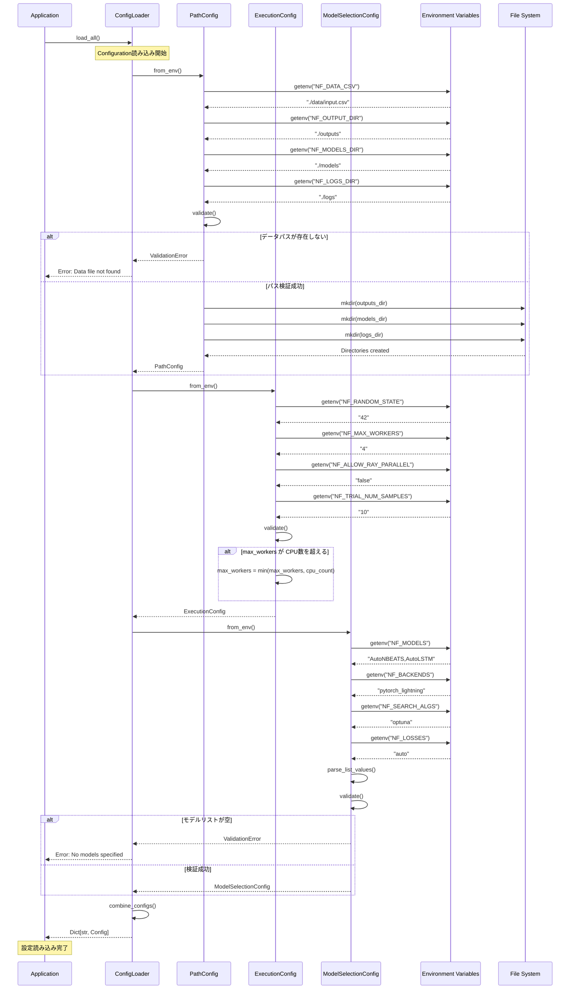

---

## 2. データパイプライン

### 2.1 データ読み込みから前処理まで

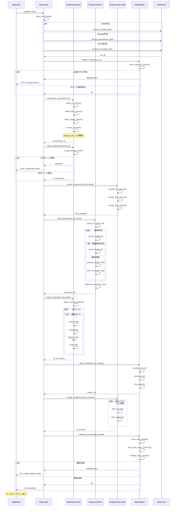

---

## 3. モデル検出フロー

### 3.1 Autoモデルとバックエンドの検出

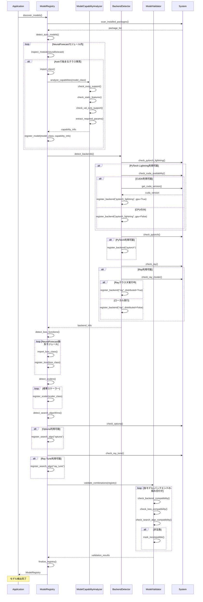

---

## 4. 実行計画生成

### 4.1 組み合わせ生成と重複排除

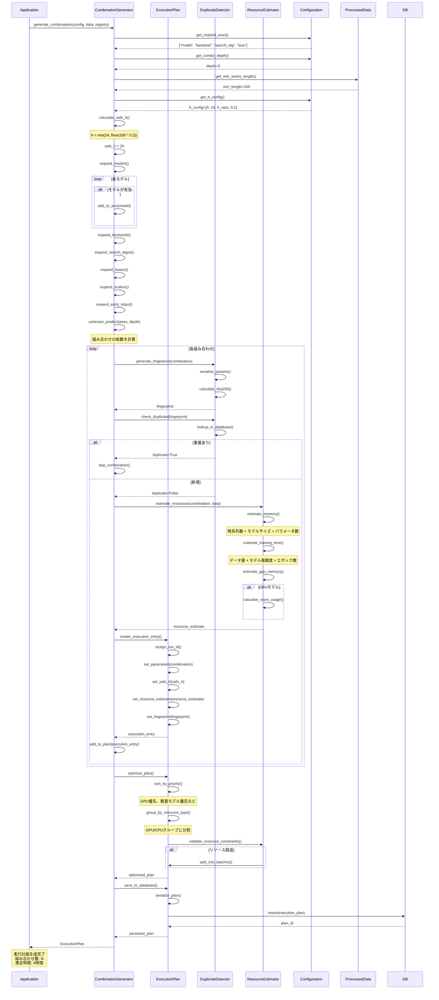

---

## 5. 並列実行フロー

### 5.1 ThreadPoolExecutorによる並列実行

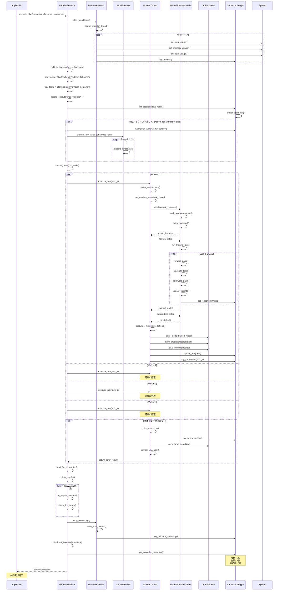

---

## 6. ロギングフロー

### 6.1 構造化ログとメトリクストラッキング

```mermaid
sequenceDiagram
    participant App as Application
    participant SL as StructuredLogger
    participant PT as ProgressTracker
    participant MB as MLflowBridge
    participant WB as WandBBridge
    participant FS as File System
    participant Console as Console Output
    
    App->>SL: initialize(config)
    
    %% ロガー設定
    SL->>SL: setup_structlog()
    SL->>SL: configure_processors()
    Note over SL: JSON formatter<br/>Timestamp<br/>Log level<br/>Context
    
    SL->>FS: create_log_file(log_path)
    FS-->>SL: file_handle
    
    %% MLflow初期化（オプション）
    alt MLflow有効
        SL->>MB: initialize(tracking_uri)
        MB->>MB: create_experiment()
        MB-->>SL: experiment_id
    end
    
    %% W&B初期化（オプション）
    alt W&B有効
        SL->>WB: initialize(project_name)
        WB->>WB: create_run()
        WB-->>SL: run_id
    end
    
    %% 実行開始ログ
    App->>SL: log_execution_start(config)
    SL->>SL: create_log_entry()
    SL->>SL: add_context(run_id, timestamp)
    SL->>FS: write_log(entry)
    SL->>Console: print_info()
    
    alt MLflow有効
        SL->>MB: log_params(config)
    end
    
    alt W&B有効
        SL->>WB: log_config(config)
    end
    
    %% 進捗トラッキング開始
    App->>PT: start_tracking(total_tasks)
    PT->>PT: initialize_tqdm(total_tasks)
    PT->>PT: create_progress_bar()
    
    %% タスク実行中のログ
    loop 各タスク
        App->>SL: log_task_start(task_id)
        SL->>FS: write_log(task_start)
        SL->>Console: print_task_info()
        
        %% エポックごとのメトリクス
        loop 各エポック
            App->>SL: log_metrics(epoch, metrics)
            SL->>SL: format_metrics()
            
            SL->>FS: write_log(metrics)
            
            alt MLflow有効
                SL->>MB: log_metrics(metrics, step=epoch)
            end
            
            alt W&B有効
                SL->>WB: log(metrics, step=epoch)
            end
            
            %% 進捗更新
            App->>PT: update(1)
            PT->>PT: increment_progress()
            PT->>Console: update_bar()
        end
        
        %% タスク完了ログ
        App->>SL: log_task_complete(task_id, results)
        SL->>SL: calculate_task_duration()
        SL->>SL: extract_final_metrics()
        
        SL->>FS: write_log(task_complete)
        SL->>Console: print_task_summary()
        
        alt MLflow有効
            SL->>MB: log_metrics(final_metrics)
            SL->>MB: log_artifact(model_path)
        end
        
        alt W&B有効
            SL->>WB: log_summary(final_metrics)
            SL->>WB: log_model(model_path)
        end
        
        %% エラーハンドリング
        alt タスク失敗
            App->>SL: log_error(task_id, exception)
            SL->>SL: extract_traceback()
            SL->>SL: extract_error_metadata()
            
            SL->>FS: write_error_log()
            SL->>Console: print_error()
            
            alt MLflow有効
                SL->>MB: log_error_artifact()
            end
            
            alt W&B有効
                SL->>WB: log_error()
            end
        end
    end
    
    %% 進捗完了
    PT->>PT: close_progress_bar()
    PT->>Console: clear_bar()
    
    %% 実行完了ログ
    App->>SL: log_execution_complete(summary)
    SL->>SL: calculate_total_duration()
    SL->>SL: aggregate_metrics()
    SL->>SL: generate_summary()
    
    SL->>FS: write_summary_log()
    SL->>Console: print_summary()
    
    Note over Console: ===== Execution Summary =====<br/>Total Tasks: X<br/>Successful: Y<br/>Failed: Z<br/>Total Time: T seconds
    
    alt MLflow有効
        SL->>MB: log_final_summary()
        SL->>MB: end_run()
    end
    
    alt W&B有効
        SL->>WB: log_final_summary()
        SL->>WB: finish_run()
    end
    
    %% ログファイルクローズ
    SL->>FS: close_log_file()
    
    SL-->>App: LoggingComplete
    
    Note over App: ロギング完了
```

---

## 7. 完全な学習パイプライン

### 7.1 エンドツーエンドの学習フロー

```mermaid
sequenceDiagram
    participant User as User/CLI
    participant Orch as MainOrchestrator
    participant CL as ConfigLoader
    participant DL as DataLoader
    participant MR as ModelRegistry
    participant CG as CombinationGenerator
    participant PE as ParallelExecutor
    participant Model as NeuralForecast
    participant AS as ArtifactSaver
    participant DB as Database
    participant Logger as StructuredLogger
    
    %% 1. 初期化フェーズ
    User->>Orch: run_training(cli_args)
    
    Note over Orch: === Phase 1: Initialization ===
    
    Orch->>Logger: initialize_logging()
    Logger-->>Orch: logger_ready
    
    Orch->>CL: load_all_configs(cli_args)
    CL->>CL: merge_env_and_cli()
    CL->>CL: validate_configs()
    CL-->>Orch: configs
    
    Orch->>Logger: log_config(configs)
    
    %% 2. データ準備フェーズ
    Note over Orch: === Phase 2: Data Preparation ===
    
    Orch->>DL: load_and_preprocess(data_path)
    
    DL->>DL: load_csv()
    DL->>DL: standardize_columns()
    DL->>DL: parse_dates()
    DL->>DL: infer_frequency()
    DL->>DL: handle_missing()
    DL->>DL: encode_exogenous()
    DL->>DL: validate_data()
    
    DL-->>Orch: processed_data
    
    Orch->>Logger: log_data_info(processed_data)
    Orch->>DB: save_dataset_metadata(processed_data)
    
    %% 3. モデル検出フェーズ
    Note over Orch: === Phase 3: Model Discovery ===
    
    Orch->>MR: discover_all()
    
    MR->>MR: detect_auto_models()
    MR->>MR: detect_backends()
    MR->>MR: detect_losses()
    MR->>MR: detect_scalers()
    MR->>MR: detect_search_algos()
    MR->>MR: validate_combinations()
    
    MR-->>Orch: registry
    
    Orch->>Logger: log_registry_info(registry)
    
    %% 4. 実行計画生成フェーズ
    Note over Orch: === Phase 4: Execution Planning ===
    
    Orch->>CG: generate_plan(configs, processed_data, registry)
    
    CG->>CG: calculate_safe_h()
    CG->>CG: expand_axes()
    CG->>CG: cartesian_product()
    CG->>CG: generate_fingerprints()
    CG->>CG: filter_duplicates()
    CG->>CG: estimate_resources()
    CG->>CG: optimize_plan()
    
    CG-->>Orch: execution_plan
    
    Orch->>Logger: log_plan_summary(execution_plan)
    Orch->>DB: save_execution_plan(execution_plan)
    
    %% 5. 実行フェーズ
    Note over Orch: === Phase 5: Execution ===
    
    Orch->>PE: execute_plan(execution_plan)
    
    PE->>PE: start_resource_monitor()
    PE->>PE: create_thread_pool()
    
    loop 各組み合わせ
        PE->>PE: assign_to_worker()
        
        par Worker Thread
            PE->>PE: setup_environment()
            PE->>PE: set_random_seed()
            
            %% モデル初期化
            PE->>Model: initialize(params)
            Model->>Model: setup_backend()
            Model->>Model: configure_hyperparams()
            Model-->>PE: model_instance
            
            %% 学習
            PE->>Model: fit(train_data, val_data)
            
            loop エポック
                Model->>Model: train_epoch()
                Model->>Model: validate()
                Model->>Logger: log_metrics()
                
                alt Early Stopping条件
                    Model->>Model: stop_training()
                end
            end
            
            Model-->>PE: trained_model
            
            %% 評価
            PE->>Model: predict(test_data)
            Model-->>PE: predictions
            
            PE->>PE: calculate_metrics(predictions)
            
            %% アーティファクト保存
            PE->>AS: save_model(trained_model)
            AS->>AS: generate_model_path()
            AS->>FS: write_model()
            AS-->>PE: model_path
            
            PE->>AS: save_predictions(predictions)
            AS->>FS: write_predictions()
            AS-->>PE: predictions_path
            
            PE->>AS: save_metadata(run_info)
            AS->>FS: write_metadata()
            AS-->>PE: metadata_path
            
            %% データベース記録
            PE->>DB: insert_run(run_info)
            PE->>DB: insert_metrics(metrics)
            PE->>DB: insert_artifacts(paths)
            
            PE->>Logger: log_run_complete()
            PE->>Logger: update_progress()
            
            alt エラー発生
                PE->>Logger: log_error(exception)
                PE->>DB: insert_error(error_info)
                PE->>AS: save_error_metadata()
            end
        end
    end
    
    PE->>PE: wait_all_workers()
    PE->>PE: stop_resource_monitor()
    PE->>PE: shutdown_thread_pool()
    
    PE-->>Orch: execution_results
    
    %% 6. 集約フェーズ
    Note over Orch: === Phase 6: Aggregation ===
    
    Orch->>Orch: aggregate_results(execution_results)
    Orch->>Orch: calculate_summary_stats()
    Orch->>Orch: identify_best_models()
    
    Orch->>Logger: log_final_summary()
    Orch->>DB: save_experiment_summary()
    
    %% 7. クリーンアップフェーズ
    Note over Orch: === Phase 7: Cleanup ===
    
    Orch->>Logger: flush_logs()
    Orch->>Logger: close_handlers()
    
    Orch-->>User: TrainingComplete
    
    Note over User: 学習完了<br/>成功: X件<br/>失敗: Y件<br/>総時間: Z
```

---

## 8. 予測パイプライン

### 8.1 モデル読み込みから予測まで

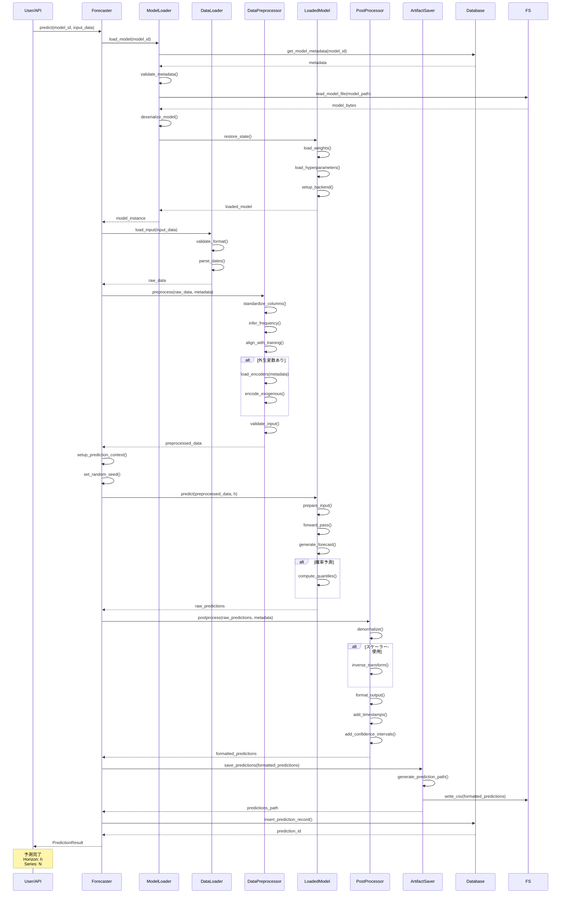

---

## 9. 再学習トリガーフロー

### 9.1 ドリフト検出から再学習まで

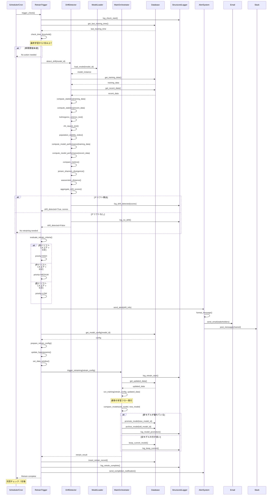

---

## 10. ハイパーパラメータ探索

### 10.1 Optunaを使った探索フロー

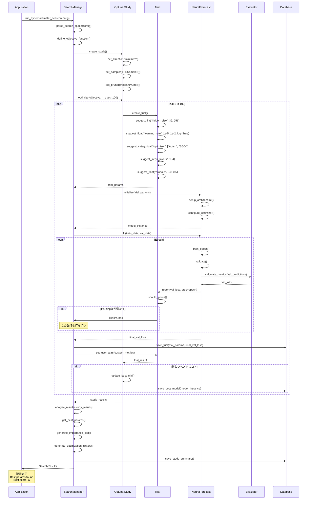

---

## 11. アーティファクト管理

### 11.1 モデル保存とバージョニング

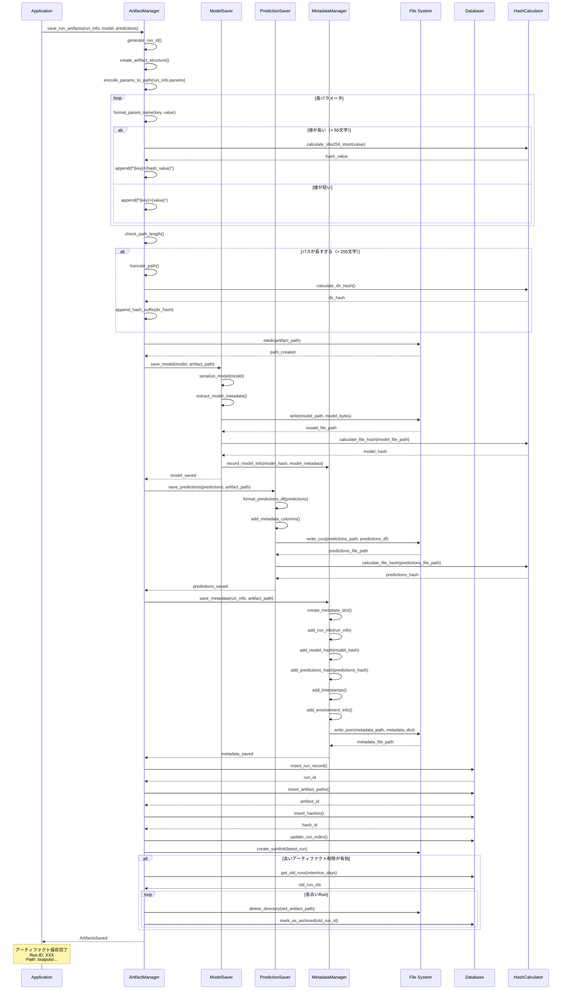

---

## 12. エラーハンドリング

### 12.1 例外処理とリトライ

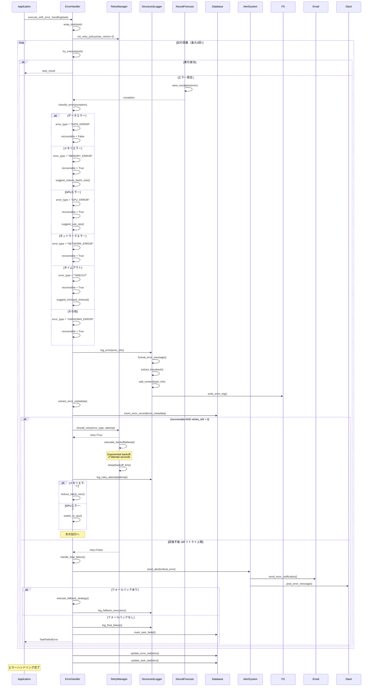

---

## 📊 シーケンス図の読み方

### 記号の説明

- **→**: 同期呼び出し（レスポンス待ち）
- **--→**: 非同期レスポンス
- **Note**: 補足説明
- **alt/else/end**: 条件分岐
- **loop/end**: 繰り返し
- **par/and/end**: 並列処理

### 色分けの意味（実装時）

- **青**: 正常フロー
- **赤**: エラーパス
- **黄**: 警告・注意
- **緑**: 成功

---

## 🎯 使用方法

### Mermaidレンダリング

これらのシーケンス図は、Mermaid対応のマークダウンビューアで表示できます：

1. **GitHub/GitLab**: 自動レンダリング
2. **VS Code**: Mermaid Preview拡張機能
3. **Mermaid Live Editor**: https://mermaid.live
4. **Confluence/Notion**: Mermaidプラグイン

### ドキュメント生成

```bash
# Mermaid CLIを使ってPNG/SVG生成
mmdc -i SEQUENCE_DIAGRAMS_DETAILED.md -o output/
```

---

## 📚 関連ドキュメント

- **00_INTEGRATED_DESIGN_OVERVIEW.md**: システム全体設計
- **03_ARCHITECTURE_DESIGN_DETAILED.md**: アーキテクチャ詳細
- **04_CLASS_DESIGN_DETAILED.md**: クラス設計詳細
- **07_IMPLEMENTATION_GUIDE.md**: 実装ガイド

---

**ドキュメントバージョン**: 1.0  
**最終更新日**: 2025-11-04  
**作成者**: System Architect  
**ステータス**: Complete
